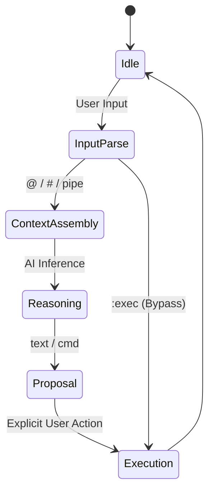

# Execution Semantics of yuangs

> This document defines the **formal execution semantics** of yuangs.
> It specifies **what the system is**, **what it can do**, and **what it must never do**.

yuangs is modeled as a **user-governed execution state machine**.
AI participates strictly as a reasoning component and never as an execution authority.

---

## 1. Core Principle

> **AI may reason.  
> Only the user may execute.**

All system behaviors are constrained by this principle.

---

## 2. State Machine Overview

yuangs operates as a finite state machine with explicit user-controlled transitions.

---

## 3. States and Responsibilities

### 3.1 Idle

- No context
- No execution
- Waiting for user input

---

### 3.2 Input Parse

The system classifies input into one or more of:

- Context declaration (`@file`, `#dir`)
- AI reasoning request (`ai`, `ai -e`)
- Direct execution (`:exec`)
- Plain question

No file system access occurs here.

---

### 3.3 Context Assembly

Context is **explicitly user-declared**.

Allowed sources:

| Source | Authorization |
|------|---------------|
| `@file` | Explicit |
| `#dir` | Explicit |
| Pipe input | Explicit |
| Git diff | **Limited exception** (current working tree only) |

Disallowed sources:

- Implicit filesystem scanning
- Environment variables
- Network access
- Undeclared directories

Context is read-only.

---

### 3.4 Reasoning (AI State)

AI receives:

- User input
- Assembled context
- Execution history (if any)

AI is allowed to:

- Analyze
- Explain
- Suggest commands
- Propose plans (future capability)

AI is **not allowed to**:

- Execute commands
- Advance state autonomously
- Access new context
- Retry without user input

---

### 3.5 Proposal

AI output is interpreted as a **proposal**, never an action.

Proposal types:

- Text explanation
- Suggested shell command(s)
- Step list (non-executable)
- Warnings or risk notes

All proposals are inert until acted upon by the user.

---

### 3.6 Execution (User-Governed)

Execution can only be triggered by **explicit user action**:

| Mechanism | Description |
|---------|-------------|
| Press Enter | Confirm suggested command |
| `:exec` | Bypass AI and execute directly |
| Manual copy-paste | Outside system control |
| `@!cmd` | **Execution-for-Observation** (Explicitly requested side-effect for context) |

AI is not notified of execution unless output is piped back explicitly.

---

## 4. Forbidden Transitions (Hard Guarantees)

The following transitions **must never exist**:

- AI → Execution (direct or indirect)
- Proposal → Execution without user gate
- Planner step → automatic next step
- Retry loop without user input
- Hidden execution side effects

Any feature requiring these transitions is out of scope.

---

## 5. Error and Failure Semantics

On failure:

- Execution stops
- System returns to Idle or Context state
- AI may analyze failure **only after output is provided as context**

There is no automatic recovery.

---

## 6. Observability and Auditability

All executions are:

- Visible
- Reproducible
- Attributable to user action

Execution history may be recorded, replayed, or inspected.

Replay does not grant execution authority.

---

## 7. Summary

yuangs is not an autonomous agent.

It is:

- A reasoning assistant
- A context-aware analyzer
- A proposal generator
- A user-governed execution environment

At no point does yuangs replace user intent or responsibility.
