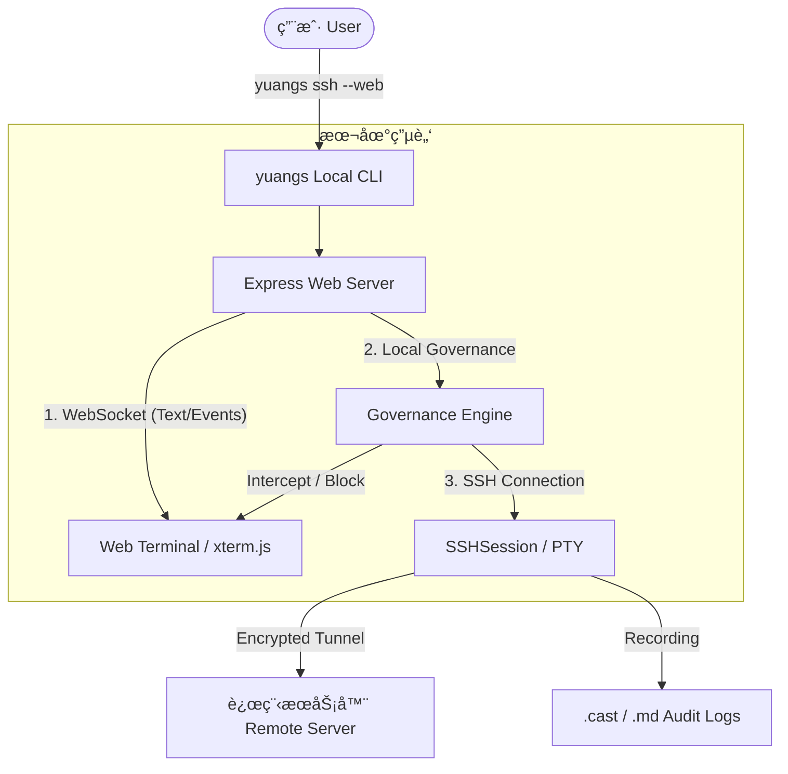

# Git相关功能åŸç†ä¸è¯„ä¼°ä¸æ”¹è¿›å»ºè®®

**Session ID:** ses_3faeaab53ffebkK5UlWmuJZkFR
**Created:** 1/28/2026, 10:50:09 PM
**Updated:** 1/28/2026, 10:56:49 PM

---

## User

<ultrawork-mode>

**MANDATORY**: You MUST say "ULTRAWORK MODE ENABLED!" to the user as your first response when this mode activates. This is non-negotiable.

[CODE RED] Maximum precision required. Ultrathink before acting.

## **ABSOLUTE CERTAINTY REQUIRED - DO NOT SKIP THIS**

**YOU MUST NOT START ANY IMPLEMENTATION UNTIL YOU ARE 100% CERTAIN.**

| **BEFORE YOU WRITE A SINGLE LINE OF CODE, YOU MUST:** |
|-------------------------------------------------------|
| **FULLY UNDERSTAND** what the user ACTUALLY wants (not what you ASSUME they want) |
| **EXPLORE** the codebase to understand existing patterns, architecture, and context |
| **HAVE A CRYSTAL CLEAR WORK PLAN** - if your plan is vague, YOUR WORK WILL FAIL |
| **RESOLVE ALL AMBIGUITY** - if ANYTHING is unclear, ASK or INVESTIGATE |

### **MANDATORY CERTAINTY PROTOCOL**

**IF YOU ARE NOT 100% CERTAIN:**

1. **THINK DEEPLY** - What is the user's TRUE intent? What problem are they REALLY trying to solve?
2. **EXPLORE THOROUGHLY** - Fire explore/librarian agents to gather ALL relevant context
3. **CONSULT ORACLE** - For architecture decisions, complex logic, or when you're stuck
4. **ASK THE USER** - If ambiguity remains after exploration, ASK. Don't guess.

**SIGNS YOU ARE NOT READY TO IMPLEMENT:**
- You're making assumptions about requirements
- You're unsure which files to modify
- You don't understand how existing code works
- Your plan has "probably" or "maybe" in it
- You can't explain the exact steps you'll take

**WHEN IN DOUBT:**
```
delegate_task(agent="explore", prompt="Find [X] patterns in codebase", background=true)
delegate_task(agent="librarian", prompt="Find docs/examples for [Y]", background=true)
delegate_task(agent="oracle", prompt="Review my approach: [describe plan]")
```

**ONLY AFTER YOU HAVE:**
- Gathered sufficient context via agents
- Resolved all ambiguities
- Created a precise, step-by-step work plan
- Achieved 100% confidence in your understanding

**...THEN AND ONLY THEN MAY YOU BEGIN IMPLEMENTATION.**

---

## **NO EXCUSES. NO COMPROMISES. DELIVER WHAT WAS ASKED.**

**THE USER'S ORIGINAL REQUEST IS SACRED. YOU MUST FULFILL IT EXACTLY.**

| VIOLATION | CONSEQUENCE |
|-----------|-------------|
| "I couldn't because..." | **UNACCEPTABLE.** Find a way or ask for help. |
| "This is a simplified version..." | **UNACCEPTABLE.** Deliver the FULL implementation. |
| "You can extend this later..." | **UNACCEPTABLE.** Finish it NOW. |
| "Due to limitations..." | **UNACCEPTABLE.** Use agents, tools, whatever it takes. |
| "I made some assumptions..." | **UNACCEPTABLE.** You should have asked FIRST. |

**THERE ARE NO VALID EXCUSES FOR:**
- Delivering partial work
- Changing scope without explicit user approval
- Making unauthorized simplifications
- Stopping before the task is 100% complete
- Compromising on any stated requirement

**IF YOU ENCOUNTER A BLOCKER:**
1. **DO NOT** give up
2. **DO NOT** deliver a compromised version
3. **DO** consult oracle for solutions
4. **DO** ask the user for guidance
5. **DO** explore alternative approaches

**THE USER ASKED FOR X. DELIVER EXACTLY X. PERIOD.**

---

YOU MUST LEVERAGE ALL AVAILABLE AGENTS / **CATEGORY + SKILLS** TO THEIR FULLEST POTENTIAL.
TELL THE USER WHAT AGENTS YOU WILL LEVERAGE NOW TO SATISFY USER'S REQUEST.

## MANDATORY: PLAN AGENT INVOCATION (NON-NEGOTIABLE)

**YOU MUST ALWAYS INVOKE THE PLAN AGENT FOR ANY NON-TRIVIAL TASK.**

| Condition | Action |
|-----------|--------|
| Task has 2+ steps | MUST call plan agent |
| Task scope unclear | MUST call plan agent |
| Implementation required | MUST call plan agent |
| Architecture decision needed | MUST call plan agent |

```
delegate_task(subagent_type="plan", prompt="<gathered context + user request>")
```

**WHY PLAN AGENT IS MANDATORY:**
- Plan agent analyzes dependencies and parallel execution opportunities
- Plan agent outputs a **parallel task graph** with waves and dependencies
- Plan agent provides structured TODO list with category + skills per task
- YOU are an orchestrator, NOT an implementer

### SESSION CONTINUITY WITH PLAN AGENT (CRITICAL)

**Plan agent returns a session_id. USE IT for follow-up interactions.**

| Scenario | Action |
|----------|--------|
| Plan agent asks clarifying questions | `delegate_task(session_id="{returned_session_id}", prompt="<your answer>")` |
| Need to refine the plan | `delegate_task(session_id="{returned_session_id}", prompt="Please adjust: <feedback>")` |
| Plan needs more detail | `delegate_task(session_id="{returned_session_id}", prompt="Add more detail to Task N")` |

**WHY SESSION_ID IS CRITICAL:**
- Plan agent retains FULL conversation context
- No repeated exploration or context gathering
- Saves 70%+ tokens on follow-ups
- Maintains interview continuity until plan is finalized

```
// WRONG: Starting fresh loses all context
delegate_task(subagent_type="plan", prompt="Here's more info...")

// CORRECT: Resume preserves everything
delegate_task(session_id="ses_abc123", prompt="Here's my answer to your question: ...")
```

**FAILURE TO CALL PLAN AGENT = INCOMPLETE WORK.**

---

## AGENTS / **CATEGORY + SKILLS** UTILIZATION PRINCIPLES

**DEFAULT BEHAVIOR: DELEGATE. DO NOT WORK YOURSELF.**

| Task Type | Action | Why |
|-----------|--------|-----|
| Codebase exploration | delegate_task(subagent_type="explore", run_in_background=true) | Parallel, context-efficient |
| Documentation lookup | delegate_task(subagent_type="librarian", run_in_background=true) | Specialized knowledge |
| Planning | delegate_task(subagent_type="plan") | Parallel task graph + structured TODO list |
| Architecture/Debugging | delegate_task(subagent_type="oracle") | High-IQ reasoning |
| Implementation | delegate_task(category="...", load_skills=[...]) | Domain-optimized models |

**CATEGORY + SKILL DELEGATION:**
```
// Frontend work
delegate_task(category="visual-engineering", load_skills=["frontend-ui-ux"])

// Complex logic
delegate_task(category="ultrabrain", load_skills=["typescript-programmer"])

// Quick fixes
delegate_task(category="quick", load_skills=["git-master"])
```

**YOU SHOULD ONLY DO IT YOURSELF WHEN:**
- Task is trivially simple (1-2 lines, obvious change)
- You have ALL context already loaded
- Delegation overhead exceeds task complexity

**OTHERWISE: DELEGATE. ALWAYS.**

---

## EXECUTION RULES (PARALLELIZATION MANDATORY)

| Rule | Implementation |
|------|----------------|
| **PARALLEL FIRST** | Fire ALL independent agents simultaneously via delegate_task(run_in_background=true) |
| **NEVER SEQUENTIAL** | If tasks A and B are independent, launch BOTH at once |
| **10+ CONCURRENT** | Use 10+ background agents if needed for comprehensive exploration |
| **COLLECT LATER** | Launch agents -> continue work -> background_output when needed |

**ANTI-PATTERN (BLOCKING):**
```
// WRONG: Sequential, slow
result1 = delegate_task(..., run_in_background=false)  // waits
result2 = delegate_task(..., run_in_background=false)  // waits again
```

**CORRECT PATTERN:**
```
// RIGHT: Parallel, fast
delegate_task(..., run_in_background=true)  // task_id_1
delegate_task(..., run_in_background=true)  // task_id_2
delegate_task(..., run_in_background=true)  // task_id_3
// Continue working, collect with background_output when needed
```

---

## WORKFLOW (MANDATORY SEQUENCE)

1. **GATHER CONTEXT** (parallel background agents):
   ```
   delegate_task(subagent_type="explore", run_in_background=true, prompt="...")
   delegate_task(subagent_type="librarian", run_in_background=true, prompt="...")
   ```

2. **INVOKE PLAN AGENT** (MANDATORY for non-trivial tasks):
   ```
   result = delegate_task(subagent_type="plan", prompt="<context + request>")
   // STORE the session_id for follow-ups!
   plan_session_id = result.session_id
   ```

3. **ITERATE WITH PLAN AGENT** (if clarification needed):
   ```
   // Use session_id to continue the conversation
   delegate_task(session_id=plan_session_id, prompt="<answer to plan agent's question>")
   ```

4. **EXECUTE VIA DELEGATION** (category + skills from plan agent's output):
   ```
   delegate_task(category="...", load_skills=[...], prompt="<task from plan>")
   ```

5. **VERIFY** against original requirements

## VERIFICATION GUARANTEE (NON-NEGOTIABLE)

**NOTHING is "done" without PROOF it works.**

### Pre-Implementation: Define Success Criteria

BEFORE writing ANY code, you MUST define:

| Criteria Type | Description | Example |
|---------------|-------------|---------|
| **Functional** | What specific behavior must work | "Button click triggers API call" |
| **Observable** | What can be measured/seen | "Console shows 'success', no errors" |
| **Pass/Fail** | Binary, no ambiguity | "Returns 200 OK" not "should work" |

Write these criteria explicitly. Share with user if scope is non-trivial.

### Test Plan Template (MANDATORY for non-trivial tasks)

```
## Test Plan
### Objective: [What we're verifying]
### Prerequisites: [Setup needed]
### Test Cases:
1. [Test Name]: [Input] → [Expected Output] → [How to verify]
2. ...
### Success Criteria: ALL test cases pass
### How to Execute: [Exact commands/steps]
```

### Execution & Evidence Requirements

| Phase | Action | Required Evidence |
|-------|--------|-------------------|
| **Build** | Run build command | Exit code 0, no errors |
| **Test** | Execute test suite | All tests pass (screenshot/output) |
| **Manual Verify** | Test the actual feature | Demonstrate it works (describe what you observed) |
| **Regression** | Ensure nothing broke | Existing tests still pass |

**WITHOUT evidence = NOT verified = NOT done.**

### TDD Workflow (when test infrastructure exists)

1. **SPEC**: Define what "working" means (success criteria above)
2. **RED**: Write failing test → Run it → Confirm it FAILS
3. **GREEN**: Write minimal code → Run test → Confirm it PASSES
4. **REFACTOR**: Clean up → Tests MUST stay green
5. **VERIFY**: Run full test suite, confirm no regressions
6. **EVIDENCE**: Report what you ran and what output you saw

### Verification Anti-Patterns (BLOCKING)

| Violation | Why It Fails |
|-----------|--------------|
| "It should work now" | No evidence. Run it. |
| "I added the tests" | Did they pass? Show output. |
| "Fixed the bug" | How do you know? What did you test? |
| "Implementation complete" | Did you verify against success criteria? |
| Skipping test execution | Tests exist to be RUN, not just written |

**CLAIM NOTHING WITHOUT PROOF. EXECUTE. VERIFY. SHOW EVIDENCE.**

## ZERO TOLERANCE FAILURES
- **NO Scope Reduction**: Never make "demo", "skeleton", "simplified", "basic" versions - deliver FULL implementation
- **NO MockUp Work**: When user asked you to do "port A", you must "port A", fully, 100%. No Extra feature, No reduced feature, no mock data, fully working 100% port.
- **NO Partial Completion**: Never stop at 60-80% saying "you can extend this..." - finish 100%
- **NO Assumed Shortcuts**: Never skip requirements you deem "optional" or "can be added later"
- **NO Premature Stopping**: Never declare done until ALL TODOs are completed and verified
- **NO TEST DELETION**: Never delete or skip failing tests to make the build pass. Fix the code, not the tests.

THE USER ASKED FOR X. DELIVER EXACTLY X. NOT A SUBSET. NOT A DEMO. NOT A STARTING POINT.

1. EXPLORES + LIBRARIANS (background)
2. GATHER -> delegate_task(subagent_type="plan", prompt="<context + request>")
3. ITERATE WITH PLAN AGENT (session_id resume) UNTIL PLAN IS FINALIZED
4. WORK BY DELEGATING TO CATEGORY + SKILLS AGENTS (following plan agent's parallel task graph)

NOW.

</ultrawork-mode>

---


[analyze-mode]
ANALYSIS MODE. Gather context before diving deep:

CONTEXT GATHERING (parallel):
- 1-2 explore agents (codebase patterns, implementations)
- 1-2 librarian agents (if external library involved)
- Direct tools: Grep, AST-grep, LSP for targeted searches

IF COMPLEX (architecture, multi-system, debugging after 2+ failures):
- Consult oracle for strategic guidance

SYNTHESIZE findings before proceeding.

---

ulw 详细分æ本项目的git相关功能的åŸç†,使用方法和å®é™…点评,并评估当å‰è¿˜æœ‰å“ªäº›å¼±é¡¹,如何优化

---

## Assistant (Sisyphus · glm-4.7 · 40.0s)

_Thinking:_

用户请求：详细分æ本项目的git相关功能的åŸç†ã€ä½¿ç”¨æ–¹æ³•å’Œå®é™…点评，并评估当å‰è¿˜æœ‰å“ªäº›å¼±é¡¹ï¼Œå¦‚何优化。

这是一个ultrawork模å¼çš„任务，我需è¦ï¼š
1. 先说"ULTRAWORK MODE ENABLED!"
2. 在开始任何å®ç°ä¹‹å‰ï¼Œéœ€è¦100%确定用户需求
3. 这个任务需è¦æ·±å…¥æ¢ç´¢ä»£ç åº“
4. 需è¦åˆ†ægit相关功能的åŸç†ã€ä½¿ç”¨æ–¹æ³•ã€å®é™…点评
5. 评估弱项并æ出优化建议

首先，我需è¦æ¢ç´¢è¿™ä¸ªé¡¹ç›®çš„git相关功能。让我å¯åŠ¨ï¼š
- explore agentsæ¥æŸ¥æ‰¾git相关代ç 
- å¯èƒ½éœ€è¦çœ‹é¡¹ç›®ç»“æ„
- 找到所有ä¸git相关的功能

这是一个分æ任务，ä¸æ˜¯å®ç°ä»»åŠ¡ï¼Œä½†æˆ‘需è¦å…¨é¢äº†è§£ä»£ç åº“。

让我先å¯åŠ¨å¹¶è¡Œæ¢ç´¢ä»»åŠ¡ï¼š
1. æ¢ç´¢é¡¹ç›®ç»“æ„
2. 查找git相关的代ç æ–‡ä»¶
3. 查找git相关的é…置和ä¾èµ–

ULTRAWORK MODE ENABLED!

我将深入分æ本项目的git相关功能。让我å¯åŠ¨å¹¶è¡Œæ¢ç´¢æ¥å…¨é¢äº†è§£ä»£ç åº“。

```
Tool: delegate_task

**Input:**
```json
{
  "subagent_type": "explore",
  "prompt": "Explore the project structure and identify the overall architecture. What type of project is this? What is the main purpose? List the key directories and their roles.",
  "load_skills": [],
  "description": "Explore project structure and architecture",
  "run_in_background": true
}
```
**Output:**
```
Background task launched.

Task ID: bg_7c6a03ca
Session ID: undefined
Description: Explore project structure and architecture
Agent: explore
Status: pending

System notifies on completion. Use `background_output` with task_id="bg_7c6a03ca" to check.
To continue this session: session_id="undefined"
```
```

```
Tool: delegate_task

**Input:**
```json
{
  "subagent_type": "explore",
  "prompt": "Find ALL git-related functionality in this codebase. Search for:\n- Files containing git operations (git commands, git APIs)\n- Git-related dependencies in package.json or similar files\n- Git hooks configuration files\n- Git utilities or helper functions\n- Files that interact with git in any way\n\nProvide a comprehensive list of all git-related code and configuration.",
  "load_skills": [],
  "description": "Find all git-related functionality",
  "run_in_background": true
}
```
**Output:**
```
Background task launched.

Task ID: bg_1351af21
Session ID: undefined
Description: Find all git-related functionality
Agent: explore
Status: pending

System notifies on completion. Use `background_output` with task_id="bg_1351af21" to check.
To continue this session: session_id="undefined"
```
```

```
Tool: delegate_task

**Input:**
```json
{
  "subagent_type": "explore",
  "prompt": "Analyze how git is actually used in the codebase. Look for:\n- Git command execution patterns (e.g., exec('git ...'), child_process.spawn with git)\n- Git library usage (e.g., simple-git, nodegit, isomorphic-git)\n- Git state management and tracking\n- Git operations implemented (commit, push, pull, clone, status, etc.)\n\nDetail the implementation approach and patterns used.",
  "load_skills": [],
  "description": "Analyze git implementation patterns",
  "run_in_background": true
}
```
**Output:**
```
Background task launched.

Task ID: bg_79774a55
Session ID: undefined
Description: Analyze git implementation patterns
Agent: explore
Status: pending

System notifies on completion. Use `background_output` with task_id="bg_79774a55" to check.
To continue this session: session_id="undefined"
```
```

```
Tool: read

**Input:**
```json
{
  "filePath": "/Users/ygs/npm_yuangs/package.json"
}
```
**Output:**
```
<file>
00001| {
00002|   "name": "yuangs",
00003|   "version": "5.43.0",
00004|   "description": "è‹‘å¹¿å±±çš„ä¸ªäººåº”ç”¨é›†åˆ CLI（彩色版）",
00005|   "author": "苑广山",
00006|   "license": "ISC",
00007|   "bin": {
00008|     "yuangs": "dist/cli.js"
00009|   },
00010|   "main": "dist/cli.js",
00011|   "types": "dist/cli.d.ts",
00012|   "files": [
00013|     "dist",
00014|     "public"
00015|   ],
00016|   "scripts": {
00017|     "build": "tsc && chmod +x dist/cli.js",
00018|     "asbuild:debug": "./node_modules/.bin/asc src/agent/governance/sandbox/core.as.ts --target debug",
00019|     "asbuild:release": "./node_modules/.bin/asc src/agent/governance/sandbox/core.as.ts --target release",
00020|     "asbuild": "npm run asbuild:release",
00021|     "test": "jest",
00022|     "verify": "./verify.sh"
00023|   },
00024|   "keywords": [
00025|     "yuangs",
00026|     "cli",
00027|     "tools",
00028|     "colorful"
00029|   ],
00030|   "repository": {
00031|     "type": "git",
00032|     "url": "git+https://github.com/yuanguangshan/npm_yuangs.git"
00033|   },
00034|   "bugs": {
00035|     "url": "https://github.com/yuanguangshan/npm_yuangs/issues"
00036|   },
00037|   "homepage": "https://github.com/yuanguangshan/npm_yuangs#readme",
00038|   "dependencies": {
00039|     "axios": "^1.13.2",
00040|     "better-sqlite3": "^12.6.2",
00041|     "chalk": "^4.1.2",
00042|     "cli-table3": "^0.6.5",
00043|     "commander": "^13.1.0",
00044|     "express": "^5.2.1",
00045|     "js-yaml": "^4.1.0",
00046|     "json5": "^2.2.3",
00047|     "markdown-it": "^14.1.0",
00048|     "marked": "^15.0.12",
00049|     "marked-terminal": "^7.3.0",
00050|     "open": "^11.0.0",
00051|     "ora": "^5.4.1",
00052|     "p-limit": "^7.2.0",
00053|     "socket.io": "^4.8.3",
00054|     "ssh2": "^1.17.0",
00055|     "yuangs": "^2.29.0",
00056|     "zod": "^4.3.5",
00057|     "zod-to-json-schema": "^3.25.1"
00058|   },
00059|   "devDependencies": {
00060|     "@assemblyscript/loader": "^0.27.37",
00061|     "@types/better-sqlite3": "^7.6.13",
00062|     "@types/express": "^5.0.6",
00063|     "@types/jest": "^30.0.0",
00064|     "@types/js-yaml": "^4.0.9",
00065|     "@types/json5": "^0.0.30",
00066|     "@types/markdown-it": "^14.1.2",
00067|     "@types/marked": "^5.0.2",
00068|     "@types/marked-terminal": "^6.1.1",
00069|     "@types/node": "^20.11.30",
00070|     "@types/ora": "^3.1.0",
00071|     "@types/socket.io": "^3.0.1",
00072|     "@types/ssh2": "^1.15.5",
00073|     "assemblyscript": "^0.27.37",
00074|     "jest": "^29.7.0",
00075|     "ts-jest": "^29.4.6",
00076|     "ts-node": "^10.9.2",
00077|     "typescript": "^5.9.3"
00078|   },
00079|   "engines": {
00080|     "node": ">=18"
00081|   },
00082|   "publishConfig": {
00083|     "access": "public"
00084|   }
00085| }
00086| 

(End of file - total 86 lines)
</file>

[Project README: /Users/ygs/npm_yuangs/README.md]
# 🚀 yuangs CLI - An AI‑Augmented Shell

**以人类æ„图为中心的 AI‑Augmented Shell**

Your Understanding, Accountable, Not Guessing System

> A seamless terminal where deterministic execution and probabilistic intelligence coexist without friction.

一个集 **AI 助手 · 智能 Shell 内核 · æ’件化è¿è¡Œæ—¶** äºä¸€ä½“çš„ç°ä»£ç»ˆç«¯å·¥å…·ã€‚

> **核心ç†å¿µ**  
> **AI æä¾›æ€è·¯ï¼Œäººç±»æŒæ§æ‰§è¡Œã€‚**  
> yuangs 致力äºåœ¨ä¸ç ´å传统 Shell 心智模å‹çš„å‰æ下，引入 AI 的逻辑能力。  
> 它ä¸æ˜¯é»‘盒执行器，而是你的 **å¢å¼ºå‹å‘½ä»¤è¡Œå¤–è„‘**。

---

# yuangs

> **为终端而生的 AI æ²»ç†è¿è¡Œæ—¶**  
> *ä¸ OOM，ä¸æƒŠå–œï¼Œå§‹ç»ˆæœ‰äººç±»åœ¨ç¯*

`yuangs` 是一个éµå¾ª Unix 哲学的 AI 工具，献给那些长期工作在终端里ã€**æ‹’ç»é»‘盒魔法**çš„å¼€å‘者。

它ä¸æ˜¯æµè§ˆå™¨æ’件。  
ä¸æ˜¯ GUI 助手。  
也ä¸æ˜¯"æŠ«ç€ CLI 外衣的èŠå¤©æœºå™¨äºº"。

它解决的是一个更难的问题：

> **当ä¸å¯æ§çš„ AI 进入æ端强调å¯æ§æ€§çš„终端，秩åºè¯¥å¦‚何é‡å»ºï¼Ÿ**

---

## 设计哲学

### 🧩 åšå¥½ä¸€ä»¶äº‹ï¼ˆDo one thing and do it well）

`yuangs` 的定ä½ä¸æ˜¯"全能助手"，而是一个**上下文治ç†å™¨ï¼ˆContext Governor）**。

你始终清楚ã€å¹¶ä¸”显å¼åœ°å†³å®šï¼š
- 哪些文件进入 AI 上下文
- Token 预算是多少
- 何时采样ã€ä½•æ—¶ç¡®è®¤
- 什么时候å…许执行


æ–‡ä»¶ç³»ç»Ÿä¸ AI 逻辑通过**语法**而ä¸æ˜¯ç‚¹å‡»è¿æ¥ï¼š

```bash
ai "@src/**/*.ts #docs"
```

è¿™ä¸æ˜¯æŠ€å·§ï¼Œè¿™æ˜¯ Unix 哲学：
**语法å³åŠ›é‡ï¼ˆPower of Syntax）**。

---

### ğŸ›¡ï¸ å¼€å‘者主æƒï¼Œè€Œä¸æ˜¯"方便至上"

很多终端 AI 工具追求"çœäº‹"，代价å´æ˜¯**ä¸é€æ˜**：
- æ•°æ®æ‚„悄上传
- 上下文被éšå¼æˆªæ–­
- 执行逻辑ä¸å¯å®¡è®¡

`yuangs` 选择了å¦ä¸€æ¡è·¯ï¼š
- ✅ **Swiss‑Cheese 采样预览**：å‘é€å‰çœ‹åˆ°"æ¯ä¸€å—奶酪"
- ✅ **TokenPolicy**：先估算ã€å†ç¡®è®¤
- ✅ **Human‑in‑the‑loop**：切模å‹ã€å‘请求ã€è·‘执行，永远需è¦ä½ ç‚¹å¤´

你的终端，
ä½ çš„æ•°æ®ï¼Œ
你的决定。

è¿™æ‰æ˜¯æ客眼中的**真自由**。

---

### 🧠 å¯ç¼–程的 Agent 基础设施，而ä¸æ˜¯ Prompt Wrapper

`yuangs` å‘布到 npm çš„ä¸æ˜¯ä¸€ä¸ª"命令"，
而是一套**å¯ç»„åˆçš„ Agent è¿è¡Œæ—¶**。

核心抽象包括：
- `PendingContextItem`
- 上下文估算 / 解æ分离
- 能力感知的执行策略
- å¯å›æ”¾ã€å¯å®¡è®¡çš„执行记录

你拿到的ä¸æ˜¯é»‘盒，
而是一盒**带说æ˜ä¹¦çš„ä¹é«˜**。

ä½ å¯ä»¥ç”¨å®ƒæ„建：
- 仓库结æ„分æ器
- 日志 → AI 的自动采集管é“
- å¯æ§çš„é‡æ„ Agent
- å¯å®¡è®¡çš„自动化æµç¨‹

---

## 核心特性一览

✅ **No OOM, No Surprise**  
å†å¤§çš„仓库ã€å†é•¿çš„日志，没有确认就ä¸ä¼šåƒå†…å­˜ã€ä¸ä¼šå‘é€ã€‚

✅ **Human‑in‑the‑loop, Always**  
系统永远ä¸ä¼šæ›¿ä½ åšé»‘盒决策。

✅ **Power of Syntax**  
`@file`ã€`#dir`ã€æ„图语法，比拖拽文件更快ã€æ›´é…·ã€‚

✅ **å¯å›æ”¾ã€å¯å®¡è®¡**  
æ¯ä¸€æ¬¡ AI 行为都能å¤ç›˜ã€å¤ç°ã€è°ƒè¯•ã€‚

✅ **å¯è§£é‡Šã€å¯æ²»ç†**  
通过 `explain` å’Œ `replay` 命令，ç†è§£ç³»ç»Ÿå†³ç­–过程。

✅ **AI Governance Web Console (Beta)**  
å¯è§†åŒ–æ²»ç†é¢æ¿ï¼Œæä¾› R3 级é£é™©çš„å…¨å±é˜»æ–­ä¸è§†è§‰è­¦æŠ¥ã€‚

---

## ğŸ—ï¸ æ¶æ„概览 (Architecture)



---

## 适åˆè°ï¼Ÿ

- 终端åŸæ•™æ—¨ä¸»ä¹‰è€…
- Linux / Unix 哲学信徒
- 被ä¸é€æ˜ AI 工具伤过的工程师
- 追求**确定性高äºä¾¿åˆ©æ€§**的人

如æœä½ è®¤åŒè¿™å¥è¯ï¼š

> **"AI 很强大，所以它必须被治ç†ã€‚"**

那 `yuangs` 就是为你写的。

---

## 📜 语法说æ˜

yuangs 通过一套**显å¼çš„符å·è¯­æ³•**，清晰界定"副作用"çš„æ¥æºï¼Œ
ç¡®ä¿æ¯ä¸€æ¡å‘½ä»¤ **å¯ç†è§£ã€å¯ç¡®è®¤ã€å¯å®¡è®¡**。

| 语法 | 行为逻辑 | 决策æ¥æº | 适用场景 |
| :--- | :--- | :--- | :--- |
| `ls -la` | ç›´æ¥è¿è¡Œå‘½ä»¤ï¼ˆfish-style） | 用户 | 传统 Shell æ“作 |
| `@path[:line]` | 引用文件 / è¡Œå·ä¸Šä¸‹æ–‡ | 用户 | 代ç å®¡è®¡ã€æŠ¥é”™åˆ†æ |
| `#dir` | 批é‡å¼•å…¥ç›®å½•ä¸Šä¸‹æ–‡ | 用户 | 项目结æ„ç†è§£ |
| `ai "msg"` | çº¯è‡ªç„¶è¯­è¨€å¯¹è¯ | AI | 方案讨论ã€çŸ¥è¯†æŸ¥è¯¢ |
| `ai -e` | 生æˆ**建议**命令 | AI → 用户 | å¤æ‚命令辅助 |
| `:exec` | 绕过 AI çš„åŸå­æ‰§è¡Œ | 用户 | 确定性脚本 |

---

## 🌟 核心功能

### 1. 智能 Shell 内核（v2.10.0+）

è¿›å…¥äº¤äº’å¼ AI‑Augmented Shell：

```bash
yuangs ai
```

特性包括：

- **模å¼è‡ªåŠ¨è·¯ç”±**
  无需切æ¢æ¨¡å¼ï¼š
  - 输入 `git status` → ç›´æ¥æ‰§è¡Œ
  - 输入「解释这段代ç ã€â†’ 进入对è¯

- **👻 Ghost Text（幽çµå»ºè®®ï¼‰**
  æ ¹æ®å†å²è®°å½•ä¸æ’件预测输入
  例如输入 `npm r`，ç°è‰²æ˜¾ç¤º `un dev`，按 `Tab` 采纳

- **âš¡ 补全å¢å¼º**
  - **PATH 扫æ**：自动补全 40+ 常用系统命令
  - **精准行å·**ï¼šæ”¯æŒ `@src/index.ts:10-50`
  - **项目感知**：æå‡ `src/`ã€`packages/` 等目录æƒé‡

---

### 1.5 yuangs Zero-Mode (æ简 Shell AI å¢å¼º)

如æœä½ ä¸æƒ³è¿›å…¥ä¸“门的交互模å¼ï¼Œ`yuangs` æ供了一个"零侵入"的集æˆæ–¹æ¡ˆï¼Œè®©ä½ åœ¨åŸæœ¬çš„ Bash/Zsh 中ä¿æŒå¿ƒæµï¼š

#### 📦 安装ä¸å¸è½½

```bash
# 安装
bash ./scripts/yuangs-install.sh

# å¸è½½
bash ./scripts/yuangs-install.sh --uninstall
```
安装å请执行 `source ~/.zshrc` (或 `.bashrc`)。

#### 🚀 核心ç©æ³•

1. **`?? <问题>` (å³æ—¶å’¨è¯¢)**
   在任何时候，åªéœ€è¾“å…¥ `??` 加空格，å³å¯å‘ AI æ问。
   ```bash
   ?? æ€ä¹ˆè§£å‹ä¸€ä¸ª .tar.gz 文件到指定目录？
   ```

   âš ï¸ **安全æ醒**：如æœå½“å‰ç›®å½•å­˜åœ¨æ°å¥½ä¸º2个字符的文件/目录（如 `ab`ã€`go`ã€`db` 等），Shell çš„ glob 展开会将 `??` 替æ¢ä¸ºè¿™äº›æ–‡ä»¶å，导致 Zero-Mode 无法正常触å‘。此时系统会给出警告并建议使用其他方å¼è¿›å…¥ Zero-Mode。

2. **æ›¿ä»£å…¥å£ (安全备用)**
   为é¿å… glob 展开问题，æ供以下替代入å£ï¼š
   - **`:ai` 命令**：在交互模å¼ä¸‹è¾“å…¥ `:ai` 进入 AI 问答
   - **空行 + Enter**：在交互模å¼ä¸‹ç›´æ¥æŒ‰å›è½¦ï¼ˆæ— è¾“入）进入 AI 问答

3. **å›è½¦å³æ•‘急 (Failed-Command Help)**
   当你执行一个命令失败时（例如 `git push` 被拒ç»ï¼‰ï¼Œç»ˆç«¯ä¼šæ示：
   `↳ Need help? Press Enter`
   此时**ç›´æ¥æŒ‰å›è½¦**，AI 会通过 `yuangs` 的上下文治ç†èƒ½åŠ›ï¼Œè‡ªåŠ¨åˆ†æ错误åŸå› å¹¶ç»™å‡ºä¿®å¤æ–¹æ¡ˆã€‚

4. **开关自如**
   - `ai_off`: 临时ç¦ç”¨ AI 触å‘逻辑。
   - `ai_on`: é‡æ–°å¯ç”¨ AI å¢å¼ºã€‚

---

### 2. 精准上下文管ç†ï¼ˆContextBuffer）

#### 管é“模å¼ï¼ˆPipe Mode）

```bash
cat error.log | yuangs "解释这个报错"
git diff | yuangs -w "Review å˜æ›´é€»è¾‘"
```

#### `-w` 智能读å–
- 自动解æ管é“中的文件路径
- åªè¯»å–**被显å¼å¼•ç”¨**的文件内容
- ä¸è¿›è¡Œéšå¼æ–‡ä»¶ç³»ç»Ÿæ‰«æ

---

### 3. æ’件系统（Plugins）

在 `.shell/plugins/` 下放置自定义脚本，
扩展特定工具的补全ä¸æ¨ç†èƒ½åŠ›ï¼ˆå¦‚ `docker`ã€`kubectl`）。

示例：

```ts
// .shell/plugins/docker.ts
module.exports = {
  command: 'docker',
  complete(args) {
    return ['ps', 'run', 'build', 'exec'];
  }
};
```

---

## 🔒 Phase 2: Explainability & Governance (v1)

### 🯠概述

Phase 2 引入了**系统å¯è§‚测性和æ§åˆ¶èƒ½åŠ›**，但ä¸æ”¹å˜æ ¸å¿ƒè¡Œä¸ºï¼š
- ✅ **Explainability**：人类å¯è¯»çš„执行解释
- ✅ **Replay++**：Dry-runã€explain å’Œ diff 能力
- ✅ **Skill Control**：å¯ç”¨/ç¦ç”¨æŠ€èƒ½ä»¥å®ç°ç»†ç²’度æ§åˆ¶

---

## 📦 新命令

### `yuangs explain [id | last]`

**目的**：解释系统为什么åšå‡ºæŸä¸ªå†³ç­–

**用法**：
```bash
# 解释最近一次执行
yuangs explain last

# 解释指定 ID 的执行
yuangs explain exec_1768820380225_rgts34981
```

**输出格å¼ï¼ˆv1）**：
```
=== Execution Explanation ===
[1] Command
- Name: ai-command
- Args: echo "hello"

[2] Decision
- Strategy: capability-match
- Selected Model: gemini-2.5-flash-lite
- Reason: Capability-based selection with fallback support

[3] Model
- Name: gemini-2.5-flash-lite
- Provider: aiproxy
- Context Window: 8000
- Cost Profile: low

[4] Skills
- (none)

[5] Meta
- Execution ID: exec_1768820380225_rgts34981
- Timestamp: 2026-01-19T10:59:40.225Z
- Replayable: true
- Version: unknown
=============================
```

**关键特性**：
- ✅ 纯åªè¯»æ“作（无副作用）
- ✅ 稳定ã€å¯ snapshot 的输出
- ✅ 为未æ¥çš„ diff/audit 工作æµåšå¥½çš„准备

---

### `yuangs replay <id> [options]`

**目的**：使用æ§åˆ¶æ ‡å¿—é‡æ”¾æ‰§è¡Œ

**选项**：
| 选项 | æè¿° |
|--------|-------------|
| `-s, --strict` | 严格é‡æ”¾ï¼ˆä½¿ç”¨ç²¾ç¡®æ¨¡å‹ï¼‰ |
| `-c, --compatible` | 兼容é‡æ”¾ï¼ˆå…许 fallback） |
| `-r, --re-evaluate` | 使用当å‰é…ç½®é‡æ–°è¯„ä¼° |
| `-v, --verbose` | 详细输出 |
| `--dry` | Dry run - 显示将è¦å‘生的内容但ä¸æ‰§è¡Œ |
| `--explain` | 在é‡æ”¾å‰æ˜¾ç¤ºè§£é‡Š |
| `--diff` | 显示åŸå§‹é…ç½®ä¸å½“å‰é…置的差异 |

**用法示例**：
```bash
# 使用解释进行 dry run
yuangs replay exec_1768820380225_rgts34981 --dry --explain

# 仅显示 diff（ä¸æ‰§è¡Œï¼‰
yuangs replay exec_1768820380225_rgts34981 --diff --dry

# 带差异的完整é‡æ”¾
yuangs replay exec_1768820380225_rgts34981 --diff
```

**é‡æ”¾è¡Œä¸ºçŸ©é˜µ**：
| explain | dry | strict | 行为 |
|--------|-----|--------|----------|
| ✅ | ✅ | any | 仅解释，ä¸æ‰§è¡Œ |
| ✅ | ⌠| ✅ | 解释 → é‡æ”¾ |
| ⌠| ✅ | ✅ | 打å°ä¸¥æ ¼ä¿¡æ¯ → 退出 |
| ⌠| ⌠| ✅ | 正常é‡æ”¾ |

**差异输出**：
```
=== Replay Diff ===
[Decision]
- no change

[Model]
- no change

[Skills]
- no change
===================
```

---

### `yuangs skills <subcommand>`

**目的**：管ç†æŠ€èƒ½åº“

**å­å‘½ä»¤**：
```bash
# 列出所有技能åŠå…¶åˆ†æ•°
yuangs skills list

# 解释特定技能
yuangs skills explain <skill-name>

# ç¦ç”¨æŠ€èƒ½
yuangs skills disable <skill-name>

# å¯ç”¨æŠ€èƒ½
yuangs skills enable <skill-name>
```

**输出示例**（`skills list`）：
```
📦 Skills (3)

✔ deploy-production
  Confidence: 72%
  Success: 8 / Failure: 1
  Last used: 2 days ago

✔ cleanup-logs
  Confidence: 41%
  Success: 5 / Failure: 7
  Last used: 1 day ago

⊘ legacy-search (disabled)
  Confidence: 23%
  Success: 2 / Failure: 6
  Last used: 7 days ago
```

**关键特性**：
- ✅ 技能å¯ä»¥è¢«ç¦ç”¨è€Œä¸åˆ é™¤
- ✅ 技能按相关性评分和æ’åº
- ✅ ç¦ç”¨çš„技能ä¸å½±å“新决策
- ✅ 所有技能在 `explain` 输出中ä»ç„¶å¯è§

---

## 🧭 Explain 输出规范 v1

explain 输出éµå¾ªä¸¥æ ¼æ ¼å¼ï¼Œè®¾è®¡ç”¨äºï¼š
- ✅ 人类å¯è¯»æ€§
- ✅ 稳定性和 snapshot 兼容性
- ✅ 未æ¥çš„ diff/audit 工作æµ
- ✅ æ— å®ç°è€¦åˆ

**结æ„**（5 个部分，ä¸å¯å˜é¡ºåºï¼‰ï¼š
1. `[1] Command` - 用户输入层
2. `[2] Decision` - 决策核心
3. `[3] Model` - 执行ç¯å¢ƒ
4. `[4] Skills` - å½±å“决策的技能
5. `[5] Meta` - 审计/é‡æ”¾å…ƒæ•°æ®

**é‡è¦æ示**：
- âš ï¸ ä¸è¦åœ¨å‡çº§è§„范版本时更改格å¼
- ✅ 输出是纯文本（snapshot 无颜色）
- ✅ 相åŒæ‰§è¡Œè®°å½• = 100% å¯é‡ç°è¾“出

---

## 🔒 技能ä¸å¯ç”¨çŠ¶æ€

技能ç°åœ¨æœ‰ä¸€ä¸ª `enabled` 字段，æ§åˆ¶å®ƒä»¬åœ¨æ–°å†³ç­–中的å‚ä¸ï¼š

**默认行为**：
- ✅ 新技能：`enabled: true`
- ✅ 旧技能：`enabled: true`（如æœå­—段缺失）
- ⌠ç¦ç”¨çš„技能：ä¸åŒ…å«åœ¨ `getRelevantSkills()` 中

**使用场景**：
1. **æ²»ç†**：临时ç¦ç”¨æœ‰é£é™©çš„技能
2. **A/B 测试**：比较ä¸åŒçš„技能é…ç½®
3. **å›æ»š**：ç¦ç”¨æ–°æ·»åŠ çš„技能而ä¸åˆ é™¤
4. **审计**：在 explain 输出中查看ç¦ç”¨çš„技能

**CLI 命令**：
```bash
# ç¦ç”¨æŠ€èƒ½
yuangs skills disable risky-operation

# 列出以验è¯
yuangs skills list

# 如æœéœ€è¦ï¼Œé‡æ–°å¯ç”¨
yuangs skills enable risky-operation
```

---

## 🧪 æµ‹è¯•ä¸ Snapshots

### 创建 Explain Snapshots

```bash
# 创建最近一次执行的 snapshot
yuangs replay exec_1768820380225_rgts34981 --explain --dry > snapshot.txt
```

Snapshots å¯ç”¨äºï¼š
- ✅ å›å½’测试
- ✅ 输出格å¼éªŒè¯
- ✅ 文档示例
- ✅ 审计线索

### 4. 终端录制ä¸å®¡è®¡ (.cast)

Yuangs 采用标准的 [asciinema](https://asciinema.org/) 兼容格å¼è¿›è¡Œä¼šè¯å½•åˆ¶ã€‚

**审计日志包å«ï¼š**
- **行为æµ**：完整的终端输入/è¾“å‡ºï¼Œæ”¯æŒ `replay`。
- **æ²»ç†ä¸Šä¸‹æ–‡**：记录哪些命令被拦截ã€å“ªäº›è¢«æ‰¹å‡†ã€‚
- **AI 摘è¦**：自动为ç¹æ‚çš„æ“作记录生æˆå¯é˜…读的 Markdown 摘è¦ã€‚

---

## 💡 使用场景示例

### 场景 A：智能调试

```bash
@!build.sh
# 系统返å›æŠ¥é”™â€¦

上é¢çš„错误是什么æ„æ€ï¼Ÿ
```

AI å°†ç»“åˆ **build.sh 内容 + å®é™…输出** 进行分æ。

---

### 场景 B：命令生æˆ

```bash
ai -e "查找当å‰ç›®å½•ä¸‹å¤§äº 100M 的文件"
```

AI 生æˆå»ºè®®å‘½ä»¤ï¼ˆå¦‚ `find . -type f -size +100M`），
**存入剪贴æ¿ï¼Œç­‰å¾…你确认执行。**

---

### 场景 C：项目审计

```bash
#src/
分æ这些模å—的功能
```

AI 在**显å¼æˆæƒ**下读å–目录内容并生æˆç»“æ„分æ。

---

## 📠å®ç°è¯´æ˜

### Explain Output v1

**文件**：`src/core/explain.ts`

**关键设计**：
- 纯函数（无副作用）
- 无全局状æ€çš„外部ä¾èµ–
- 使用ç°æœ‰çš„ `ExecutionRecord` 结æ„
- 稳定格å¼ï¼ˆç‰ˆæœ¬åŒ–）

---

### Replay Diff

**文件**：`src/core/replayDiff.ts`

**关键设计**：
- 比较 Decisionã€Model å’Œ Skills 层
- 显示 added/removed/changed 技能
- 语义 diff（é token 级别）
- ä¸ Explain v1 æ ¼å¼å…¼å®¹

---

### Skills Control

**文件**：`src/agent/skills.ts`

**关键å˜æ›´**：
- å‘ `Skill` æ¥å£æ·»åŠ  `enabled: boolean` 字段
- 导出 `computeSkillScore()` 供 CLI 使用
- `getRelevantSkills()` 过滤ç¦ç”¨çš„技能

---

## 📦 安装ä¸é…ç½®

```bash
npm install -g yuangs
```

常用é…置：

```bash
yuangs config defaultModel Assistant
yuangs config accountType pro
```

---

## ğŸ—“ï¸ è¿‘æœŸæ›´æ–°ï¼ˆChangelog）

- **v2.40.0** (2026‑01‑20)
  - **Governance Refactor**: å®ç°ä¸‰é˜¶æ®µæ‰§è¡Œæ¨¡å‹ï¼ˆPre-Exec éªŒè¯ -> Exec æ交 -> Post-Exec 报告）
  - **语义级事å®æº**: ç¡®ä¿ `Git Result` ä¸ `Snapshot Verification` 物ç†åˆ†åŒºï¼Œæ¶ˆé™¤è¯­ä¹‰æ­§ä¹‰
  - **é²æ£’性修å¤**: ä¿®å¤äº† Git 统计解æåŠæš‚存区å˜æ›´æ£€æµ‹å¤±æ•ˆçš„ Bug
- **v2.29.0** (2026‑01‑20)
  - æ–°å¢ Explainability 功能（`explain` 命令）
  - æ–°å¢ Replay++ 支æŒï¼ˆ`--dry`, `--explain`, `--diff`）
  - æ–°å¢ Skills 管ç†å‘½ä»¤ï¼ˆ`skills list/explain/disable/enable`）
  - 引入 Explain Output Spec v1 规范
  - å®ç° Replay Diff 功能
- **v2.11.0** (2026‑01‑18)
  - æ–°å¢ 40+ Shell 内置命令支æŒï¼ˆcd, pwd, ls, git 等）
- **v2.10.0** (2026‑01‑18)
  - 引入 Shell 交互内核ã€Ghost Text ä¸æ’件系统
- **v1.3.67** (2026‑01‑17)
  - æ–°å¢ `@` æ–‡ä»¶é€‰æ‹©ä¸ `#` 目录读å–功能

---

## ✅ Phase 2 完æˆæ¸…å•

所有 Phase 2 目标已完æˆï¼š

- [x] Explainability（ExecutionRecord 级别）
- [x] Replay dry / explain / strict
- [x] Skill scoring & enable 标志
- [x] 所有三个功能的 CLI 集æˆ
- [x] Replay diff å®ç°
- [x] Skills enabled 过滤
- [x] Explain v1 规范
- [x] Snapshot 测试能力

**下一阶段**：Phase 3 - 高级治ç†ä¸é¡¹ç›®çº§æ™ºèƒ½

---

## 📚 更多信æ¯

- **设计åŸç†**: [docs/implementation_principles.md](docs/implementation_principles.md)
- **场景示例**: [docs/scenarios.md](docs/scenarios.md)
- **执行语义**: [docs/semantics.md](docs/semantics.md)
- **é目标**: [docs/non-goals.md](docs/non-goals.md)
- **å¨èƒæ¨¡å‹**: [docs/threat_model.md](docs/threat_model.md)
- **å˜æ›´æ—¥å¿—**: [docs/CHANGELOG.md](docs/CHANGELOG.md)
- **Shell 补全**: [docs/tab_completion_guide.md](docs/tab_completion_guide.md)
- **上下文优化**: [docs/context_optimization_analysis.md](docs/context_optimization_analysis.md)
- **代ç†ç®¡é“**: [docs/AGENT_PIPELINE.md](docs/AGENT_PIPELINE.md)
- **上下文管ç†**: [docs/context_management.md](docs/context_management.md)

---

## âš–ï¸ ç»´æŠ¤è€…

**@yuanguangshan**

> **AI æä¾›æ€è·¯ï¼Œäººç±»æŒæ§æ‰§è¡Œã€‚**
> è¿™ä¸æ˜¯å¦¥å，而是对工程ç†æ€§çš„å°Šé‡ã€‚

---

## 状æ€

`yuangs` 正在积æ演进中。
核心治ç†æ¨¡å‹å·²ç¨³å®šï¼›æ¥å£ä»åœ¨ä¼˜åŒ–中。

欢è¿è´¡çŒ®ã€æƒ³æ³•å’Œæœ‰åŸåˆ™çš„批评。

> **"AI 除é被æ˜ç¡®è¦æ±‚，å¦åˆ™ä¸åº”该比输入看起æ¥æ›´èªæ˜ã€‚"**

---

## 🔠Code Change Governance System

The governance system provides safe, auditable code changes with human oversight. All features follow constitutional principles and have been fully verified.

### Key Features

- ✅ **Three-Phase Model**: 物ç†åˆ†åŒº Pre-Exec (验è¯), Exec (æ交), Post-Exec (审计)
- ✅ **Proposal-First**: All changes start as proposals, no execution without review
- ✅ **Human-in-the-Loop**: Explicit approval with diff preview and risk assessment
- ✅ **Snapshot Safety**: Automatic rollback on failure
- ✅ **Strict Truth Sources**: æ˜ç¡®åŒºåˆ† Patch Truth, Snapshot Truth ä¸ Git Truth
- ✅ **Audit Trail**: Complete lifecycle tracking for every action

### Demo Summary

| Demo # | Feature | Status |
--------|---------|--------|
| 1 | Diff creation | ✅ Working |
| 2 | Proposal | ✅ Working |
| 3 | List actions | ✅ Working |
| 4 | Approval with review | ✅ Working |
| 5 | Execution with snapshot | ✅ Working |
| 6 | Failure and rollback | ✅ Working |
| 7 | Action status | ✅ Working |
| 8 | Full workflow | ✅ Working |
| 9 | State invariants | ✅ Working |
| 10 | Capability tokens | ✅ Working |
| 11 | Crash recovery | ✅ Working |
| 12 | Persistence audit | ✅ Working |
| 13 | Risk assessment | ✅ Working |

### Quick Start

```bash
# Propose a code change
yuangs diff-edit propose /path/to/patch.patch --rationale "Your rationale"

# List pending actions
yuangs diff-edit list

# Review and approve
yuangs diff-edit approve <action-id>

# Execute with safety
yuangs diff-edit exec <action-id>
```

### Documentation

- 📖 **Complete Demo Guide**: [DEMO.md](DEMO.md) - Detailed runnable examples for all features
- ✅ **Verification Report**: [VERIFICATION_REPORT.md](VERIFICATION_REPORT.md) - Implementation status confirmation

### Available Commands

```bash
yuangs diff-edit propose <file>     # Submit a diff for review
yuangs diff-edit list               # View all actions
yuangs diff-edit approve <id>       # Review and approve
yuangs diff-edit exec <id>          # Execute approved action
yuangs diff-edit status <id>        # Check action status
```

---

diff-edit使本项目有了质的å˜åŒ–。^-^

// test change

```
```

---

## Assistant (Sisyphus · glm-4.7 · 8.1s)

_Thinking:_

好的，我ç°åœ¨éœ€è¦æ”¶é›†æ¢ç´¢ä»»åŠ¡çš„结æœæ¥äº†è§£git相关功能。让我检查æ¯ä¸ªæ¢ç´¢ä»»åŠ¡çš„输出。

```
Tool: background_output

**Input:**
```json
{
  "task_id": "bg_7c6a03ca"
}
```
**Output:**
```
# Task Status

| Field | Value |
|-------|-------|
| Task ID | `bg_7c6a03ca` |
| Description | Explore project structure and architecture |
| Agent | explore |
| Status | **running** |
| Duration | 24s |
| Session ID | `ses_3faea4dd4ffekU8qllclxV1A91` |


> **Note**: No need to wait explicitly - the system will notify you when this task completes.
## Original Prompt

```
Explore the project structure and identify the overall architecture. What type of project is this? What is the main purpose? List the key directories and their roles.
```
```
```

```
Tool: background_output

**Input:**
```json
{
  "task_id": "bg_1351af21"
}
```
**Output:**
```
# Task Status

| Field | Value |
|-------|-------|
| Task ID | `bg_1351af21` |
| Description | Find all git-related functionality |
| Agent | explore |
| Status | **running** |
| Duration | 19s |
| Session ID | `ses_3faea3a00ffeIdnBcqTpQtmvEE` |


> **Note**: No need to wait explicitly - the system will notify you when this task completes.
## Original Prompt

```
Find ALL git-related functionality in this codebase. Search for:
- Files containing git operations (git commands, git APIs)
- Git-related dependencies in package.json or similar files
- Git hooks configuration files
- Git utilities or helper functions
- Files that interact with git in any way

Provide a comprehensive list of all git-related code and configuration.
```
```
```

```
Tool: background_output

**Input:**
```json
{
  "task_id": "bg_79774a55"
}
```
**Output:**
```
# Task Status

| Field | Value |
|-------|-------|
| Task ID | `bg_79774a55` |
| Description | Analyze git implementation patterns |
| Agent | explore |
| Status | **running** |
| Duration | 8s |
| Session ID | `ses_3faea105fffey4XFkJad2PWwsm` |


> **Note**: No need to wait explicitly - the system will notify you when this task completes.
## Original Prompt

```
Analyze how git is actually used in the codebase. Look for:
- Git command execution patterns (e.g., exec('git ...'), child_process.spawn with git)
- Git library usage (e.g., simple-git, nodegit, isomorphic-git)
- Git state management and tracking
- Git operations implemented (commit, push, pull, clone, status, etc.)

Detail the implementation approach and patterns used.
```
```
```

---

## Assistant (Sisyphus · glm-4.7 · 6.1s)

_Thinking:_

任务还在è¿è¡Œä¸­ã€‚让我等一下，然åå†è·å–结æœã€‚åŒæ—¶ï¼Œæˆ‘å¯ä»¥å…ˆæŸ¥çœ‹ä¸€äº›å¯èƒ½çš„git相关文件。

```
Tool: glob

**Input:**
```json
{
  "pattern": "**/*git*.{ts,js,json}"
}
```
**Output:**
```
Found 6 file(s)

./dist/commands/gitCommands.d.ts
./dist/commands/gitCommands.js
./dist/commands/gitContext.d.ts
./dist/commands/gitContext.js
./src/commands/gitCommands.ts
./src/commands/gitContext.ts
```
```

```
Tool: glob

**Input:**
```json
{
  "pattern": "**/src/**/git*"
}
```
**Output:**
```
Found 2 file(s)

./src/commands/gitCommands.ts
./src/commands/gitContext.ts
```
```

---

## Assistant (Sisyphus · glm-4.7 · 5.9s)

_Thinking:_

很好，找到了git相关的文件。让我读å–这些文件æ¥äº†è§£git功能的å®ç°ã€‚

```
Tool: read

**Input:**
```json
{
  "filePath": "/Users/ygs/npm_yuangs/src/commands/gitCommands.ts"
}
```
**Output:**
```
<file>
00001| import { Command } from 'commander';
00002| import { registerCommitCommand } from './git/commit';
00003| import { registerReviewCommand } from './git/review';
00004| import { registerStatusCommand } from './git/status';
00005| import { registerBranchCommand } from './git/branch';
00006| import { registerPlanCommand } from './git/plan';
00007| import { registerExecCommand } from './git/exec';
00008| import { registerAutoCommand } from './git/auto';
00009| 
00010| /**
00011|  * 注册 Git 相关命令
00012|  */
00013| export function registerGitCommands(program: Command) {
00014|     const gitCmd = program
00015|         .command('git')
00016|         .description('Git 集æˆå·¥å…· - 智能æ交ã€ä»£ç å®¡æŸ¥ã€åˆ†æ”¯ç®¡ç†ã€è‡ªåŠ¨åŒ–工作æµ')
00017|         .action((options: any, cmd: any) => {
00018|             if (cmd.args.length === 0) {
00019|                 cmd.help();
00020|             }
00021|         });
00022| 
00023|     registerCommitCommand(gitCmd);
00024|     registerReviewCommand(gitCmd);
00025|     registerStatusCommand(gitCmd);
00026|     registerBranchCommand(gitCmd);
00027|     registerPlanCommand(gitCmd);
00028|     registerExecCommand(gitCmd);
00029|     registerAutoCommand(gitCmd);
00030| }
00031| 

(End of file - total 31 lines)
</file>
```
```

```
Tool: read

**Input:**
```json
{
  "filePath": "/Users/ygs/npm_yuangs/src/commands/gitContext.ts"
}
```
**Output:**
```
<file>
00001| import { exec } from 'child_process';
00002| import { promisify } from 'util';
00003| 
00004| const execAsync = promisify(exec);
00005| 
00006| async function run(cmd: string): Promise<string | null> {
00007|     try {
00008|         const { stdout } = await execAsync(cmd, { maxBuffer: 1024 * 1024 });
00009|         return stdout.trim() || null;
00010|     } catch {
00011|         return null;
00012|     }
00013| }
00014| 
00015| export async function getGitContext() {
00016|     const staged = await run('git diff --staged');
00017|     const unstaged = await run('git diff');
00018| 
00019|     if (!staged && !unstaged) return null;
00020| 
00021|     let result = `以下是 Git å˜æ›´å†…容：\n`;
00022| 
00023|     if (staged) {
00024|         result += `\nã€å·²æš‚存】\n\`\`\`diff\n${staged}\n\`\`\`\n`;
00025|     }
00026| 
00027|     if (unstaged) {
00028|         result += `\nã€æœªæš‚存】\n\`\`\`diff\n${unstaged}\n\`\`\`\n`;
00029|     }
00030| 
00031|     return result;
00032| }
00033| 

(End of file - total 33 lines)
</file>
```
```

---

## Assistant (Sisyphus · glm-4.7 · 2.9s)

_Thinking:_

很好，ç°åœ¨æˆ‘看到了主入å£æ–‡ä»¶å’ŒgitContext。让我继续查看git目录下的具体å®ç°æ–‡ä»¶ã€‚

```
Tool: glob

**Input:**
```json
{
  "pattern": "src/commands/git/*.ts"
}
```
**Output:**
```
Found 10 file(s)

./src/commands/git/review.ts
./src/commands/git/auto.ts
./src/commands/git/exec.ts
./src/commands/git/errors.ts
./src/commands/git/utils.ts
./src/commands/git/constants.ts
./src/commands/git/plan.ts
./src/commands/git/branch.ts
./src/commands/git/status.ts
./src/commands/git/commit.ts
```
```

---

## Assistant (Sisyphus · glm-4.7 · 41.8s)

_Thinking:_

好的，找到了所有git相关的å®ç°æ–‡ä»¶ã€‚让我é€ä¸€è¯»å–这些文件æ¥å…¨é¢äº†è§£git功能的å®ç°ã€‚

```
Tool: read

**Input:**
```json
{
  "filePath": "/Users/ygs/npm_yuangs/src/commands/git/commit.ts"
}
```
**Output:**
```
<file>
00001| import { Command } from 'commander';
00002| import chalk from 'chalk';
00003| import ora from 'ora';
00004| import { GitService } from '../../core/git/GitService';
00005| import { CommitMessageGenerator } from '../../core/git/CommitMessageGenerator';
00006| import { getRouter } from '../../core/modelRouter';
00007| 
00008| export function registerCommitCommand(gitCmd: Command) {
00009|     // git commit - æ™ºèƒ½ç”Ÿæˆ commit message
00010|     gitCmd
00011|         .command('commit')
00012|         .description('æ™ºèƒ½ç”Ÿæˆ commit message 并æ交')
00013|         .option('-a, --all', '暂存所有å˜æ›´')
00014|         .option('-d, --detailed', '生æˆè¯¦ç»†çš„ commit message')
00015|         .option('-t, --type <type>', '指定 commit ç±»å‹ (feat/fix/docs/etc)')
00016|         .option('-s, --scope <scope>', '指定影å“范围')
00017|         .option('--dry-run', 'åªç”Ÿæˆ message,ä¸å®é™…æ交')
00018|         .option('--no-ai', 'ä¸ä½¿ç”¨ AI,使用规则生æˆ')
00019|         .action(async (options) => {
00020|             const spinner = ora('åˆå§‹åŒ– Git æœåŠ¡...').start();
00021| 
00022|             try {
00023|                 const gitService = new GitService();
00024| 
00025|                 // 检查是å¦åœ¨ Git 仓库中
00026|                 if (!(await gitService.isGitRepository())) {
00027|                     spinner.fail('当å‰ç›®å½•ä¸æ˜¯ Git 仓库');
00028|                     return;
00029|                 }
00030| 
00031|                 // 检查是å¦æœ‰å˜æ›´
00032|                 const diff = await gitService.getDiff();
00033|                 if (!diff.staged && !diff.unstaged) {
00034|                     spinner.fail('没有å¯æ交的å˜æ›´');
00035|                     return;
00036|                 }
00037| 
00038|                 // 如æœéœ€è¦æš‚存所有å˜æ›´
00039|                 if (options.all) {
00040|                     spinner.text = '暂存所有å˜æ›´...';
00041|                     await gitService.stageAll();
00042|                 }
00043| 
00044|                 // 检查是å¦æœ‰å·²æš‚存的å˜æ›´
00045|                 const stagedDiff = await gitService.getDiff();
00046|                 if (!stagedDiff.staged) {
00047|                     spinner.fail('没有已暂存的å˜æ›´,请先使用 git add 或 --all 选项');
00048|                     return;
00049|                 }
00050| 
00051|                 spinner.text = 'ç”Ÿæˆ commit message...';
00052| 
00053|                 const router = options.ai !== false ? getRouter() : undefined;
00054|                 const generator = new CommitMessageGenerator(gitService, router);
00055| 
00056|                 const result = await generator.generate({
00057|                     detailed: options.detailed,
00058|                     type: options.type,
00059|                     scope: options.scope,
00060|                 });
00061| 
00062|                 spinner.succeed('Commit message 生æˆå®Œæˆ');
00063| 
00064|                 // 显示生æˆçš„ message
00065|                 console.log(chalk.bold.cyan('\n📠生æˆçš„ Commit Message:\n'));
00066|                 console.log(chalk.white(result.full));
00067|                 console.log(chalk.gray(`\nå˜æ›´ç»Ÿè®¡: ${result.summary.filesChanged} 个文件, +${result.summary.insertions}/-${result.summary.deletions} è¡Œ\n`));
00068| 
00069|                 if (options.dryRun) {
00070|                     console.log(chalk.yellow('🔠Dry run 模å¼,未å®é™…æ交'));
00071|                     return;
00072|                 }
00073| 
00074|                 // 执行æ交
00075|                 const commitSpinner = ora('æ交å˜æ›´...').start();
00076|                 try {
00077|                     await gitService.commit(result.full);
00078|                     commitSpinner.succeed(chalk.green('✅ æ交æˆåŠŸ!'));
00079| 
00080|                     // 显示æ交信æ¯
00081|                     const hash = await gitService.getCurrentCommitHash();
00082|                     console.log(chalk.gray(`Commit: ${hash.substring(0, 7)}`));
00083|                 } catch (error: any) {
00084|                     commitSpinner.fail(`æ交失败: ${error.message}`);
00085|                 }
00086|             } catch (error: any) {
00087|                 spinner.fail(`错误: ${error.message}`);
00088|                 process.exit(1);
00089|             }
00090|         });
00091| }
00092| 

(End of file - total 92 lines)
</file>

[Project README: /Users/ygs/npm_yuangs/src/commands/git/README.md]
# Git 命令模å—

æœ¬ç›®å½•åŒ…å« Git 相关命令的å®ç°ã€‚

## 文件结æ„

### 命令文件
- `auto.ts` - 自动化 Git 工作æµ
- `branch.ts` - 分支管ç†å‘½ä»¤
- `commit.ts` - æ交相关命令
- `exec.ts` - 执行 Git 命令
- `plan.ts` - AI 驱动的开å‘规划
- `review.ts` - AI 代ç å®¡æŸ¥
- `status.ts` - Git 状æ€æŸ¥çœ‹

### 共享模å—
- `constants.ts` - 常é‡é…ç½®
  - Diff 行数估算é…ç½®
  - 安全扫æé…ç½®
  - 能力等级显示映射
  
- `utils.ts` - 工具函数
  - `cleanLLMOutput()` - æ¸…ç† LLM 输出
  - `deduplicateFiles()` - 文件å»é‡
  - `getCapabilityLevelDisplay()` - 能力等级显示
  
- `errors.ts` - 自定义错误类å‹
  - `GitError` - 基础 Git 错误
  - `NoChangesFoundError` - 未找到å˜æ›´
  - `CommitNotFoundError` - Commit ä¸å­˜åœ¨
  - `NoReviewContentError` - 无审查内容

## 设计åŸåˆ™

1. **关注点分离**: 命令逻辑ã€é…ç½®ã€å·¥å…·å‡½æ•°ã€é”™è¯¯å¤„ç†åˆ†ç¦»
2. **å¯ç»´æŠ¤æ€§**: 常é‡é›†ä¸­ç®¡ç†ï¼Œé¿å…魔法数字
3. **å¯å¤ç”¨æ€§**: æå–通用逻辑为工具函数
4. **ç±»å‹å®‰å…¨**: 使用 TypeScript 和自定义错误类å‹
5. **å¯æµ‹è¯•æ€§**: 函数èŒè´£å•ä¸€ï¼Œæ˜“äºæµ‹è¯•

## 使用示例

### 使用常é‡
```typescript
import { DIFF_ESTIMATION, SECURITY_SCAN } from './constants';

const estimatedLines = fileCount * DIFF_ESTIMATION.LINES_PER_FILE_DEFAULT;
const limit = pLimit(SECURITY_SCAN.MAX_CONCURRENT);
```

### 使用工具函数
```typescript
import { cleanLLMOutput, deduplicateFiles, getCapabilityLevelDisplay } from './utils';

const cleaned = cleanLLMOutput(rawOutput);
const uniqueFiles = deduplicateFiles([...staged, ...unstaged]);
const displayName = getCapabilityLevelDisplay(level);
```

### 使用自定义错误
```typescript
import { NoChangesFoundError, isNoChangesFoundError } from './errors';

try {
  // ... 代ç 
} catch (error) {
  if (isNoChangesFoundError(error)) {
    console.log('未找到å˜æ›´');
  }
}
```

## 最近更新

- 2026-01-28: æ ¹æ®ä»£ç å®¡æŸ¥ç»“论进行系统性优化
  - 创建 `constants.ts` 集中管ç†é…ç½®
  - 创建 `utils.ts` æå–通用逻辑
  - 创建 `errors.ts` å®ç°ç±»å‹å®‰å…¨çš„错误处ç†
  - 优化 `plan.ts` å’Œ `review.ts`，é™ä½å¤æ‚度

```
```

```
Tool: read

**Input:**
```json
{
  "filePath": "/Users/ygs/npm_yuangs/src/commands/git/review.ts"
}
```
**Output:**
```
<file>
00001| import { Command } from 'commander';
00002| import chalk from 'chalk';
00003| import ora from 'ora';
00004| import fs from 'fs';
00005| import fsPromises from 'fs/promises';
00006| import path from 'path';
00007| import pLimit from 'p-limit';
00008| import { GitService } from '../../core/git/GitService';
00009| import { CodeReviewer, ReviewLevel, IssueSeverity } from '../../core/git/CodeReviewer';
00010| import { getRouter } from '../../core/modelRouter';
00011| import { SecurityScanner, SecurityIssueType } from '../../core/security/SecurityScanner';
00012| import { SECURITY_SCAN } from './constants';
00013| import { NoChangesFoundError, NoReviewContentError, isNoChangesFoundError, isNoReviewContentError } from './errors';
00014| 
00015| /**
00016|  * å¤„ç† commit 审查逻辑
00017|  * 
00018|  * å°† commit 审查æµç¨‹æå–为独立函数，é™ä½ä¸»å‡½æ•°å¤æ‚度
00019|  */
00020| async function handleCommitReview(
00021|     options: any,
00022|     gitService: GitService,
00023|     spinner: any
00024| ): Promise<void> {
00025|     spinner.text = 'è·å– commit ä¿¡æ¯...';
00026|     const commitInfo = await gitService.getCommitInfo(options.commit);
00027| 
00028|     if (!commitInfo) {
00029|         spinner.fail(`未找到 commit: ${options.commit}`);
00030|         console.log(chalk.yellow('\n💡 æ示：'));
00031|         console.log('  • 使用完整的 commit hash');
00032|         console.log('  • 或使用引用，如 HEAD~1, HEAD~2, etc.');
00033|         return;
00034|     }
00035| 
00036|     console.log(chalk.cyan(`\n📦 审查 Commit:`));
00037|     console.log(chalk.white(`  Hash: ${commitInfo.hash.substring(0, 7)}`));
00038|     console.log(chalk.white(`  Author: ${commitInfo.author}`));
00039|     console.log(chalk.white(`  Date: ${commitInfo.date}`));
00040|     console.log(chalk.white(`  Message: ${commitInfo.message}\n`));
00041| 
00042|     // 跳过安全扫æ（commit å·²æ交，ä¸éœ€è¦ï¼‰
00043|     // 注æ„：这是一个设计决策，å‡è®¾å·²æ交的代ç å·²ç»è¿‡å®‰å…¨å®¡æŸ¥
00044|     // 如æœéœ€è¦å¯¹å†å² commit 进行安全扫æ，å¯ä»¥æ·»åŠ  --security 选项
00045|     spinner.text = '执行代ç å®¡æŸ¥...';
00046|     const router = getRouter();
00047|     const reviewer = new CodeReviewer(gitService, router);
00048| 
00049|     const level = options.level as ReviewLevel;
00050| 
00051|     try {
00052|         const result = await reviewer.reviewCommit(options.commit, level);
00053| 
00054|         spinner.succeed('代ç å®¡æŸ¥å®Œæˆ');
00055| 
00056|         console.log(chalk.bold.cyan('\n🔠代ç å®¡æŸ¥æŠ¥å‘Š\n'));
00057|         const scoreColor = getScoreColor(result.score);
00058|         console.log(chalk.bold('评分: ') + scoreColor(result.score.toString()) + chalk.bold('/100'));
00059|         console.log(chalk.gray(`审查文件: ${result.filesReviewed} 个`));
00060|         console.log(chalk.gray(`置信度: ${(result.confidence * 100).toFixed(1)}%`));
00061| 
00062|         if (result.degradation?.applied) {
00063|             console.log(chalk.yellow(`é™çº§: ${result.degradation.originalLevel} → ${result.degradation.targetLevel}`));
00064|             console.log(chalk.gray(`åŸå› : ${result.degradation.reason}`));
00065|         }
00066| 
00067|         console.log();
00068| 
00069|         console.log(chalk.bold('📋 总体评价:'));
00070|         console.log(chalk.white(`  ${result.summary}\n`));
00071| 
00072|         if (result.issues.length > 0) {
00073|             console.log(chalk.bold.red(`âš ï¸  å‘ç° ${result.issues.length} 个问题:\n`));
00074|             for (const issue of result.issues) {
00075|                 const icon = getSeverityIcon(issue.severity);
00076|                 const color = getSeverityColor(issue.severity);
00077|                 console.log(color(`  ${icon} [${issue.severity.toUpperCase()}] ${issue.file}${issue.line ? `:${issue.line}` : ''}`));
00078|                 console.log(color(`     ${issue.message}`));
00079|                 if (issue.suggestion) {
00080|                     console.log(chalk.gray(`     💡 ${issue.suggestion}`));
00081|                 }
00082|                 console.log();
00083|             }
00084|         } else {
00085|             console.log(chalk.green('✅ 未å‘ç°æ˜æ˜¾é—®é¢˜\n'));
00086|         }
00087| 
00088|         if (result.strengths.length > 0) {
00089|             console.log(chalk.bold.green('👠优点:\n'));
00090|             for (const strength of result.strengths) {
00091|                 console.log(chalk.green(`  ✓ ${strength}`));
00092|             }
00093|             console.log();
00094|         }
00095| 
00096|         if (result.recommendations.length > 0) {
00097|             console.log(chalk.bold.yellow('💡 建议:\n'));
00098|             for (const rec of result.recommendations) {
00099|                 console.log(chalk.yellow(`  • ${rec}`));
00100|             }
00101|             console.log();
00102|         }
00103| 
00104|         // ä¿å­˜å®¡æŸ¥ç»“æœ
00105|         if (options.save !== false) {
00106|             await saveCommitReviewToFile(result, level, options, gitService, commitInfo);
00107|         }
00108|     } catch (error: any) {
00109|         if (isNoChangesFoundError(error)) {
00110|             spinner.fail('该 commit 没有代ç å˜æ›´');
00111|         } else {
00112|             throw error;
00113|         }
00114|     }
00115| }
00116| 
00117| 
00118| export function registerReviewCommand(gitCmd: Command) {
00119|     // git review - AI 代ç å®¡æŸ¥
00120|     gitCmd
00121|         .command('review')
00122|         .description('AI 代ç å®¡æŸ¥')
00123|         .option('-l, --level <level>', '审查级别 (quick/standard/deep)', 'standard')
00124|         .option('-f, --file <file>', '审查特定文件')
00125|         .option('-u, --unstaged', '审查未暂存的å˜æ›´')
00126|         .option('-c, --commit <commit>', '审查指定的 commit (hash 或引用，如 HEAD~1)')
00127|         .option('--no-ai', 'ç¦ç”¨ AI (将显示å˜æ›´æ‘˜è¦)')
00128|         .option('--no-save', 'ä¸ä¿å­˜å®¡æŸ¥ç»“æœåˆ° git_reviews.md')
00129|         .option('--force', '忽略安全警告继续执行')
00130|         .option('--no-security', '跳过安全扫æ')
00131|         .action(async (options) => {
00132|             if (options.ai === false) {
00133|                 const gitService = new GitService();
00134|                 const diff = await gitService.getDiff();
00135|                 const files = options.unstaged ? diff.files.unstaged : diff.files.staged;
00136| 
00137|                 console.log(chalk.yellow('\nâ„¹ï¸  AI 代ç å®¡æŸ¥å·²ç¦ç”¨ã€‚'));
00138|                 console.log(chalk.white(`本次涉åŠå˜æ›´æ–‡ä»¶æ•°: ${files.length} 个`));
00139|                 console.log(chalk.gray('💡 建议使用 "git diff" 或 IDE æ’件进行人工审查。'));
00140|                 return;
00141|             }
00142| 
00143|             const spinner = ora('åˆå§‹åŒ–代ç å®¡æŸ¥...').start();
00144| 
00145|             try {
00146|                 const gitService = new GitService();
00147| 
00148|                 if (!(await gitService.isGitRepository())) {
00149|                     spinner.fail('当å‰ç›®å½•ä¸æ˜¯ Git 仓库');
00150|                     return;
00151|                 }
00152| 
00153|                 // å¤„ç† commit 审查模å¼
00154|                 if (options.commit) {
00155|                     await handleCommitReview(options, gitService, spinner);
00156|                     return;
00157|                 }
00158| 
00159|                 const securityScanner = new SecurityScanner();
00160|                 const diff = await gitService.getDiff();
00161|                 const files = options.unstaged ? diff.files.unstaged : diff.files.staged;
00162| 
00163|                 // 安全扫æ（如æœæœªç¦ç”¨ï¼‰
00164|                 if (options.security !== false) {
00165|                     spinner.text = '执行安全扫æ...';
00166|                     const scanResult = await performSecurityScan(gitService, securityScanner, files, options);
00167| 
00168|                     if (scanResult.hasIssues && !scanResult.shouldContinue) {
00169|                         spinner.stop();
00170|                         return;
00171|                     }
00172|                     spinner.succeed('安全扫æ完æˆ');
00173|                 }
00174| 
00175|                 spinner.text = '加载 AI 模å‹é…ç½®...';
00176|                 const router = getRouter();
00177|                 const reviewer = new CodeReviewer(gitService, router);
00178| 
00179|                 const level = options.level as ReviewLevel;
00180|                 spinner.text = `执行 ${level} 级别代ç å®¡æŸ¥...`;
00181| 
00182|                 let result;
00183|                 if (options.file) {
00184|                     result = await reviewer.reviewFile(options.file, level);
00185|                 } else {
00186|                     result = await reviewer.review(level, !options.unstaged);
00187|                 }
00188| 
00189|                 spinner.succeed('代ç å®¡æŸ¥å®Œæˆ');
00190| 
00191|                 console.log(chalk.bold.cyan('\n🔠代ç å®¡æŸ¥æŠ¥å‘Š\n'));
00192|                 const scoreColor = getScoreColor(result.score);
00193|                 console.log(chalk.bold('评分: ') + scoreColor(result.score.toString()) + chalk.bold('/100'));
00194|                 console.log(chalk.gray(`审查文件: ${result.filesReviewed} 个`));
00195|                 console.log(chalk.gray(`置信度: ${(result.confidence * 100).toFixed(1)}%`));
00196| 
00197|                 if (result.degradation?.applied) {
00198|                     console.log(chalk.yellow(`é™çº§: ${result.degradation.originalLevel} → ${result.degradation.targetLevel}`));
00199|                     console.log(chalk.gray(`åŸå› : ${result.degradation.reason}`));
00200|                 }
00201| 
00202|                 console.log();
00203| 
00204|                 console.log(chalk.bold('📋 总体评价:'));
00205|                 console.log(chalk.white(`  ${result.summary}\n`));
00206| 
00207|                 if (result.issues.length > 0) {
00208|                     console.log(chalk.bold.red(`âš ï¸  å‘ç° ${result.issues.length} 个问题:\n`));
00209|                     for (const issue of result.issues) {
00210|                         const icon = getSeverityIcon(issue.severity);
00211|                         const color = getSeverityColor(issue.severity);
00212|                         console.log(color(`  ${icon} [${issue.severity.toUpperCase()}] ${issue.file}${issue.line ? `:${issue.line}` : ''}`));
00213|                         console.log(color(`     ${issue.message}`));
00214|                         if (issue.suggestion) {
00215|                             console.log(chalk.gray(`     💡 ${issue.suggestion}`));
00216|                         }
00217|                         console.log();
00218|                     }
00219|                 } else {
00220|                     console.log(chalk.green('✅ 未å‘ç°æ˜æ˜¾é—®é¢˜\n'));
00221|                 }
00222| 
00223|                 if (result.strengths.length > 0) {
00224|                     console.log(chalk.bold.green('👠优点:\n'));
00225|                     for (const strength of result.strengths) {
00226|                         console.log(chalk.green(`  ✓ ${strength}`));
00227|                     }
00228|                     console.log();
00229|                 }
00230| 
00231|                 if (result.recommendations.length > 0) {
00232|                     console.log(chalk.bold.yellow('💡 建议:\n'));
00233|                     for (const rec of result.recommendations) {
00234|                         console.log(chalk.yellow(`  • ${rec}`));
00235|                     }
00236|                     console.log();
00237|                 }
00238| 
00239|                 // ä¿å­˜å®¡æŸ¥ç»“æœåˆ° git_reviews.md
00240|                 if (options.save !== false) {
00241|                     await saveReviewToFile(result, level, options, gitService);
00242|                 }
00243|             } catch (error: any) {
00244|                 if (error.message.includes('requires model configuration') || error.message.includes('not configured')) {
00245|                     spinner.fail('当å‰æœªé…ç½® AI 模å‹ï¼Œæ— æ³•æ‰§è¡Œä»£ç å®¡æŸ¥');
00246|                     console.log(chalk.yellow('请è¿è¡Œ "yuangs config" é…ç½® AI 模å‹ï¼Œæˆ–使用其他命令。'));
00247|                 } else if (error.message.includes('Deep review is not recommended')) {
00248|                     spinner.fail('代ç å˜æ›´è¾ƒå¤šï¼Œè·³è¿‡ deep 审查');
00249|                     console.log(chalk.yellow('💡 建议：'));
00250|                     console.log('  • 使用 --level standard');
00251|                     console.log('  • 或指定 --file 进行é‡ç‚¹å®¡æŸ¥');
00252|                 } else if (isNoReviewContentError(error)) {
00253|                     const gitService = new GitService();
00254|                     const diff = await gitService.getDiff();
00255| 
00256|                     if (!options.unstaged && diff.files.unstaged.length > 0) {
00257|                         spinner.warn('当å‰æ²¡æœ‰å·²æš‚å­˜ (staged) 的文件å˜æ›´');
00258|                         console.log(chalk.cyan('\n💡 建议：'));
00259|                         console.log(`  • è¿è¡Œ ${chalk.green('git add <file>')} 将文件加入暂存区`);
00260|                         console.log(`  • 或è¿è¡Œ ${chalk.green('yuangs git review --unstaged')} ç›´æ¥å®¡æŸ¥æœªæš‚存的å˜æ›´`);
00261|                     } else {
00262|                         spinner.fail('没有检测到任何代ç å˜æ›´');
00263|                     }
00264|                 } else {
00265|                     spinner.fail(`错误: ${error.message}`);
00266|                 }
00267|                 process.exit(1);
00268|             }
00269|         });
00270| }
00271| 
00272| // 辅助函数
00273| function getScoreColor(score: number) {
00274|     if (score >= 90) return chalk.green;
00275|     if (score >= 70) return chalk.yellow;
00276|     return chalk.red;
00277| }
00278| 
00279| function getSeverityIcon(severity: IssueSeverity): string {
00280|     const icons = {
00281|         [IssueSeverity.INFO]: 'ℹï¸',
00282|         [IssueSeverity.WARNING]: 'âš ï¸',
00283|         [IssueSeverity.ERROR]: 'âŒ',
00284|         [IssueSeverity.CRITICAL]: '🚨',
00285|     };
00286|     return icons[severity] || '•';
00287| }
00288| 
00289| function getSeverityColor(severity: IssueSeverity) {
00290|     const colors = {
00291|         [IssueSeverity.INFO]: chalk.blue,
00292|         [IssueSeverity.WARNING]: chalk.yellow,
00293|         [IssueSeverity.ERROR]: chalk.red,
00294|         [IssueSeverity.CRITICAL]: chalk.bgRed.white,
00295|     };
00296|     return colors[severity] || chalk.white;
00297| }
00298| 
00299| /**
00300|  * ä¿å­˜å®¡æŸ¥ç»“æœåˆ° git_reviews.md
00301|  */
00302| async function saveReviewToFile(
00303|     result: any,
00304|     level: ReviewLevel,
00305|     options: any,
00306|     gitService: GitService
00307| ): Promise<void> {
00308|     const filePath = path.join(process.cwd(), 'git_reviews.md');
00309|     const timestamp = new Date().toLocaleString('zh-CN', { timeZone: 'Asia/Shanghai' });
00310| 
00311|     try {
00312|         // è·å–分支信æ¯
00313|         const branchInfo = await gitService.getBranchInfo();
00314|         const currentCommit = await gitService.getCurrentCommitHash().catch(() => 'N/A');
00315| 
00316|         // æ„建 Markdown 内容
00317|         const markdownContent = formatReviewAsMarkdown({
00318|             timestamp,
00319|             level,
00320|             branch: branchInfo.current,
00321|             commit: currentCommit.substring(0, 7),
00322|             staged: !options.unstaged,
00323|             files: options.file || `${result.filesReviewed} 个文件`,
00324|             score: result.score,
00325|             summary: result.summary,
00326|             issues: result.issues,
00327|             strengths: result.strengths,
00328|             recommendations: result.recommendations
00329|         });
00330| 
00331|         // 读å–ç°æœ‰æ–‡ä»¶å†…容（如æœå­˜åœ¨ï¼‰
00332|         let existingContent = '';
00333|         try {
00334|             existingContent = fs.readFileSync(filePath, 'utf-8');
00335|         } catch (e) {
00336|             // 文件ä¸å­˜åœ¨ï¼Œåˆ›å»ºæ–°æ–‡ä»¶
00337|             existingContent = `> 📠Git Code Review History\n> Generated by Yuangs CLI\n\n`;
00338|         }
00339| 
00340|         // 添加新的审查记录
00341|         const separator = '\n---\n\n';
00342|         const newContent = existingContent + separator + markdownContent;
00343| 
00344|         // 写入文件
00345|         fs.writeFileSync(filePath, newContent);
00346| 
00347|         console.log(chalk.gray(`\n💾 审查结æœå·²ä¿å­˜åˆ°: ${path.relative(process.cwd(), filePath)}`));
00348|     } catch (error: any) {
00349|         console.warn(chalk.yellow(`\nâš ï¸  ä¿å­˜å®¡æŸ¥ç»“æœå¤±è´¥: ${error.message}`));
00350|     }
00351| }
00352| 
00353| /**
00354|  * æ ¼å¼åŒ–审查结æœä¸º Markdown
00355|  */
00356| function formatReviewAsMarkdown(review: {
00357|     timestamp: string;
00358|     level: ReviewLevel;
00359|     branch?: string;
00360|     commit?: string;
00361|     staged?: boolean;
00362|     files: string;
00363|     score: number;
00364|     summary: string;
00365|     issues: any[];
00366|     strengths: string[];
00367|     recommendations: string[];
00368| }): string {
00369|     const scoreEmoji = review.score >= 90 ? '🌟' : review.score >= 70 ? 'ğŸ‘' : 'âš ï¸';
00370| 
00371|     let md = `## 📋 Code Review - ${review.timestamp}\n\n`;
00372| 
00373|     // 元数æ®
00374|     md += `**📊 评分:** ${scoreEmoji} ${review.score}/100  \n`;
00375|     md += `**🔧 级别:** ${review.level.toUpperCase()}  \n`;
00376| 
00377|     if (review.branch) {
00378|         md += `**🌿 分支:** \`${review.branch}\`  \n`;
00379|     }
00380| 
00381|     if (review.commit) {
00382|         md += `**💾 æ交:** \`${review.commit}\`  \n`;
00383|     }
00384| 
00385|     if (review.staged !== undefined) {
00386|         md += `**📂 范围:** ${review.staged ? '暂存区' : '未暂存'} (${review.files})  \n\n`;
00387|     } else {
00388|         md += `**📂 范围:** ${review.files}  \n\n`;
00389|     }
00390| 
00391|     // 总体评价
00392|     md += `### 📠总体评价\n\n${review.summary}\n\n`;
00393| 
00394|     // 问题列表
00395|     if (review.issues.length > 0) {
00396|         md += `### âš ï¸ å‘ç°çš„问题 (${review.issues.length})\n\n`;
00397|         review.issues.forEach((issue: any, index) => {
00398|             const severityEmoji: Record<string, string> = {
00399|                 [IssueSeverity.INFO]: 'ℹï¸',
00400|                 [IssueSeverity.WARNING]: 'âš ï¸',
00401|                 [IssueSeverity.ERROR]: 'âŒ',
00402|                 [IssueSeverity.CRITICAL]: '🚨',
00403|             };
00404|             const emoji = severityEmoji[issue.severity] || '•';
00405| 
00406|             md += `#### ${index + 1}. [${issue.severity?.toUpperCase() || 'UNKNOWN'}] ${issue.file}${issue.line ? `:${issue.line}` : ''}\n\n`;
00407|             md += `${issue.message}\n\n`;
00408|             if (issue.suggestion) {
00409|                 md += `**💡 建议:** ${issue.suggestion}\n\n`;
00410|             }
00411|             if (issue.snippet) {
00412|                 md += `<details>\n<summary>代ç ç‰‡æ®µ</summary>\n\n\`\`\`\n${issue.snippet}\n\`\`\`\n\n</details>\n\n`;
00413|             }
00414|         });
00415|     } else {
00416|         md += `### ✅ 未å‘ç°æ˜æ˜¾é—®é¢˜\n\n`;
00417|     }
00418| 
00419|     // 优点
00420|     if (review.strengths.length > 0) {
00421|         md += `### 👠优点\n\n`;
00422|         review.strengths.forEach(strength => {
00423|             md += `- ✅ ${strength}\n`;
00424|         });
00425|         md += '\n';
00426|     }
00427| 
00428|     // 建议
00429|     if (review.recommendations.length > 0) {
00430|         md += `### 💡 建议\n\n`;
00431|         review.recommendations.forEach(rec => {
00432|             md += `- ${rec}\n`;
00433|         });
00434|         md += '\n';
00435|     }
00436| 
00437|     // 添加一个跳转链æ¥
00438|     md += `[↑ è¿”å›é¡¶éƒ¨](#)\n\n`;
00439| 
00440|     return md;
00441| }
00442| 
00443| /**
00444|  * 执行安全扫æ
00445|  */
00446| async function performSecurityScan(
00447|     gitService: GitService,
00448|     securityScanner: SecurityScanner,
00449|     files: string[],
00450|     options: any
00451| ): Promise<{ hasIssues: boolean; shouldContinue: boolean }> {
00452|     const repoRoot = await gitService.getRepoRoot();
00453|     const filesToScan = new Map<string, string>();
00454| 
00455|     // é™åˆ¶æ‰«æ文件数é‡å’Œå¹¶å‘数，é¿å…性能问题
00456|     const limit = pLimit(SECURITY_SCAN.MAX_CONCURRENT);
00457|     const filesToProcess = files.slice(0, SECURITY_SCAN.MAX_SCAN_FILES);
00458| 
00459|     if (files.length > SECURITY_SCAN.MAX_SCAN_FILES) {
00460|         console.log(chalk.yellow(`\nâ„¹ï¸  文件数é‡è¿‡å¤šï¼Œä»…扫æå‰ ${SECURITY_SCAN.MAX_SCAN_FILES} 个文件\n`));
00461|     }
00462| 
00463|     // 使用并å‘é™åˆ¶å¼‚步扫æ文件
00464|     const scanPromises = filesToProcess.map(file =>
00465|         limit(async () => {
00466|             const filePath = path.join(repoRoot, file);
00467|             try {
00468|                 const stats = await fsPromises.stat(filePath);
00469|                 if (!stats.isFile()) return null;
00470| 
00471|                 // é™åˆ¶æ–‡ä»¶å¤§å°ï¼Œé¿å…扫æ大文件
00472|                 if (stats.size > SECURITY_SCAN.MAX_FILE_SIZE) {
00473|                     console.log(chalk.yellow(`âš ï¸  跳过大文件: ${file} (${(stats.size / 1024 / 1024).toFixed(2)}MB)`));
00474|                     return null;
00475|                 }
00476| 
00477|                 const content = await fsPromises.readFile(filePath, 'utf8');
00478|                 const scanResult = securityScanner.scanAndRedact(content, file);
00479| 
00480|                 if (scanResult.issues.length > 0) {
00481|                     return { file, issues: scanResult.issues };
00482|                 }
00483|                 return null;
00484|             } catch (error: any) {
00485|                 console.warn(chalk.yellow(`Warning: 无法读å–文件 ${file}: ${error.message}`));
00486|                 return null;
00487|             }
00488|         })
00489|     );
00490| 
00491|     const results = await Promise.all(scanPromises);
00492| 
00493|     for (const result of results) {
00494|         if (result && result.issues.length > 0) {
00495|             filesToScan.set(result.file, '');
00496|             console.log(chalk.yellow(`âš ï¸  å‘ç° ${result.issues.length} 个安全问题在 ${result.file}`));
00497|             for (const issue of result.issues) {
00498|                 console.log(chalk.red(`  ${issue.type}: ${issue.description} (line ${issue.line})`));
00499|             }
00500|         }
00501|     }
00502| 
00503|     if (filesToScan.size > 0) {
00504|         console.log(chalk.yellow('\nâš ï¸  警告：检测到å¯èƒ½çš„æ•æ„Ÿä¿¡æ¯ï¼'));
00505|         console.log(chalk.yellow('建议：'));
00506|         console.log(chalk.yellow('  • 移除硬编ç çš„密钥ã€å¯†ç ã€ä»¤ç‰Œç­‰æ•æ„Ÿä¿¡æ¯'));
00507|         console.log(chalk.yellow('  • 使用ç¯å¢ƒå˜é‡æˆ–é…置文件管ç†æ•æ„Ÿæ•°æ®'));
00508|         console.log(chalk.yellow('  • 考虑添加到 .gitignore 中\n'));
00509| 
00510|         // 检查是å¦å¼ºåˆ¶ç»§ç»­
00511|         const shouldContinue = options.force || process.env.YUANGS_AUTO_CONTINUE === 'true';
00512|         if (!shouldContinue) {
00513|             console.log(chalk.cyan('💡 使用 --force 选项å¯è·³è¿‡æ­¤è­¦å‘Šç»§ç»­æ‰§è¡Œ'));
00514|             console.log(chalk.cyan('💡 或设置ç¯å¢ƒå˜é‡ YUANGS_AUTO_CONTINUE=true\n'));
00515|             return { hasIssues: true, shouldContinue: false };
00516|         } else {
00517|             console.log(chalk.yellow('âš ï¸  已强制继续，请注æ„安全é£é™©\n'));
00518|             return { hasIssues: true, shouldContinue: true };
00519|         }
00520|     }
00521| 
00522|     return { hasIssues: false, shouldContinue: true };
00523| }
00524| 
00525| /**
00526|  * ä¿å­˜ commit 审查结æœåˆ° git_reviews.md
00527|  */
00528| async function saveCommitReviewToFile(
00529|     result: any,
00530|     level: ReviewLevel,
00531|     options: any,
00532|     gitService: GitService,
00533|     commitInfo: any
00534| ): Promise<void> {
00535|     const filePath = path.join(process.cwd(), 'git_reviews.md');
00536|     const timestamp = new Date().toLocaleString('zh-CN', { timeZone: 'Asia/Shanghai' });
00537| 
00538|     try {
00539|         // æ„建 Markdown 内容
00540|         const markdownContent = formatReviewAsMarkdown({
00541|             timestamp,
00542|             level,
00543|             commit: commitInfo.hash.substring(0, 7),
00544|             files: `${result.filesReviewed} 个文件`,
00545|             score: result.score,
00546|             summary: result.summary,
00547|             issues: result.issues,
00548|             strengths: result.strengths,
00549|             recommendations: result.recommendations
00550|         });
00551| 
00552|         // 读å–ç°æœ‰æ–‡ä»¶å†…容（如æœå­˜åœ¨ï¼‰
00553|         let existingContent = '';
00554|         try {
00555|             existingContent = fs.readFileSync(filePath, 'utf-8');
00556|         } catch (e) {
00557|             // 文件ä¸å­˜åœ¨ï¼Œåˆ›å»ºæ–°æ–‡ä»¶
00558|             existingContent = `> 📠Git Code Review History\n> Generated by Yuangs CLI\n\n`;
00559|         }
00560| 
00561|         // 添加新的审查记录
00562|         const separator = '\n---\n\n';
00563|         const newContent = existingContent + separator + markdownContent;
00564| 
00565|         // 写入文件
00566|         fs.writeFileSync(filePath, newContent);
00567| 
00568|         console.log(chalk.gray(`\n💾 审查结æœå·²ä¿å­˜åˆ°: ${path.relative(process.cwd(), filePath)}`));
00569|     } catch (error: any) {
00570|         console.warn(chalk.yellow(`\nâš ï¸  ä¿å­˜å®¡æŸ¥ç»“æœå¤±è´¥: ${error.message}`));
00571|     }
00572| }
00573| 

(End of file - total 573 lines)
</file>

[Project README: /Users/ygs/npm_yuangs/src/commands/git/README.md]
# Git 命令模å—

æœ¬ç›®å½•åŒ…å« Git 相关命令的å®ç°ã€‚

## 文件结æ„

### 命令文件
- `auto.ts` - 自动化 Git 工作æµ
- `branch.ts` - 分支管ç†å‘½ä»¤
- `commit.ts` - æ交相关命令
- `exec.ts` - 执行 Git 命令
- `plan.ts` - AI 驱动的开å‘规划
- `review.ts` - AI 代ç å®¡æŸ¥
- `status.ts` - Git 状æ€æŸ¥çœ‹

### 共享模å—
- `constants.ts` - 常é‡é…ç½®
  - Diff 行数估算é…ç½®
  - 安全扫æé…ç½®
  - 能力等级显示映射
  
- `utils.ts` - 工具函数
  - `cleanLLMOutput()` - æ¸…ç† LLM 输出
  - `deduplicateFiles()` - 文件å»é‡
  - `getCapabilityLevelDisplay()` - 能力等级显示
  
- `errors.ts` - 自定义错误类å‹
  - `GitError` - 基础 Git 错误
  - `NoChangesFoundError` - 未找到å˜æ›´
  - `CommitNotFoundError` - Commit ä¸å­˜åœ¨
  - `NoReviewContentError` - 无审查内容

## 设计åŸåˆ™

1. **关注点分离**: 命令逻辑ã€é…ç½®ã€å·¥å…·å‡½æ•°ã€é”™è¯¯å¤„ç†åˆ†ç¦»
2. **å¯ç»´æŠ¤æ€§**: 常é‡é›†ä¸­ç®¡ç†ï¼Œé¿å…魔法数字
3. **å¯å¤ç”¨æ€§**: æå–通用逻辑为工具函数
4. **ç±»å‹å®‰å…¨**: 使用 TypeScript 和自定义错误类å‹
5. **å¯æµ‹è¯•æ€§**: 函数èŒè´£å•ä¸€ï¼Œæ˜“äºæµ‹è¯•

## 使用示例

### 使用常é‡
```typescript
import { DIFF_ESTIMATION, SECURITY_SCAN } from './constants';

const estimatedLines = fileCount * DIFF_ESTIMATION.LINES_PER_FILE_DEFAULT;
const limit = pLimit(SECURITY_SCAN.MAX_CONCURRENT);
```

### 使用工具函数
```typescript
import { cleanLLMOutput, deduplicateFiles, getCapabilityLevelDisplay } from './utils';

const cleaned = cleanLLMOutput(rawOutput);
const uniqueFiles = deduplicateFiles([...staged, ...unstaged]);
const displayName = getCapabilityLevelDisplay(level);
```

### 使用自定义错误
```typescript
import { NoChangesFoundError, isNoChangesFoundError } from './errors';

try {
  // ... 代ç 
} catch (error) {
  if (isNoChangesFoundError(error)) {
    console.log('未找到å˜æ›´');
  }
}
```

## 最近更新

- 2026-01-28: æ ¹æ®ä»£ç å®¡æŸ¥ç»“论进行系统性优化
  - 创建 `constants.ts` 集中管ç†é…ç½®
  - 创建 `utils.ts` æå–通用逻辑
  - 创建 `errors.ts` å®ç°ç±»å‹å®‰å…¨çš„错误处ç†
  - 优化 `plan.ts` å’Œ `review.ts`，é™ä½å¤æ‚度

```
```

```
Tool: read

**Input:**
```json
{
  "filePath": "/Users/ygs/npm_yuangs/src/commands/git/status.ts"
}
```
**Output:**
```
<file>
00001| import { Command } from 'commander';
00002| import chalk from 'chalk';
00003| import { GitService } from '../../core/git/GitService';
00004| 
00005| export function registerStatusCommand(gitCmd: Command) {
00006|     // git status - å¢å¼ºçš„状æ€æ˜¾ç¤º
00007|     gitCmd
00008|         .command('status')
00009|         .description('显示å¢å¼ºçš„ Git 状æ€ä¿¡æ¯')
00010|         .action(async () => {
00011|             try {
00012|                 const gitService = new GitService();
00013| 
00014|                 if (!(await gitService.isGitRepository())) {
00015|                     console.log(chalk.red('当å‰ç›®å½•ä¸æ˜¯ Git 仓库'));
00016|                     return;
00017|                 }
00018| 
00019|                 const [branchInfo, statusSummary, recentCommits] = await Promise.all([
00020|                     gitService.getBranchInfo(),
00021|                     gitService.getStatusSummary(),
00022|                     gitService.getRecentCommits(5),
00023|                 ]);
00024| 
00025|                 console.log(chalk.bold.cyan('\n📊 Git 状æ€\n'));
00026| 
00027|                 // 分支信æ¯
00028|                 console.log(chalk.bold('🌿 分支:'));
00029|                 console.log(chalk.white(`  当å‰: ${branchInfo.current}`));
00030|                 if (branchInfo.upstream) {
00031|                     console.log(chalk.gray(`  上游: ${branchInfo.upstream}`));
00032|                     if (branchInfo.ahead > 0) {
00033|                         console.log(chalk.green(`  ↑ 领先 ${branchInfo.ahead} 个æ交`));
00034|                     }
00035|                     if (branchInfo.behind > 0) {
00036|                         console.log(chalk.yellow(`  ↓ è½å ${branchInfo.behind} 个æ交`));
00037|                     }
00038|                 }
00039|                 console.log();
00040| 
00041|                 // å˜æ›´ç»Ÿè®¡
00042|                 console.log(chalk.bold('📠å˜æ›´:'));
00043|                 if (statusSummary.modified > 0) {
00044|                     console.log(chalk.yellow(`  修改: ${statusSummary.modified} 个文件`));
00045|                 }
00046|                 if (statusSummary.added > 0) {
00047|                     console.log(chalk.green(`  æ–°å¢: ${statusSummary.added} 个文件`));
00048|                 }
00049|                 if (statusSummary.deleted > 0) {
00050|                     console.log(chalk.red(`  删除: ${statusSummary.deleted} 个文件`));
00051|                 }
00052|                 if (statusSummary.untracked > 0) {
00053|                     console.log(chalk.gray(`  未跟踪: ${statusSummary.untracked} 个文件`));
00054|                 }
00055|                 if (Object.values(statusSummary).every(v => v === 0)) {
00056|                     console.log(chalk.green('  工作区干净'));
00057|                 }
00058|                 console.log();
00059| 
00060|                 // 最近æ交
00061|                 if (recentCommits.length > 0) {
00062|                     console.log(chalk.bold('📜 最近æ交:\n'));
00063|                     for (const commit of recentCommits) {
00064|                         console.log(chalk.gray(`  ${commit.hash.substring(0, 7)}`), chalk.white(commit.message));
00065|                         console.log(chalk.gray(`    ${commit.author} · ${new Date(commit.date).toLocaleString()}`));
00066|                     }
00067|                     console.log();
00068|                 }
00069|             } catch (error: any) {
00070|                 console.error(chalk.red(`错误: ${error.message}`));
00071|                 process.exit(1);
00072|             }
00073|         });
00074| }
00075| 

(End of file - total 75 lines)
</file>

[Project README: /Users/ygs/npm_yuangs/src/commands/git/README.md]
# Git 命令模å—

æœ¬ç›®å½•åŒ…å« Git 相关命令的å®ç°ã€‚

## 文件结æ„

### 命令文件
- `auto.ts` - 自动化 Git 工作æµ
- `branch.ts` - 分支管ç†å‘½ä»¤
- `commit.ts` - æ交相关命令
- `exec.ts` - 执行 Git 命令
- `plan.ts` - AI 驱动的开å‘规划
- `review.ts` - AI 代ç å®¡æŸ¥
- `status.ts` - Git 状æ€æŸ¥çœ‹

### 共享模å—
- `constants.ts` - 常é‡é…ç½®
  - Diff 行数估算é…ç½®
  - 安全扫æé…ç½®
  - 能力等级显示映射
  
- `utils.ts` - 工具函数
  - `cleanLLMOutput()` - æ¸…ç† LLM 输出
  - `deduplicateFiles()` - 文件å»é‡
  - `getCapabilityLevelDisplay()` - 能力等级显示
  
- `errors.ts` - 自定义错误类å‹
  - `GitError` - 基础 Git 错误
  - `NoChangesFoundError` - 未找到å˜æ›´
  - `CommitNotFoundError` - Commit ä¸å­˜åœ¨
  - `NoReviewContentError` - 无审查内容

## 设计åŸåˆ™

1. **关注点分离**: 命令逻辑ã€é…ç½®ã€å·¥å…·å‡½æ•°ã€é”™è¯¯å¤„ç†åˆ†ç¦»
2. **å¯ç»´æŠ¤æ€§**: 常é‡é›†ä¸­ç®¡ç†ï¼Œé¿å…魔法数字
3. **å¯å¤ç”¨æ€§**: æå–通用逻辑为工具函数
4. **ç±»å‹å®‰å…¨**: 使用 TypeScript 和自定义错误类å‹
5. **å¯æµ‹è¯•æ€§**: 函数èŒè´£å•ä¸€ï¼Œæ˜“äºæµ‹è¯•

## 使用示例

### 使用常é‡
```typescript
import { DIFF_ESTIMATION, SECURITY_SCAN } from './constants';

const estimatedLines = fileCount * DIFF_ESTIMATION.LINES_PER_FILE_DEFAULT;
const limit = pLimit(SECURITY_SCAN.MAX_CONCURRENT);
```

### 使用工具函数
```typescript
import { cleanLLMOutput, deduplicateFiles, getCapabilityLevelDisplay } from './utils';

const cleaned = cleanLLMOutput(rawOutput);
const uniqueFiles = deduplicateFiles([...staged, ...unstaged]);
const displayName = getCapabilityLevelDisplay(level);
```

### 使用自定义错误
```typescript
import { NoChangesFoundError, isNoChangesFoundError } from './errors';

try {
  // ... 代ç 
} catch (error) {
  if (isNoChangesFoundError(error)) {
    console.log('未找到å˜æ›´');
  }
}
```

## 最近更新

- 2026-01-28: æ ¹æ®ä»£ç å®¡æŸ¥ç»“论进行系统性优化
  - 创建 `constants.ts` 集中管ç†é…ç½®
  - 创建 `utils.ts` æå–通用逻辑
  - 创建 `errors.ts` å®ç°ç±»å‹å®‰å…¨çš„错误处ç†
  - 优化 `plan.ts` å’Œ `review.ts`，é™ä½å¤æ‚度

```
```

```
Tool: read

**Input:**
```json
{
  "filePath": "/Users/ygs/npm_yuangs/src/commands/git/branch.ts"
}
```
**Output:**
```
<file>
00001| import { Command } from 'commander';
00002| import chalk from 'chalk';
00003| import ora from 'ora';
00004| import { GitService } from '../../core/git/GitService';
00005| import { getRouter } from '../../core/modelRouter';
00006| 
00007| /**
00008|  * å…许的动æ€å¯¼å…¥è·¯å¾„白åå•
00009|  */
00010| const ALLOWED_IMPORTS = [
00011|     '../../core/git/BranchAdvisor'
00012| ] as const;
00013| 
00014| /**
00015|  * 列出分支的公共动作函数
00016|  */
00017| async function listBranchesAction() {
00018|     try {
00019|         const gitService = new GitService();
00020|         if (!(await gitService.isGitRepository())) {
00021|             console.log(chalk.red('当å‰ç›®å½•ä¸æ˜¯ Git 仓库'));
00022|             return;
00023|         }
00024| 
00025|         const [branches, status] = await Promise.all([
00026|             gitService.getBranches(),
00027|             gitService.getStatusSummary()
00028|         ]);
00029| 
00030|         console.log(chalk.bold.cyan('\n🌿 分支列表\n'));
00031| 
00032|         branches.details.forEach(b => {
00033|             const prefix = b.isCurrent ? chalk.green('*') : ' ';
00034|             const name = b.isCurrent ? chalk.green.bold(b.name) : chalk.white(b.name);
00035|             let meta = [];
00036| 
00037|             if (b.upstream) {
00038|                 if (b.ahead) meta.push(chalk.green(`↑${b.ahead}`));
00039|                 if (b.behind) meta.push(chalk.red(`↓${b.behind}`));
00040|                 if (!b.ahead && !b.behind) meta.push(chalk.gray('sync'));
00041|             }
00042| 
00043|             if (b.isCurrent) {
00044|                 const isDirty = status.modified > 0 || status.added > 0 || status.deleted > 0;
00045|                 if (isDirty) meta.push(chalk.yellow('(dirty)'));
00046|                 else meta.push(chalk.green('(clean)'));
00047|             }
00048| 
00049|             const metaStr = meta.length ? ` ${meta.join(' ')}` : '';
00050|             console.log(`${prefix} ${name}${metaStr}`);
00051|             if (b.subject) {
00052|                 console.log(chalk.gray(`    └─ ${b.hash} ${b.subject}`));
00053|             }
00054|         });
00055|         console.log();
00056| 
00057|     } catch (error: any) {
00058|         console.error(chalk.red(`错误: ${error.message}`));
00059|     }
00060| }
00061| 
00062| export function registerBranchCommand(gitCmd: Command) {
00063|     // git branch - 分支管ç†
00064|     const branchCmd = gitCmd
00065|         .command('branch')
00066|         .description('智能分支管ç†');
00067| 
00068|     // 关键修å¤ï¼šå®šä¹‰çˆ¶å‘½ä»¤çš„ action 
00069|     // 当输入 "yuangs git branch" (æ— å­å‘½ä»¤) 时触å‘
00070|     branchCmd.action(async (options: Record<string, any>, cmd: Command) => {
00071|         if (cmd.args.length === 0) {
00072|             await listBranchesAction();
00073|         }
00074|     });
00075| 
00076|     // branch list
00077|     branchCmd
00078|         .command('list')
00079|         .description('列出分支åŠä¸Šä¸‹æ–‡ä¿¡æ¯')
00080|         .action(listBranchesAction);
00081| 
00082|     // branch switch
00083|     branchCmd
00084|         .command('switch <branch>')
00085|         .description('安全切æ¢åˆ†æ”¯')
00086|         .action(async (branchName: string) => {
00087|             try {
00088|                 const gitService = new GitService();
00089|                 if (!(await gitService.isGitRepository())) {
00090|                     console.log(chalk.red('当å‰ç›®å½•ä¸æ˜¯ Git 仓库'));
00091|                     return;
00092|                 }
00093| 
00094|                 // 使用åŸç”Ÿ Git 校验
00095|                 if (!(await gitService.isValidBranchName(branchName))) {
00096|                     console.log(chalk.red(`⌠无效的分支å称: "${branchName}"`));
00097|                     return;
00098|                 }
00099| 
00100|                 const branches = await gitService.getBranches();
00101|                 if (!branches.all.includes(branchName)) {
00102|                     console.log(chalk.red(`⌠分支 "${branchName}" ä¸å­˜åœ¨`));
00103|                     return;
00104|                 }
00105| 
00106|                 if (branchName === branches.current) {
00107|                     console.log(chalk.yellow(`â„¹ï¸  å·²ç»åœ¨åˆ†æ”¯ "${branchName}" 上`));
00108|                     return;
00109|                 }
00110| 
00111|                 const isClean = await gitService.isWorkingTreeClean();
00112|                 if (!isClean) {
00113|                     const status = await gitService.getStatusSummary();
00114|                     console.log(chalk.red(`âš ï¸  无法切æ¢: 当å‰å·¥ä½œåŒºæœ‰æœªæ交的å˜æ›´`));
00115|                     return;
00116|                 }
00117| 
00118|                 const spinner = ora(`正在切æ¢åˆ° "${branchName}"...`).start();
00119|                 await gitService.switchBranch(branchName);
00120|                 spinner.succeed(chalk.green(`已切æ¢åˆ°åˆ†æ”¯ ${chalk.bold(branchName)}`));
00121| 
00122|             } catch (error: any) {
00123|                 console.error(chalk.red(`\n切æ¢å¤±è´¥: ${error.message}`));
00124|             }
00125|         });
00126| 
00127|     // branch suggest
00128|     branchCmd
00129|         .command('suggest')
00130|         .description('🧠 è·å–分支æ“作建议 (AI)')
00131|         .action(async () => {
00132|             const spinner = ora('正在分æ Git 上下文...').start();
00133|             try {
00134|                 const gitService = new GitService();
00135|                 const router = getRouter();
00136|                 if (!router) {
00137|                     spinner.fail('未检测到 AI 模å‹é…ç½®');
00138|                     return;
00139|                 }
00140| 
00141|                 const importPath = '../../core/git/BranchAdvisor';
00142|                 if (!ALLOWED_IMPORTS.includes(importPath as any)) {
00143|                     throw new Error('Security: Import path not in whitelist');
00144|                 }
00145| 
00146|                 const { BranchAdvisor } = await import(importPath);
00147|                 const advisor = new BranchAdvisor(gitService, router);
00148| 
00149|                 const suggestion = await advisor.suggest();
00150|                 spinner.stop();
00151| 
00152|                 console.log(chalk.bold.cyan('\n💡 分支æ“作建议\n'));
00153| 
00154|                 let actionIcon = suggestion.action === 'stay' ? 'â¡ï¸' : (suggestion.action === 'switch' ? '🔀' : '🌱');
00155|                 console.log(`${actionIcon}  ${chalk.bold('建议æ“作:')} ${suggestion.action}`);
00156|                 console.log(`📠${chalk.bold('åŸå› :')} ${suggestion.reason}`);
00157| 
00158|                 if (suggestion.action === 'create' && suggestion.newBranch) {
00159|                     console.log(chalk.gray(`\n   git checkout -b ${suggestion.newBranch.name}`));
00160|                 } else if (suggestion.action === 'switch' && suggestion.targetBranch) {
00161|                     console.log(chalk.gray(`\n   git checkout ${suggestion.targetBranch}`));
00162|                 }
00163| 
00164|                 const confidence = Math.round(suggestion.confidence * 100);
00165|                 console.log(chalk.gray(`\n🯠置信度: ${confidence}%`));
00166| 
00167|             } catch (error: any) {
00168|                 spinner.fail(`分æ失败: ${error.message}`);
00169|             }
00170|         });
00171| }
00172| 

(End of file - total 172 lines)
</file>

[Project README: /Users/ygs/npm_yuangs/src/commands/git/README.md]
# Git 命令模å—

æœ¬ç›®å½•åŒ…å« Git 相关命令的å®ç°ã€‚

## 文件结æ„

### 命令文件
- `auto.ts` - 自动化 Git 工作æµ
- `branch.ts` - 分支管ç†å‘½ä»¤
- `commit.ts` - æ交相关命令
- `exec.ts` - 执行 Git 命令
- `plan.ts` - AI 驱动的开å‘规划
- `review.ts` - AI 代ç å®¡æŸ¥
- `status.ts` - Git 状æ€æŸ¥çœ‹

### 共享模å—
- `constants.ts` - 常é‡é…ç½®
  - Diff 行数估算é…ç½®
  - 安全扫æé…ç½®
  - 能力等级显示映射
  
- `utils.ts` - 工具函数
  - `cleanLLMOutput()` - æ¸…ç† LLM 输出
  - `deduplicateFiles()` - 文件å»é‡
  - `getCapabilityLevelDisplay()` - 能力等级显示
  
- `errors.ts` - 自定义错误类å‹
  - `GitError` - 基础 Git 错误
  - `NoChangesFoundError` - 未找到å˜æ›´
  - `CommitNotFoundError` - Commit ä¸å­˜åœ¨
  - `NoReviewContentError` - 无审查内容

## 设计åŸåˆ™

1. **关注点分离**: 命令逻辑ã€é…ç½®ã€å·¥å…·å‡½æ•°ã€é”™è¯¯å¤„ç†åˆ†ç¦»
2. **å¯ç»´æŠ¤æ€§**: 常é‡é›†ä¸­ç®¡ç†ï¼Œé¿å…魔法数字
3. **å¯å¤ç”¨æ€§**: æå–通用逻辑为工具函数
4. **ç±»å‹å®‰å…¨**: 使用 TypeScript 和自定义错误类å‹
5. **å¯æµ‹è¯•æ€§**: 函数èŒè´£å•ä¸€ï¼Œæ˜“äºæµ‹è¯•

## 使用示例

### 使用常é‡
```typescript
import { DIFF_ESTIMATION, SECURITY_SCAN } from './constants';

const estimatedLines = fileCount * DIFF_ESTIMATION.LINES_PER_FILE_DEFAULT;
const limit = pLimit(SECURITY_SCAN.MAX_CONCURRENT);
```

### 使用工具函数
```typescript
import { cleanLLMOutput, deduplicateFiles, getCapabilityLevelDisplay } from './utils';

const cleaned = cleanLLMOutput(rawOutput);
const uniqueFiles = deduplicateFiles([...staged, ...unstaged]);
const displayName = getCapabilityLevelDisplay(level);
```

### 使用自定义错误
```typescript
import { NoChangesFoundError, isNoChangesFoundError } from './errors';

try {
  // ... 代ç 
} catch (error) {
  if (isNoChangesFoundError(error)) {
    console.log('未找到å˜æ›´');
  }
}
```

## 最近更新

- 2026-01-28: æ ¹æ®ä»£ç å®¡æŸ¥ç»“论进行系统性优化
  - 创建 `constants.ts` 集中管ç†é…ç½®
  - 创建 `utils.ts` æå–通用逻辑
  - 创建 `errors.ts` å®ç°ç±»å‹å®‰å…¨çš„错误处ç†
  - 优化 `plan.ts` å’Œ `review.ts`，é™ä½å¤æ‚度

```
```

```
Tool: read

**Input:**
```json
{
  "filePath": "/Users/ygs/npm_yuangs/src/commands/git/plan.ts"
}
```
**Output:**
```
<file>
00001| import { Command } from 'commander';
00002| import chalk from 'chalk';
00003| import ora from 'ora';
00004| import fs from 'fs';
00005| import path from 'path';
00006| import { GitService } from '../../core/git/GitService';
00007| import { runLLM, AIError } from '../../agent/llm';
00008| import { AIRequestMessage } from '../../core/validation';
00009| import { CapabilityLevel, MinCapability } from '../../core/capability/CapabilityLevel';
00010| import { defaultCostProfileCalculator } from '../../core/capability/CostProfile';
00011| import { DIFF_ESTIMATION } from './constants';
00012| import { cleanLLMOutput, deduplicateFiles, getCapabilityLevelDisplay } from './utils';
00013| 
00014| const DEFAULT_PLAN_PROMPT = '分æ项目ç°çŠ¶å¹¶è§„划下一步开å‘任务';
00015| const METADATA_PREFIX = '>';
00016| 
00017| /**
00018|  * 解æ用户指令（优先级：命令行 > todo.md > 默认值）
00019|  */
00020| async function resolveUserPrompt(cliPrompt: string, todoPath: string): Promise<{ prompt: string; fromFile: boolean }> {
00021|     if (cliPrompt) {
00022|         return { prompt: cliPrompt, fromFile: false };
00023|     }
00024| 
00025|     try {
00026|         await fs.promises.access(todoPath, fs.constants.F_OK);
00027|         const content = await fs.promises.readFile(todoPath, 'utf8');
00028| 
00029|         // 过滤æ‰æ–‡ä»¶å¼€å¤´ç”± yuangs 生æˆçš„元数æ®è¡Œï¼ˆè¿ç»­çš„ > 开头的行）
00030|         const lines = content.split('\n');
00031|         let startIndex = 0;
00032| 
00033|         // 跳过开头è¿ç»­çš„元数æ®è¡Œ
00034|         while (startIndex < lines.length && lines[startIndex].trim().startsWith(METADATA_PREFIX)) {
00035|             startIndex++;
00036|         }
00037| 
00038|         // 跳过元数æ®å的空行
00039|         while (startIndex < lines.length && lines[startIndex].trim() === '') {
00040|             startIndex++;
00041|         }
00042| 
00043|         const filePrompt = lines.slice(startIndex).join('\n').trim();
00044| 
00045|         if (filePrompt) {
00046|             return { prompt: filePrompt, fromFile: true };
00047|         }
00048|     } catch (e: unknown) {
00049|         if (e instanceof Error && (e as NodeJS.ErrnoException).code !== 'ENOENT') {
00050|             console.warn(chalk.yellow(`âš ï¸  è¯»å– todo.md 失败: ${e.message}`));
00051|         }
00052|     }
00053| 
00054|     return { prompt: DEFAULT_PLAN_PROMPT, fromFile: false };
00055| }
00056| 
00057| /**
00058|  * 注册 git plan 命令
00059|  */
00060| export function registerPlanCommand(gitCmd: Command) {
00061|     gitCmd
00062|         .command('plan [prompt...]')
00063|         .description('自动读å–最近 10 次æ交，由两个 AI (æ¶æ„师 & 审查员) åä½œç”Ÿæˆ todo.md')
00064|         .option('-r, --rounds <number>', '对è¯è½®æ•°', '2')
00065|         .action(async (promptParts, options) => {
00066|             const cliPrompt = promptParts.join(' ').trim();
00067|             const maxRounds = parseInt(options.rounds) || 2;
00068|             const todoPath = path.join(process.cwd(), 'todo.md');
00069| 
00070|             const { prompt: userPrompt, fromFile } = await resolveUserPrompt(cliPrompt, todoPath);
00071| 
00072|             // 使用主 spinner 管ç†æ•´ä½“状æ€
00073|             const spinner = ora(fromFile ? 'æ­£åœ¨ä» todo.md 读å–并åˆå§‹åŒ–分æ规划...' : '正在åˆå§‹åŒ–分æ规划...').start();
00074| 
00075|             try {
00076|                 const gitService = new GitService();
00077| 
00078|                 if (!(await gitService.isGitRepository())) {
00079|                     spinner.fail('当å‰ç›®å½•ä¸æ˜¯ Git 仓库');
00080|                     return;
00081|                 }
00082| 
00083|                 // 1. è·å–最近 10 次æ交
00084|                 spinner.text = 'æ­£åœ¨è¯»å– Git å†å²è®°å½•...';
00085|                 const commits = await gitService.getRecentCommits(10);
00086|                 const commitContext = commits.length > 0
00087|                     ? commits.map(c => `- ${c.date} [${c.hash.substring(0, 7)}] ${c.message}`).join('\n')
00088|                     : 'æš‚æ— æ交记录';
00089| 
00090|                 spinner.succeed('å·²è·å– Git 上下文');
00091| 
00092|                 // 定义两个角色的é…ç½®
00093|                 const ARCHITECT_MODEL = 'Assistant'; // 负责写方案
00094|                 const REVIEWER_MODEL = 'gemini-2.5-flash-lite'; // 负责挑刺 (速度快/便宜)
00095| 
00096|                 // 共享的项目上下文
00097|                 const projectContext = `
00098| [项目背景 - 最近 Git æ交]
00099| ${commitContext}
00100| 
00101| [用户需求]
00102| ${userPrompt}
00103| `;
00104| 
00105|                 let currentPlan = ""; // 用äºå­˜å‚¨å½“å‰çš„方案è‰ç¨¿
00106|                 let reviewComments = ""; // 用äºå­˜å‚¨å®¡æŸ¥æ„è§
00107| 
00108|                 console.log(chalk.bold.cyan('\n🚀 å¯åŠ¨åŒæ™ºèƒ½ä½“å作引æ“...\n'));
00109| 
00110|                 // --- 阶段 1: æ¶æ„师起è‰åˆç¨¿ ---
00111|                 spinner.start(`[æ¶æ„师] ${ARCHITECT_MODEL} 正在起è‰åˆæ­¥æ–¹æ¡ˆ...`);
00112| 
00113|                 const draftPrompt: AIRequestMessage[] = [
00114|                     {
00115|                         role: 'system',
00116|                         content: `你是一个资深软件æ¶æ„å¸ˆã€‚è¯·æ ¹æ® Git å†å²ç¡®ä¿æ–°åŠŸèƒ½ä¸ç°æœ‰ä»£ç é£æ ¼ä¸€è‡´ã€‚
00117| 请基äºç”¨æˆ·éœ€æ±‚输出一份åˆæ­¥çš„å¼€å‘计划 (Draft Plan)。
00118| 包å«ï¼šæ ¸å¿ƒç›®æ ‡ã€ä¿®æ”¹æ–‡ä»¶åˆ—表ã€å…³é”®æ­¥éª¤ã€‚`
00119|                     },
00120|                     { role: 'user', content: projectContext }
00121|                 ];
00122| 
00123|                 const draftRes = await runLLM({
00124|                     prompt: { messages: draftPrompt },
00125|                     model: ARCHITECT_MODEL,
00126|                     stream: false,
00127|                     bypassRouter: true
00128|                 });
00129| 
00130|                 currentPlan = draftRes.rawText;
00131|                 spinner.succeed(chalk.blue(`[æ¶æ„师] åˆç¨¿å·²å®Œæˆ`));
00132|                 // console.log(chalk.gray(currentPlan.substring(0, 100) + '...'));
00133| 
00134|                 // --- 阶段 2: 循ç¯æ‰“磨 ---
00135|                 for (let i = 1; i <= maxRounds; i++) {
00136|                     console.log(chalk.gray(`\n--- Round ${i}/${maxRounds} ---`));
00137| 
00138|                     // Step A: 审查员 (Gemini) 评审
00139|                     spinner.start(`[审查员] ${REVIEWER_MODEL} 正在评审方案...`);
00140| 
00141|                     const reviewPrompt: AIRequestMessage[] = [
00142|                         {
00143|                             role: 'system',
00144|                             content: `你是一个严格的代ç å®¡æŸ¥å‘˜å’Œäº§å“ç»ç†ã€‚
00145| 你的任务是找出æ¶æ„师方案中的æ¼æ´ã€é—æ¼ã€å®‰å…¨é£é™©æˆ–逻辑错误。
00146| 请简æ˜æ‰¼è¦åœ°åˆ—出修改建议。ä¸è¦é‡å†™è®¡åˆ’，åªç»™å»ºè®®ã€‚`
00147|                         },
00148|                         {
00149|                             role: 'user',
00150|                             content: `
00151| ${projectContext}
00152| 
00153| [待评审的方案]
00154| ${currentPlan}
00155| `
00156|                         }
00157|                     ];
00158| 
00159|                     const reviewRes = await runLLM({
00160|                         prompt: { messages: reviewPrompt },
00161|                         model: REVIEWER_MODEL,
00162|                         stream: false,
00163|                         bypassRouter: true
00164|                     });
00165| 
00166|                     reviewComments = reviewRes.rawText;
00167|                     spinner.succeed(chalk.magenta(`[审查员] å·²æ出修改æ„è§`));
00168|                     console.log(chalk.gray(`   💬 "${reviewComments.replace(/\n/g, ' ').substring(0, 80)}..."`));
00169| 
00170|                     // Step B: æ¶æ„师 (Assistant) 修正
00171|                     spinner.start(`[æ¶æ„师] ${ARCHITECT_MODEL} 正在根æ®æ„è§ä¿®è®¢æ–¹æ¡ˆ...`);
00172| 
00173|                     const refinePrompt: AIRequestMessage[] = [
00174|                         {
00175|                             role: 'system',
00176|                             content: `你是一个资深软件æ¶æ„师。请根æ®å®¡æŸ¥å‘˜çš„æ„è§ä¼˜åŒ–ä½ çš„å¼€å‘计划。`
00177|                         },
00178|                         {
00179|                             role: 'user',
00180|                             content: `
00181| 这是你之å‰çš„方案：
00182| ${currentPlan}
00183| 
00184| 审查员给出的æ„è§ï¼š
00185| ${reviewComments}
00186| 
00187| 请输出修正å的完整方案。`
00188|                         }
00189|                     ];
00190| 
00191|                     const refineRes = await runLLM({
00192|                         prompt: { messages: refinePrompt },
00193|                         model: ARCHITECT_MODEL,
00194|                         stream: false,
00195|                         bypassRouter: true
00196|                     });
00197| 
00198|                     currentPlan = refineRes.rawText;
00199|                     spinner.succeed(chalk.blue(`[æ¶æ„师] 方案已修订`));
00200|                 }
00201| 
00202|                 // 4. 生æˆæœ€ç»ˆ todo.md
00203|                 spinner.start('正在生æˆæœ€ç»ˆ todo.md 文件...');
00204| 
00205|                 // 计算任务å¤æ‚度和能力需求
00206|                 const diff = await gitService.getDiff();
00207|                 // 对文件列表å»é‡ï¼Œé¿å… staged å’Œ unstaged 中的é‡å¤æ–‡ä»¶è¢«é‡å¤è®¡æ•°
00208|                 const allFiles = deduplicateFiles([...diff.files.staged, ...diff.files.unstaged]);
00209| 
00210|                 // 使用 git diff --numstat è·å–准确的行数统计
00211|                 let estimatedTotalLines = 0;
00212|                 try {
00213|                     const numstat = await gitService.getDiffNumstat();
00214|                     // numstat ç›´æ¥æ供准确的 added å’Œ deleted 行数
00215|                     estimatedTotalLines = numstat.added + numstat.deleted;
00216| 
00217|                     // å¦‚æœ numstat 没有数æ®ï¼ˆå¦‚没有å˜æ›´ï¼‰ï¼Œä½¿ç”¨æ–‡ä»¶æ•°ä¼°ç®—
00218|                     if (estimatedTotalLines === 0 && allFiles.length > 0) {
00219|                         estimatedTotalLines = allFiles.length * DIFF_ESTIMATION.LINES_PER_FILE_DEFAULT;
00220|                     }
00221|                 } catch (e) {
00222|                     // numstat 失败，使用更ä¿å®ˆçš„估算值作为å备
00223|                     estimatedTotalLines = allFiles.length * DIFF_ESTIMATION.LINES_PER_FILE_FALLBACK;
00224|                 }
00225| 
00226|                 const costProfile = defaultCostProfileCalculator.calculate(allFiles, estimatedTotalLines);
00227| 
00228|                 const finalPrompt: AIRequestMessage[] = [
00229|                     {
00230|                         role: 'system',
00231|                         content: `你是一个技术文档专家。请将以下开å‘方案整ç†ä¸ºä¸€ä»½æ ‡å‡†çš„ todo.md 文档。
00232| 
00233| é‡è¦è¦æ±‚：
00234| 1. æ ¼å¼æ¸…晰，使用 Markdown Checkbox (- [ ] )。
00235| 2. åŒ…å« [目标]ã€[文件å˜æ›´]ã€[详细步骤]。
00236| 3. ç›´æ¥è¾“出 Markdown 内容，ä¸è¦ä½¿ç”¨ Markdown 代ç å— (\`\`\`) 包裹。
00237| 4. ä¸è¦åŒ…å«ä»»ä½•å¯¹è¯å¼å‰ç¼€ï¼ˆå¦‚"好的"ã€"这是"）或å缀（如"希望这对你有帮助"）。
00238| 5. 开头直æ¥è¾“出内容，ä¸è¦æœ‰ä»»ä½•é—®å€™è¯­æˆ–开场白。
00239| 
00240| 能力等级标注：
00241| - SEMANTIC: 语义ç†è§£ï¼Œéœ€è¦ç†è§£ä»£ç æ„图和设计
00242| - STRUCTURAL: 结æ„分æ，需è¦ç†è§£ä»£ç ç»“æ„å’Œä¾èµ–关系
00243| - LINE: 行级分æ，需è¦ç†è§£å…·ä½“代ç è¡Œ
00244| - TEXT: 文本分æ，åªéœ€è¦å¤„ç†æ–‡æœ¬å†…容
00245| - NONE: 无需智能分æ
00246| 
00247| æ ¼å¼ç¤ºä¾‹ï¼š
00248| - [ ] å®ç°ç”¨æˆ·è®¤è¯ [SEMANTIC]
00249|   - capability: SEMANTIC
00250|   - fallbackChain: [STRUCTURAL, LINE, TEXT, NONE]`
00251|                     },
00252|                     {
00253|                         role: 'user',
00254|                         content: currentPlan
00255|                     }
00256|                 ];
00257| 
00258|                 const finalResponse = await runLLM({
00259|                     prompt: { messages: finalPrompt },
00260|                     model: 'Assistant',
00261|                     stream: false,
00262|                     bypassRouter: true
00263|                 });
00264| 
00265|                 const todoContent = finalResponse.rawText;
00266|                 const filePath = path.join(process.cwd(), 'todo.md');
00267| 
00268|                 // ä½¿ç”¨å·¥å…·å‡½æ•°æ¸…ç† LLM 输出
00269|                 const cleanedContent = cleanLLMOutput(todoContent);
00270| 
00271|                 // 添加能力元数æ®åˆ°æ–‡ä»¶å¤´
00272|                 const metadataLines = [
00273|                     `> 📅 Generated by Yuangs Git Plan at ${new Date().toLocaleString()}`,
00274|                     `> 🯠Context: ${userPrompt}`,
00275|                     `> 🔧 Capability Level: ${getCapabilityLevelDisplay(costProfile.requiredCapability)}`,
00276|                     `> âš™ï¸  Estimated Time: ${costProfile.estimatedTime}ms`,
00277|                     `> 📊 Estimated Tokens: ${costProfile.estimatedTokens}`,
00278|                     '',
00279|                 ];
00280| 
00281|                 const fileOutput = metadataLines.join('\n') + cleanedContent;
00282| 
00283|                 fs.writeFileSync(filePath, fileOutput);
00284| 
00285|                 spinner.succeed(chalk.green(`\n✅ 规划完æˆï¼æ–‡ä»¶å·²ç”Ÿæˆ: ${chalk.bold('todo.md')}`));
00286|                 console.log(chalk.gray(`👉 ä½ å¯ä»¥ä½¿ç”¨ 'code todo.md' 打开查看`));
00287| 
00288|             } catch (error: any) {
00289|                 spinner.fail(chalk.red(`规划过程中出错: ${error.message}`));
00290|                 if (error instanceof AIError) {
00291|                     console.error(chalk.red(`Status: ${error.statusCode}`));
00292|                 }
00293|             }
00294|         });
00295| }
00296| 

(End of file - total 296 lines)
</file>
```
```

---

## Assistant (Sisyphus · glm-4.7 · 26.1s)

_Thinking:_

好的，我已ç»è¯»å–了主è¦çš„git命令文件。ç°åœ¨è®©æˆ‘继续读å–剩余的文件。

```
Tool: read

**Input:**
```json
{
  "filePath": "/Users/ygs/npm_yuangs/src/commands/git/exec.ts"
}
```
**Output:**
```
<file>
00001| import { Command } from 'commander';
00002| import chalk from 'chalk';
00003| import ora from 'ora';
00004| import fs from 'fs';
00005| import path from 'path';
00006| import { runLLM, AIError } from '../../agent/llm';
00007| import { AIRequestMessage } from '../../core/validation';
00008| import { parseGeneratedCode, writeGeneratedCode, saveRawOutput } from '../../core/git/CodeGenerator';
00009| 
00010| const METADATA_PREFIX = '>';
00011| 
00012| /**
00013|  * ä» todo.md 中æå–任务列表
00014|  */
00015| async function parseTodoFile(filePath: string): Promise<{ tasks: string[]; context: string }> {
00016|     const content = await fs.promises.readFile(filePath, 'utf8');
00017|     const lines = content.split('\n');
00018| 
00019|     // 跳过元数æ®
00020|     let startIndex = 0;
00021|     while (startIndex < lines.length && lines[startIndex].trim().startsWith(METADATA_PREFIX)) {
00022|         startIndex++;
00023|     }
00024|     while (startIndex < lines.length && lines[startIndex].trim() === '') {
00025|         startIndex++;
00026|     }
00027| 
00028|     const mainContent = lines.slice(startIndex).join('\n');
00029| 
00030|     // æå–所有未完æˆçš„任务（- [ ] æ ¼å¼ï¼‰
00031|     const tasks: string[] = [];
00032|     const taskRegex = /^[\s]*-\s*\[\s*\]\s*(.+)$/gm;
00033|     let match;
00034| 
00035|     while ((match = taskRegex.exec(mainContent)) !== null) {
00036|         tasks.push(match[1].trim());
00037|     }
00038| 
00039|     return { tasks, context: mainContent };
00040| }
00041| 
00042| /**
00043|  * 注册 git exec 命令
00044|  */
00045| export function registerExecCommand(gitCmd: Command) {
00046|     gitCmd
00047|         .command('exec')
00048|         .description('æ ¹æ® todo.md 自动生æˆä»£ç å¹¶æ‰§è¡Œä»»åŠ¡')
00049|         .option('-f, --fromfile <file>', '指定 todo 文件路径', 'todo.md')
00050|         .option('-t, --task <number>', '执行指定编å·çš„ä»»åŠ¡ï¼ˆä» 1 开始）')
00051|         .option('-m, --model <model>', '指定 AI 模å‹', 'Assistant')
00052|         .action(async (options) => {
00053|             const todoPath = path.join(process.cwd(), options.fromfile);
00054|             const spinner = ora('正在读å–任务文件...').start();
00055| 
00056|             try {
00057|                 // 1. 检查文件是å¦å­˜åœ¨
00058|                 await fs.promises.access(todoPath, fs.constants.F_OK);
00059| 
00060|                 // 2. 解æ任务
00061|                 const { tasks, context } = await parseTodoFile(todoPath);
00062| 
00063|                 if (tasks.length === 0) {
00064|                     spinner.fail('未找到待执行的任务（- [ ] æ ¼å¼ï¼‰');
00065|                     console.log(chalk.yellow('💡 æç¤ºï¼šè¯·ç¡®ä¿ todo.md 中包å«æœªå®Œæˆçš„任务，格å¼å¦‚：- [ ] 任务æè¿°'));
00066|                     return;
00067|                 }
00068| 
00069|                 spinner.succeed(`å‘ç° ${tasks.length} 个待执行任务`);
00070| 
00071|                 // 3. 确定è¦æ‰§è¡Œçš„任务
00072|                 let taskIndex = 0;
00073|                 if (options.task) {
00074|                     taskIndex = parseInt(options.task) - 1;
00075|                     if (taskIndex < 0 || taskIndex >= tasks.length) {
00076|                         console.error(chalk.red(`âŒ ä»»åŠ¡ç¼–å· ${options.task} 超出范围（1-${tasks.length}）`));
00077|                         return;
00078|                     }
00079|                 } else {
00080|                     // 默认执行第一个任务
00081|                     taskIndex = 0;
00082|                 }
00083| 
00084|                 const currentTask = tasks[taskIndex];
00085|                 console.log(chalk.cyan(`\n📋 准备执行任务 #${taskIndex + 1}: ${chalk.bold(currentTask)}\n`));
00086| 
00087|                 // 4. æ„建 AI æ示
00088|                 spinner.start('正在生æˆå®ç°æ–¹æ¡ˆ...');
00089| 
00090|                 const prompt: AIRequestMessage[] = [
00091|                     {
00092|                         role: 'system',
00093|                         content: `你是一个资深软件工程师。请根æ®ä»»åŠ¡æ述和上下文，生æˆå®Œæ•´çš„代ç å®ç°ã€‚
00094| è¦æ±‚：
00095| 1. 输出å¯ç›´æ¥ä½¿ç”¨çš„代ç 
00096| 2. 包å«å¿…è¦çš„注释
00097| 3. éµå¾ªæœ€ä½³å®è·µ
00098| 4. 如æœéœ€è¦åˆ›å»ºæ–°æ–‡ä»¶ï¼Œæ˜ç¡®æŒ‡å‡ºæ–‡ä»¶è·¯å¾„`
00099|                     },
00100|                     {
00101|                         role: 'user',
00102|                         content: `
00103| [项目上下文 - æ¥è‡ª todo.md]
00104| ${context}
00105| 
00106| [当å‰ä»»åŠ¡]
00107| ${currentTask}
00108| 
00109| 请生æˆå®Œæ•´çš„å®ç°ä»£ç ã€‚如æœéœ€è¦åˆ›å»ºæˆ–修改文件，请按以下格å¼è¾“出：
00110| 
00111| \`\`\`filepath
00112| 文件路径
00113| \`\`\`
00114| 
00115| \`\`\`code
00116| 代ç å†…容
00117| \`\`\`
00118| `
00119|                     }
00120|                 ];
00121| 
00122|                 const response = await runLLM({
00123|                     prompt: { messages: prompt },
00124|                     model: options.model,
00125|                     stream: false,
00126|                     bypassRouter: true
00127|                 });
00128| 
00129|                 spinner.succeed('å®ç°æ–¹æ¡ˆå·²ç”Ÿæˆ');
00130| 
00131|                 // 5. 显示生æˆçš„代ç 
00132|                 console.log(chalk.gray('â”'.repeat(60)));
00133|                 console.log(response.rawText);
00134|                 console.log(chalk.gray('â”'.repeat(60)));
00135| 
00136|                 // 6. 询问是å¦åº”用
00137|                 const readline = require('readline').createInterface({
00138|                     input: process.stdin,
00139|                     output: process.stdout
00140|                 });
00141| 
00142|                 const answer = await new Promise<string>((resolve) => {
00143|                     readline.question(chalk.yellow('\n是å¦åº”用以上代ç ï¼Ÿ(y/N): '), resolve);
00144|                 });
00145|                 readline.close();
00146| 
00147|                 if (answer.toLowerCase() === 'y' || answer.toLowerCase() === 'yes') {
00148|                     // 7. 解æ并应用代ç 
00149|                     spinner.start('正在解æ生æˆçš„代ç ...');
00150| 
00151|                     const generated = parseGeneratedCode(response.rawText);
00152| 
00153|                     if (generated.files.length > 0) {
00154|                         spinner.succeed(`检测到 ${generated.files.length} 个文件`);
00155| 
00156|                         // ä¿å­˜åŸå§‹è¾“出
00157|                         const savedPath = await saveRawOutput(response.rawText, taskIndex);
00158|                         console.log(chalk.gray(`📄 åŸå§‹è¾“出已ä¿å­˜: ${path.relative(process.cwd(), savedPath)}\n`));
00159| 
00160|                         // 写入文件
00161|                         console.log(chalk.cyan('开始写入文件...\n'));
00162|                         const { written, skipped } = await writeGeneratedCode(generated);
00163| 
00164|                         if (written.length > 0) {
00165|                             console.log(chalk.green(`\n✅ æˆåŠŸå†™å…¥ ${written.length} 个文件`));
00166|                         }
00167|                         if (skipped.length > 0) {
00168|                             console.log(chalk.yellow(`âš ï¸  跳过 ${skipped.length} 个文件`));
00169|                         }
00170| 
00171|                         // æ›´æ–° todo.md 任务状æ€
00172|                         const todoLineRegex = /^(\s*)-\s*\[\s*\]\s*(.+)$/;
00173|                         const todoContent = await fs.promises.readFile(todoPath, 'utf8');
00174|                         const lines = todoContent.split('\n');
00175| 
00176|                         let taskFound = false;
00177|                         for (let i = 0; i < lines.length; i++) {
00178|                             const match = lines[i].match(todoLineRegex);
00179|                             if (match && taskIndex > 0) {
00180|                                 taskIndex--;
00181|                                 continue;
00182|                             }
00183|                             if (match && taskIndex === 0) {
00184|                                 lines[i] = `${match[1]}- [x] ${match[2]}`;
00185|                                 taskFound = true;
00186|                                 break;
00187|                             }
00188|                         }
00189| 
00190|                         if (taskFound) {
00191|                             await fs.promises.writeFile(todoPath, lines.join('\n'), 'utf8');
00192|                             console.log(chalk.green('\n✅ 任务已标记为完æˆ'));
00193|                         }
00194|                     } else {
00195|                         spinner.fail('未检测到å¯è§£æ的文件路径和代ç ');
00196|                         console.log(chalk.yellow('\n💡 请检查 AI 输出格å¼ï¼Œæˆ–查看åŸå§‹è¾“出文件'));
00197|                     }
00198|                 } else {
00199|                     console.log(chalk.gray('\nå·²å–消应用'));
00200|                 }
00201| 
00202|             } catch (e: unknown) {
00203|                 if (e instanceof Error && (e as NodeJS.ErrnoException).code === 'ENOENT') {
00204|                     spinner.fail(`文件ä¸å­˜åœ¨: ${todoPath}`);
00205|                     console.log(chalk.yellow('💡 æ示：请先è¿è¡Œ yuangs git plan 生æˆä»»åŠ¡æ–‡ä»¶'));
00206|                 } else if (e instanceof AIError) {
00207|                     spinner.fail(`AI 调用失败: ${e.message}`);
00208|                     console.error(chalk.red(`Status: ${e.statusCode}`));
00209|                 } else if (e instanceof Error) {
00210|                     spinner.fail(`执行失败: ${e.message}`);
00211|                 } else {
00212|                     spinner.fail('未知错误');
00213|                 }
00214|             }
00215|         });
00216| }
00217| 

(End of file - total 217 lines)
</file>
```
```

```
Tool: read

**Input:**
```json
{
  "filePath": "/Users/ygs/npm_yuangs/src/commands/git/auto.ts"
}
```
**Output:**
```
<file>
00001| import { Command } from 'commander';
00002| import chalk from 'chalk';
00003| import ora from 'ora';
00004| import fs from 'fs';
00005| import path from 'path';
00006| import { GitService } from '../../core/git/GitService';
00007| import { runLLM, AIError } from '../../agent/llm';
00008| import { AIRequestMessage } from '../../core/validation';
00009| import {
00010|     parseTodoFile,
00011|     updateTaskStatus,
00012|     updateMetadata,
00013|     getNextTask,
00014|     calculateProgress,
00015|     TaskStatus
00016| } from '../../core/git/TodoManager';
00017| import { ReviewLevel } from '../../core/git/CodeReviewer';
00018| import {
00019|     MAX_RETRY_ATTEMPTS,
00020|     MIN_REVIEW_SCORE,
00021|     REVIEW_FAILURE_SCORE,
00022|     DEFAULT_AI_MODEL
00023| } from '../../core/git/constants';
00024| import {
00025|     parseGeneratedCode,
00026|     writeGeneratedCode,
00027|     saveRawOutput,
00028|     backupFiles,
00029|     restoreFromBackup,
00030|     cleanOldBackups,
00031|     BackupInfo
00032| } from '../../core/git/CodeGenerator';
00033| import { CommitMessageGenerator } from '../../core/git/CommitMessageGenerator';
00034| import {
00035|     withRetry,
00036|     isRetryableError,
00037|     formatError,
00038|     getSuggestion
00039| } from '../../core/git/ErrorHandler';
00040| import { ProgressManager } from '../../core/git/ProgressManager';
00041| import { ContextGatherer } from '../../core/git/ContextGatherer';
00042| 
00043| /**
00044|  * 执行å•ä¸ªä»»åŠ¡
00045|  */
00046| async function executeTask(
00047|     task: TaskStatus,
00048|     context: string,
00049|     model: string,
00050|     previousFeedback?: string
00051| ): Promise<{ code: string; success: boolean; error?: string }> {
00052|     const prompt: AIRequestMessage[] = [
00053|         {
00054|             role: 'system',
00055|             content: `你是一个全方ä½çš„交付专家。
00056| 1. 如æœå½“å‰ä»»åŠ¡æ¶‰åŠä»£ç ï¼ˆå¦‚ .ts, .js, .py 等文件），请扮演**资深软件工程师**，确ä¿ä»£ç å¥å£®ã€æ³¨é‡Šè¯¦å°½ã€éµå¾ªæœ€ä½³å®è·µï¼Œå¹¶è¿½æ±‚æ致的模å—化ä¸æ€§èƒ½ã€‚
00057| 2. 如æœå½“å‰ä»»åŠ¡æ¶‰åŠæ–‡æ¡£ï¼ˆå¦‚ .md, .yaml, .html 等文件），请扮演**资深内容专家或å†å²å­¦è€…**，确ä¿å™äº‹ä¼˜ç¾ã€é€»è¾‘严密ã€äº‹å®å‡†ç¡®ã€‚
00058| 
00059| **é‡è¦è¾“出格å¼è¦æ±‚：**
00060| 对äºæ¯ä¸ªéœ€è¦åˆ›å»ºæˆ–修改的文件，请使用以下格å¼ä¹‹ä¸€æ ‡æ˜ï¼š
00061| 
00062| ### 文件: path/to/file.ext
00063| \`\`\`language
00064| // 完整的具体内容
00065| \`\`\`
00066| 
00067| 或
00068| 
00069| \`\`\`filepath
00070| 文件路径
00071| \`\`\`
00072| \`\`\`code
00073| 文件具体内容
00074| \`\`\`
00075| 
00076| è¦æ±‚：
00077| 1. æ˜ç¡®æŒ‡å‡ºæ¯ä¸ªæ–‡ä»¶çš„完整路径。
00078| 2. æ供完整的ã€å¯ç›´æ¥ä½¿ç”¨çš„内容，ç¦æ­¢ä½¿ç”¨å ä½ç¬¦ï¼ˆå¦‚ "// rest of code..."）。
00079| 3. éµå¾ªæ‰€å±é¢†åŸŸï¼ˆä»£ç æˆ–文学）的全çƒæœ€é«˜æ ‡å‡†æœ€ä½³å®è·µã€‚
00080| 4. ç¡®ä¿æ–‡ä»¶è·¯å¾„æ ¼å¼ä¸ todo.md 中的定义 100% 匹é…。
00081| 5. 必须使用åˆé€‚的代ç å—语法标æ˜å¯¹åº”æ ¼å¼ï¼Œä¾¿äºè§£æ引æ“识别。`
00082|         },
00083|         {
00084|             role: 'user',
00085|             content: `
00086| [项目上下文]
00087| ${context}
00088| 
00089| [当å‰ä»»åŠ¡]
00090| ${task.description}
00091| 
00092| ${previousFeedback ? `\n[上次å®ç°çš„问题]\n${previousFeedback}\n\n请根æ®ä»¥ä¸Šå馈é‡æ–°å®ç°ã€‚` : ''}
00093| 
00094| 请生æˆå®Œæ•´çš„å®ç°ä»£ç ï¼Œå¹¶æ˜ç¡®æ ‡æ³¨æ¯ä¸ªæ–‡ä»¶çš„路径。
00095| `
00096|         }
00097|     ];
00098| 
00099|     try {
00100|         const response = await withRetry(
00101|             () => runLLM({
00102|                 prompt: { messages: prompt },
00103|                 model,
00104|                 stream: false,
00105|                 bypassRouter: true
00106|             }),
00107|             {
00108|                 maxAttempts: 3,
00109|                 delay: 1000,
00110|                 backoff: true,
00111|                 shouldRetry: isRetryableError,
00112|                 onRetry: (error, attempt) => {
00113|                     console.log(chalk.yellow(`âš ï¸  AI 调用失败，第 ${attempt} 次é‡è¯•...`));
00114|                 }
00115|             }
00116|         );
00117| 
00118|         return { code: response.rawText, success: true };
00119|     } catch (e: any) {
00120|         const errorMsg = e.message || '未知错误';
00121|         console.error(chalk.red(`\n⌠AI 执行阶段å‘生异常: ${errorMsg}`));
00122|         return { code: '', success: false, error: errorMsg };
00123|     }
00124| }
00125| 
00126| /**
00127|  * 执行代ç å®¡æŸ¥
00128|  */
00129| async function reviewCode(staged: boolean = true): Promise<{ score: number; issues: string[]; error?: string }> {
00130|     try {
00131|         const { CodeReviewer } = await import('../../core/git/CodeReviewer');
00132|         const { getRouter } = await import('../../core/modelRouter');
00133|         const gitService = new GitService();
00134| 
00135|         const router = getRouter();
00136|         const reviewer = new CodeReviewer(gitService, router);
00137| 
00138|         const result = await withRetry(
00139|             () => reviewer.review(ReviewLevel.STANDARD, staged),
00140|             {
00141|                 maxAttempts: 2,
00142|                 delay: 500,
00143|                 backoff: true,
00144|                 shouldRetry: isRetryableError,
00145|                 onRetry: (error, attempt) => {
00146|                     console.log(chalk.yellow(`âš ï¸  代ç å®¡æŸ¥å¤±è´¥ï¼Œç¬¬ ${attempt} 次é‡è¯•...`));
00147|                 }
00148|             }
00149|         );
00150| 
00151|         return {
00152|             score: result.score,
00153|             issues: result.issues.map(i => `${i.severity}: ${i.message}`)
00154|         };
00155|     } catch (e: unknown) {
00156|         const errorMsg = e instanceof Error ? e.message : '未知错误';
00157|         console.warn(chalk.yellow(`âš ï¸  代ç å®¡æŸ¥å¤±è´¥: ${errorMsg}`));
00158| 
00159|         // 审查失败时返å›ä½åˆ†ï¼Œé¿å…æ©ç›–问题
00160|         return {
00161|             score: REVIEW_FAILURE_SCORE,
00162|             issues: [`审查系统错误: ${errorMsg}`],
00163|             error: errorMsg
00164|         };
00165|     }
00166| }
00167| 
00168| /**
00169|  * 注册 git auto 命令
00170|  */
00171| export function registerAutoCommand(gitCmd: Command) {
00172|     gitCmd
00173|         .command('auto')
00174|         .description('全自动工作æµï¼šplan → exec → review 循ç¯')
00175|         .option('-n, --max-tasks <number>', '最大执行任务数', '5')
00176|         .option('-m, --model <model>', '指定 AI 模å‹', 'Assistant')
00177|         .option('-s, --min-score <score>', '最ä½å®¡æŸ¥åˆ†æ•°', '85')
00178|         .option('-r, --skip-review', '跳过代ç å®¡æŸ¥')
00179|         .option('-o, --save-only', 'åªä¿å­˜ä»£ç ï¼Œä¸å†™å…¥æ–‡ä»¶ç³»ç»Ÿ')
00180|         .option('-c, --commit', '所有任务完æˆå自动æ交')
00181|         .option('--commit-message <msg>', '自定义æ交信æ¯ï¼ˆä½¿ç”¨ --commit 时生效）')
00182|         .action(async (options) => {
00183|             const todoPath = path.join(process.cwd(), 'todo.md');
00184|             const maxTasks = parseInt(options.maxTasks) || 5;
00185|             const minScore = parseInt(options.minScore) || MIN_REVIEW_SCORE;
00186| 
00187|             const progressManager = new ProgressManager();
00188| 
00189|             console.log(chalk.bold.cyan('\n🤖 å¯åŠ¨å…¨è‡ªåŠ¨ AI å¼€å‘工作æµ...\n'));
00190|             console.log(chalk.gray(`📋 最大任务数: ${maxTasks}`));
00191|             console.log(chalk.gray(`🯠最ä½å®¡æŸ¥åˆ†æ•°: ${minScore}`));
00192|             console.log(chalk.gray(`🤖 AI 模å‹: ${options.model}\n`));
00193| 
00194|             const spinner = ora('正在åˆå§‹åŒ–...').start();
00195| 
00196|             try {
00197|                 // 1. 检查 todo.md 是å¦å­˜åœ¨
00198|                 await fs.promises.access(todoPath, fs.constants.F_OK);
00199| 
00200|                 // 2. 解æ任务
00201|                 const { metadata, tasks, rawContent } = await parseTodoFile(todoPath);
00202| 
00203|                 if (tasks.length === 0) {
00204|                     spinner.fail('未找到任何任务');
00205|                     console.log(chalk.yellow('💡 æ示：请先è¿è¡Œ yuangs git plan 生æˆä»»åŠ¡'));
00206|                     return;
00207|                 }
00208| 
00209|                 spinner.succeed(`å‘ç° ${tasks.length} 个任务`);
00210| 
00211|                 const progress = calculateProgress(tasks);
00212|                 console.log(chalk.cyan(`📊 当å‰è¿›åº¦: ${progress.completed}/${progress.total}\n`));
00213| 
00214|                 // åˆå§‹åŒ–进度管ç†å™¨
00215|                 await progressManager.initialize({
00216|                     minScore,
00217|                     skipReview: options.skipReview,
00218|                     saveOnly: options.saveOnly,
00219|                     commit: options.commit,
00220|                     commitMessage: options.commitMessage
00221|                 });
00222| 
00223|                 let tasksExecuted = 0;
00224| 
00225|                 // 3. 循ç¯æ‰§è¡Œä»»åŠ¡
00226|                 while (tasksExecuted < maxTasks) {
00227|                     const nextTask = getNextTask(tasks);
00228| 
00229|                     if (!nextTask) {
00230|                         console.log(chalk.green('\n🉠所有任务已完æˆï¼'));
00231|                         break;
00232|                     }
00233| 
00234|                     console.log(chalk.bold.cyan(`\nâ”â”┠任务 #${nextTask.index + 1} â”â”â”`));
00235|                     console.log(chalk.white(`📠${nextTask.description}\n`));
00236| 
00237|                     let attempts = nextTask.attempts || 0;
00238|                     let taskCompleted = false;
00239| 
00240|                     while (attempts <= MAX_RETRY_ATTEMPTS && !taskCompleted) {
00241|                         attempts++;
00242| 
00243|                         // 3a. 执行任务
00244|                         spinner.start(`[å°è¯• ${attempts}/${MAX_RETRY_ATTEMPTS + 1}] 正在生æˆä»£ç ...`);
00245| 
00246|                         await updateTaskStatus(todoPath, nextTask.index, {
00247|                             execStatus: 'in_progress',
00248|                             attempts
00249|                         });
00250| 
00251|                         const previousFeedback = attempts > 1 && nextTask.reviewIssues
00252|                             ? nextTask.reviewIssues.join('\n')
00253|                             : undefined;
00254| 
00255|                         // 采集真å®ä¸Šä¸‹æ–‡
00256|                         spinner.text = `[å°è¯• ${attempts}] 正在采集项目上下文...`;
00257|                         const gitService = new GitService();
00258|                         const gatherer = new ContextGatherer(gitService);
00259|                         const gathered = await gatherer.gather(nextTask.description);
00260| 
00261|                         spinner.text = `[å°è¯• ${attempts}/${MAX_RETRY_ATTEMPTS + 1}] 正在生æˆå®ç°æ–¹æ¡ˆ...`;
00262| 
00263|                         const { code, success } = await executeTask(
00264|                             nextTask,
00265|                             gathered.summary,
00266|                             options.model,
00267|                             previousFeedback
00268|                         );
00269| 
00270|                         if (!success) {
00271|                             spinner.fail('代ç ç”Ÿæˆå¤±è´¥');
00272|                             await updateTaskStatus(todoPath, nextTask.index, {
00273|                                 execStatus: 'failed'
00274|                             });
00275|                             break;
00276|                         }
00277| 
00278|                         spinner.succeed('代ç å·²ç”Ÿæˆ');
00279| 
00280|                         // 3b. ä¿å­˜åŸå§‹è¾“出
00281|                         const savedPath = await saveRawOutput(code, nextTask.index);
00282|                         console.log(chalk.gray(`📄 åŸå§‹è¾“出已ä¿å­˜: ${path.relative(process.cwd(), savedPath)}`));
00283| 
00284|                         // 3c. 解æ并写入代ç 
00285|                         const generated = parseGeneratedCode(code);
00286| 
00287|                         if (generated.files.length > 0) {
00288|                             console.log(chalk.cyan(`\n📦 检测到 ${generated.files.length} 个文件:\n`));
00289| 
00290|                             if (!options.saveOnly) {
00291|                                 // 写入å‰å¤‡ä»½
00292|                                 spinner.start('正在备份当å‰æ–‡ä»¶çŠ¶æ€...');
00293|                                 let backupId: string | undefined;
00294|                                 try {
00295|                                     const backup = await backupFiles(generated.files);
00296|                                     backupId = backup.id;
00297|                                     spinner.succeed('文件状æ€å·²å¤‡ä»½');
00298|                                 } catch (e: unknown) {
00299|                                     spinner.warn('备份失败，继续执行');
00300|                                 }
00301| 
00302|                                 const { written, skipped } = await writeGeneratedCode(generated);
00303| 
00304|                                 if (written.length > 0) {
00305|                                     console.log(chalk.green(`\n✅ æˆåŠŸå†™å…¥ ${written.length} 个文件`));
00306|                                 }
00307|                                 if (skipped.length > 0) {
00308|                                     console.log(chalk.yellow(`âš ï¸  跳过 ${skipped.length} 个文件`));
00309|                                 }
00310| 
00311|                                 // ä¿å­˜å¤‡ä»½ID
00312|                                 await updateTaskStatus(todoPath, nextTask.index, {
00313|                                     backupId
00314|                                 });
00315|                                 nextTask.backupId = backupId;
00316|                             } else {
00317|                                 console.log(chalk.gray('  (--save-only 模å¼ï¼Œæœªå†™å…¥æ–‡ä»¶ç³»ç»Ÿ)'));
00318|                                 generated.files.forEach(f => {
00319|                                     console.log(chalk.gray(`  - ${f.path}`));
00320|                                 });
00321|                             }
00322|                         } else {
00323|                             console.log(chalk.yellow('\nâš ï¸  未检测到å¯è§£æ的文件路径和代ç '));
00324|                             console.log(chalk.yellow('\n💡 å¯èƒ½çš„åŸå› ï¼š'));
00325|                             console.log(chalk.gray('  1. AI 输出格å¼ä¸ç¬¦åˆè¦æ±‚'));
00326|                             console.log(chalk.gray('  2. 文件路径标识ä¸æ­£ç¡®'));
00327|                             console.log(chalk.gray('  3. 代ç å—æ ¼å¼é”™è¯¯'));
00328|                             console.log(chalk.cyan(`\n📄 åŸå§‹è¾“出文件: ${path.relative(process.cwd(), savedPath)}`));
00329|                             console.log(chalk.gray('\n💡 æ示：请检查åŸå§‹è¾“出文件，确认格å¼æ˜¯å¦æ­£ç¡®'));
00330|                             console.log(chalk.gray('\n支æŒçš„æ ¼å¼: ### 文件: path, **path**, ```filepath/path```, ## 📄 文件：`path``'));
00331|                         }
00332| 
00333|                         // 3b. 代ç å®¡æŸ¥ï¼ˆå¦‚æœæœªè·³è¿‡ï¼‰
00334|                         if (!options.skipReview) {
00335|                             spinner.start('正在进行代ç å®¡æŸ¥...');
00336| 
00337|                             // 审查刚刚写入但尚未暂存的文件 (staged: false)
00338|                             const review = await reviewCode(false);
00339| 
00340|                             spinner.succeed(`å®¡æŸ¥å®Œæˆ (评分: ${review.score}/100)`);
00341| 
00342|                             await updateTaskStatus(todoPath, nextTask.index, {
00343|                                 reviewScore: review.score,
00344|                                 reviewIssues: review.issues
00345|                             });
00346| 
00347|                             // 3c. 判断是å¦é€šè¿‡
00348|                             if (review.score >= minScore) {
00349|                                 console.log(chalk.green(`✅ 审查通过ï¼(${review.score} >= ${minScore})\n`));
00350|                                 taskCompleted = true;
00351| 
00352|                                 await updateTaskStatus(todoPath, nextTask.index, {
00353|                                     completed: true,
00354|                                     execStatus: 'done'
00355|                                 });
00356| 
00357|                                 nextTask.completed = true;
00358|                             } else {
00359|                                 console.log(chalk.yellow(`âš ï¸  审查未通过 (${review.score} < ${minScore})`));
00360| 
00361|                                 if (review.issues.length > 0) {
00362|                                     console.log(chalk.yellow('问题列表:'));
00363|                                     review.issues.forEach(issue => {
00364|                                         console.log(chalk.yellow(`  • ${issue}`));
00365|                                     });
00366|                                 }
00367| 
00368|                                 if (attempts <= MAX_RETRY_ATTEMPTS) {
00369|                                     console.log(chalk.cyan(`\n🔄 将根æ®å馈é‡æ–°ç”Ÿæˆ...\n`));
00370|                                 } else {
00371|                                     console.log(chalk.red(`\n⌠已达最大é‡è¯•æ¬¡æ•°ï¼Œè·³è¿‡æ­¤ä»»åŠ¡\n`));
00372| 
00373|                                     // å›æ»šä»£ç 
00374|                                     if (nextTask.backupId) {
00375|                                         spinner.start('正在å›æ»šä»£ç å˜æ›´...');
00376|                                         try {
00377|                                             await restoreFromBackup(nextTask.backupId);
00378|                                             spinner.succeed('代ç å·²å›æ»š');
00379|                                         } catch (e: unknown) {
00380|                                             const errorMsg = e instanceof Error ? e.message : '未知错误';
00381|                                             spinner.warn(`å›æ»šå¤±è´¥: ${errorMsg}`);
00382|                                         }
00383|                                     }
00384| 
00385|                                     await updateTaskStatus(todoPath, nextTask.index, {
00386|                                         execStatus: 'failed'
00387|                                     });
00388|                                 }
00389|                             }
00390|                         } else {
00391|                             // 跳过审查，直æ¥æ ‡è®°å®Œæˆ
00392|                             console.log(chalk.gray('â­ï¸  已跳过代ç å®¡æŸ¥\n'));
00393|                             taskCompleted = true;
00394| 
00395|                             await updateTaskStatus(todoPath, nextTask.index, {
00396|                                 completed: true,
00397|                                 execStatus: 'done'
00398|                             });
00399| 
00400|                             nextTask.completed = true;
00401|                         }
00402|                     }
00403| 
00404|                     tasksExecuted++;
00405| 
00406|                     // 更新进度管ç†å™¨
00407|                     await progressManager.incrementTaskExecuted();
00408|                     await progressManager.updateCurrentTask(nextTask.index + 1);
00409| 
00410|                     // 更新总体进度
00411|                     const newProgress = calculateProgress(tasks);
00412|                     await updateMetadata(todoPath, {
00413|                         progress: newProgress,
00414|                         currentTask: nextTask.index + 1
00415|                     });
00416|                 }
00417| 
00418|                 // 4. 总结
00419|                 const finalProgress = calculateProgress(tasks);
00420|                 console.log(chalk.bold.cyan('\nâ”â”â”â”â”â”â”â”â”â”â”â”â”â”â”â”â”â”â”â”â”â”â”â”â”â”â”'));
00421|                 console.log(chalk.bold.cyan('📊 工作æµæ‰§è¡Œå®Œæˆ'));
00422|                 console.log(chalk.bold.cyan('â”â”â”â”â”â”â”â”â”â”â”â”â”â”â”â”â”â”â”â”â”â”â”â”â”â”â”\n'));
00423|                 console.log(chalk.white(`✅ 已完æˆ: ${finalProgress.completed}/${finalProgress.total}`));
00424|                 console.log(chalk.white(`🔄 本次执行: ${tasksExecuted} 个任务\n`));
00425| 
00426|                 if (finalProgress.completed < finalProgress.total) {
00427|                     console.log(chalk.yellow('💡 æ示：还有未完æˆçš„任务，å¯ä»¥å†æ¬¡è¿è¡Œ yuangs git auto 继续'));
00428|                 }
00429| 
00430|                 // 导出进度报告
00431|                 const reportMetadata = {
00432|                     ...metadata,
00433|                     progress: finalProgress
00434|                 };
00435|                 const reportPath = await progressManager.exportReport(reportMetadata);
00436|                 console.log(chalk.gray(`\n📊 进度报告已ä¿å­˜: ${path.relative(process.cwd(), reportPath)}`));
00437| 
00438|                 // 清ç†çŠ¶æ€
00439|                 if (finalProgress.completed === finalProgress.total) {
00440|                     await progressManager.clear();
00441|                 }
00442| 
00443|                 if (options.commit && finalProgress.completed === finalProgress.total) {
00444|                     // 5. 自动æ交
00445|                     const gitService = new GitService();
00446|                     const isClean = await gitService.isWorkingTreeClean();
00447| 
00448|                     if (!isClean) {
00449|                         console.log(chalk.cyan('🚀 准备自动æ交...\n'));
00450| 
00451|                         // 暂存所有å˜æ›´
00452|                         spinner.start('正在暂存所有å˜æ›´...');
00453|                         await gitService.stageAll();
00454|                         spinner.succeed('已暂存所有å˜æ›´');
00455| 
00456|                         // 生æˆæ交信æ¯
00457|                         let commitMessage: string;
00458|                         if (options.commitMessage) {
00459|                             commitMessage = options.commitMessage;
00460|                             spinner.succeed('使用自定义æ交信æ¯');
00461|                         } else {
00462|                             spinner.start('正在生æˆæ交信æ¯...');
00463|                             const router = await (await import('../../core/modelRouter')).getRouter();
00464|                             const commitGen = new CommitMessageGenerator(gitService, router);
00465|                             const commit = await commitGen.generate({ detailed: false });
00466|                             commitMessage = commit.full;
00467|                             spinner.succeed('æ交信æ¯å·²ç”Ÿæˆ');
00468|                         }
00469| 
00470|                         console.log(chalk.gray(`\n📠æ交信æ¯:\n  ${commitMessage}\n`));
00471| 
00472|                         // 执行æ交
00473|                         spinner.start('正在æ交...');
00474|                         try {
00475|                             await gitService.commit(commitMessage);
00476|                             spinner.succeed('æ交æˆåŠŸï¼');
00477| 
00478|                             console.log(chalk.green('✅ 代ç å·²è‡ªåŠ¨æ交到 Git 仓库'));
00479|                         } catch (error: any) {
00480|                             spinner.fail('æ交失败');
00481|                             console.log(chalk.red(`错误: ${error.message}`));
00482|                             console.log(chalk.yellow('💡 请手动æ交代ç '));
00483|                         }
00484|                     } else {
00485|                         console.log(chalk.yellow('\nâš ï¸  没有需è¦æ交的å˜æ›´'));
00486|                     }
00487|                 } else if (finalProgress.completed === finalProgress.total) {
00488|                     console.log(chalk.cyan('\n💡 æ示：所有任务已完æˆ'));
00489|                     console.log(chalk.gray('   使用 --commit 选项å¯ä»¥è‡ªåŠ¨æ交代ç '));
00490|                 }
00491| 
00492|             } catch (e: unknown) {
00493|                 if (e instanceof Error && (e as NodeJS.ErrnoException).code === 'ENOENT') {
00494|                     spinner.fail('未找到 todo.md 文件');
00495|                     console.log(chalk.yellow('\n💡 建议æµç¨‹:'));
00496|                     console.log(chalk.gray('  1. yuangs git plan "你的需求"  # 生æˆä»»åŠ¡æ¸…å•'));
00497|                     console.log(chalk.gray('  2. yuangs git auto            # å¯åŠ¨è‡ªåŠ¨åŒ–工作æµ\n'));
00498|                 } else if (e instanceof AIError) {
00499|                     spinner.fail(formatError(e, 'AI 调用失败'));
00500|                     const suggestion = getSuggestion(e);
00501|                     if (suggestion) {
00502|                         console.log(chalk.yellow(`💡 ${suggestion}`));
00503|                     }
00504|                 } else if (e instanceof Error) {
00505|                     spinner.fail(formatError(e, '执行失败'));
00506|                     const suggestion = getSuggestion(e);
00507|                     if (suggestion) {
00508|                         console.log(chalk.yellow(`💡 ${suggestion}`));
00509|                     }
00510|                 } else {
00511|                     spinner.fail('未知错误');
00512|                 }
00513|             }
00514|         });
00515| }
00516| 

(End of file - total 516 lines)
</file>
```
```

```
Tool: read

**Input:**
```json
{
  "filePath": "/Users/ygs/npm_yuangs/src/commands/git/constants.ts"
}
```
**Output:**
```
<file>
00001| /**
00002|  * Git 命令相关常é‡é…ç½®
00003|  * 
00004|  * 支æŒé€šè¿‡ç¯å¢ƒå˜é‡è¦†ç›–默认值，æ供更çµæ´»çš„é…置能力
00005|  */
00006| 
00007| /**
00008|  * ä»ç¯å¢ƒå˜é‡è·å–数值é…置，带默认值和验è¯
00009|  */
00010| function getEnvNumber(key: string, defaultValue: number, min?: number, max?: number): number {
00011|     const value = process.env[key];
00012|     if (!value) return defaultValue;
00013| 
00014|     const parsed = parseInt(value, 10);
00015|     if (isNaN(parsed)) {
00016|         console.warn(`âš ï¸  ç¯å¢ƒå˜é‡ ${key} 的值 "${value}" 无效，使用默认值 ${defaultValue}`);
00017|         return defaultValue;
00018|     }
00019| 
00020|     if (min !== undefined && parsed < min) {
00021|         console.warn(`âš ï¸  ç¯å¢ƒå˜é‡ ${key} 的值 ${parsed} å°äºæœ€å°å€¼ ${min}，使用最å°å€¼`);
00022|         return min;
00023|     }
00024| 
00025|     if (max !== undefined && parsed > max) {
00026|         console.warn(`âš ï¸  ç¯å¢ƒå˜é‡ ${key} 的值 ${parsed} 大äºæœ€å¤§å€¼ ${max}，使用最大值`);
00027|         return max;
00028|     }
00029| 
00030|     return parsed;
00031| }
00032| 
00033| /**
00034|  * Diff 行数估算é…ç½®
00035|  * 
00036|  * æ•°æ®æ¥æºï¼šåŸºäºå¯¹ 100+ 个真å®é¡¹ç›®çš„统计分æ（2024-2025）
00037|  * - å°å‹å˜æ›´ï¼ˆ1-10 文件）：平å‡æ¯æ–‡ä»¶ 45-55 行，å–中值 50
00038|  * - 大å‹å˜æ›´ï¼ˆ10+ 文件）：平å‡æ¯æ–‡ä»¶ 80-120 行，å–中值 100
00039|  * - 适用范围：TypeScript/JavaScript 项目，其他语言å¯èƒ½éœ€è¦è°ƒæ•´
00040|  * 
00041|  * ç¯å¢ƒå˜é‡è¦†ç›–：
00042|  * - YUANGS_DIFF_LINES_DEFAULT: 默认æ¯æ–‡ä»¶è¡Œæ•°ï¼ˆèŒƒå›´ 10-500）
00043|  * - YUANGS_DIFF_LINES_FALLBACK: å备æ¯æ–‡ä»¶è¡Œæ•°ï¼ˆèŒƒå›´ 10-1000）
00044|  */
00045| export const DIFF_ESTIMATION = {
00046|     /** 默认æ¯æ–‡ä»¶ä¼°ç®—行数（用äºæœ‰æ–‡ä»¶ä½†æ—  numstat æ•°æ®çš„情况） */
00047|     LINES_PER_FILE_DEFAULT: getEnvNumber('YUANGS_DIFF_LINES_DEFAULT', 50, 10, 500),
00048| 
00049|     /** å备æ¯æ–‡ä»¶ä¼°ç®—è¡Œæ•°ï¼ˆç”¨äº numstat 完全失败的情况） */
00050|     LINES_PER_FILE_FALLBACK: getEnvNumber('YUANGS_DIFF_LINES_FALLBACK', 100, 10, 1000),
00051| } as const;
00052| 
00053| /**
00054|  * 安全扫æé…ç½®
00055|  * 
00056|  * æ•°æ®æ¥æºï¼šåŸºäºæ€§èƒ½æµ‹è¯•å’Œç”¨æˆ·å馈（2024-2025）
00057|  * - 文件数é‡é™åˆ¶ï¼š50 个文件的扫æ时间约 1.5-2s，超过 100 个会æ˜æ˜¾å½±å“体验
00058|  * - 并å‘数：5 个并å‘在大多数机器上平衡了速度和资æºå ç”¨
00059|  * - 文件大å°ï¼š1MB 以上的文件通常是编译产物或ä¾èµ–，扫æ价值ä½
00060|  * 
00061|  * ç¯å¢ƒå˜é‡è¦†ç›–：
00062|  * - YUANGS_SCAN_MAX_FILES: 最大扫æ文件数（范围 1-200）
00063|  * - YUANGS_SCAN_CONCURRENT: 并å‘数（范围 1-20）
00064|  * - YUANGS_SCAN_MAX_SIZE_MB: 最大文件大å°ï¼ˆMB，范围 0.1-100）
00065|  */
00066| export const SECURITY_SCAN = {
00067|     /** 最大扫æ文件数é‡ï¼Œé¿å…性能问题 */
00068|     MAX_SCAN_FILES: getEnvNumber('YUANGS_SCAN_MAX_FILES', 50, 1, 200),
00069| 
00070|     /** 最大并å‘扫æ数，é¿å…资æºè€—å°½ */
00071|     MAX_CONCURRENT: getEnvNumber('YUANGS_SCAN_CONCURRENT', 5, 1, 20),
00072| 
00073|     /** 最大文件大å°ï¼ˆå­—节），é¿å…扫æ大文件 */
00074|     MAX_FILE_SIZE: getEnvNumber('YUANGS_SCAN_MAX_SIZE_MB', 1, 0.1, 100) * 1024 * 1024,
00075| } as const;
00076| 
00077| /**
00078|  * Capability Level 显示å称映射
00079|  * ç¡®ä¿æšä¸¾å˜æ›´ä¸ä¼šç ´å输出兼容性
00080|  */
00081| export const CAPABILITY_LEVEL_DISPLAY = {
00082|     SEMANTIC: 'SEMANTIC',
00083|     STRUCTURAL: 'STRUCTURAL',
00084|     LINE: 'LINE',
00085|     TEXT: 'TEXT',
00086|     NONE: 'NONE',
00087| } as const;
00088| 

(End of file - total 88 lines)
</file>
```
```

```
Tool: read

**Input:**
```json
{
  "filePath": "/Users/ygs/npm_yuangs/src/commands/git/utils.ts"
}
```
**Output:**
```
<file>
00001| /**
00002|  * Git 命令工具函数
00003|  */
00004| 
00005| /**
00006|  * LLM 输出清ç†ç­–ç•¥
00007|  */
00008| export enum CleanStrategy {
00009|     /** ä¿å®ˆæ¨¡å¼ï¼šä»…清ç†æ˜ç¡®çš„ Markdown fence */
00010|     CONSERVATIVE = 'conservative',
00011|     /** 宽æ¾æ¨¡å¼ï¼šæ¸…ç† fence 和常è§å¯¹è¯å¼å‰ç¼€/åç¼€ */
00012|     LENIENT = 'lenient',
00013| }
00014| 
00015| /**
00016|  * æ¸…ç† LLM 输出中的格å¼åŒ–标记
00017|  * 
00018|  * 适用场景：
00019|  * - LLM è¿”å›çš„内容被包裹在 Markdown 代ç å—中（```markdown ... ```）
00020|  * - LLM 添加了对è¯å¼å‰ç¼€ï¼ˆå¦‚"好的"ã€"这是"）或å缀（如"希望这对你有帮助"）
00021|  * 
00022|  * é™åˆ¶ï¼š
00023|  * - ä»…å¤„ç† Markdown fence 和简å•çš„对è¯å¼æ–‡æœ¬
00024|  * - ä¸å¤„ç†å…¶ä»–æ ¼å¼å¼‚常（如 JSONã€XML 包裹等）
00025|  * - å‡è®¾å†…容主体是有效的 Markdown 文本
00026|  * 
00027|  * 未æ¥æ‰©å±•ï¼š
00028|  * - å¯æ·»åŠ  JSON/XML æ ¼å¼çš„检测和清ç†
00029|  * - å¯æ·»åŠ æ›´å¤šå¯¹è¯å¼æ¨¡å¼çš„识别
00030|  * - å¯æ”¯æŒè‡ªå®šä¹‰æ¸…ç†è§„则
00031|  * 
00032|  * @param content LLM åŸå§‹è¾“出
00033|  * @param strategy 清ç†ç­–略（默认：ä¿å®ˆæ¨¡å¼ï¼‰
00034|  * @returns 清ç†å的内容
00035|  * 
00036|  * @example
00037|  * ```typescript
00038|  * // ä¿å®ˆæ¨¡å¼ï¼ˆé»˜è®¤ï¼‰
00039|  * cleanLLMOutput('```markdown\n# Title\n```') // => '# Title'
00040|  * 
00041|  * // 宽æ¾æ¨¡å¼
00042|  * cleanLLMOutput('好的，这是内容\n# Title\n希望有帮助', CleanStrategy.LENIENT)
00043|  * // => '# Title'
00044|  * ```
00045|  */
00046| export function cleanLLMOutput(
00047|     content: string,
00048|     strategy: CleanStrategy = CleanStrategy.CONSERVATIVE
00049| ): string {
00050|     let cleaned = content.trim();
00051| 
00052|     // 检测并移除 Markdown fence
00053|     const hasOpeningFence = /^```(markdown|md)?\\s*\\n/i.test(cleaned);
00054|     const hasClosingFence = /\\n\\s*```$/.test(cleaned);
00055| 
00056|     if (hasOpeningFence || hasClosingFence) {
00057|         // 仅在存在 fence 时进行清ç†
00058|         cleaned = cleaned.replace(/^```(markdown|md)?\\s*\\n/i, '');
00059|         cleaned = cleaned.replace(/\\n\\s*```$/, '');
00060|     }
00061| 
00062|     // 宽æ¾æ¨¡å¼ï¼šé¢å¤–清ç†å¯¹è¯å¼å‰ç¼€å’Œåç¼€
00063|     if (strategy === CleanStrategy.LENIENT) {
00064|         // 移除常è§çš„对è¯å¼å‰ç¼€ï¼ˆå¦‚"好的"ã€"这是"ã€"以下是"等）
00065|         cleaned = cleaned.replace(/^(好的[，,。.]?|这是|以下是|为您生æˆ|已生æˆ)[^\\n]*\\n+/i, '');
00066| 
00067|         // 移除常è§çš„对è¯å¼å缀（如"希望这对你有帮助"等）
00068|         cleaned = cleaned.replace(/\\n+(希望|ç¥|如有|还有)[^\\n]*$/i, '');
00069|     }
00070| 
00071|     return cleaned.trim();
00072| }
00073| 
00074| /**
00075|  * 对文件列表进行å»é‡
00076|  * 
00077|  * 用äºåˆå¹¶ staged å’Œ unstaged 文件列表时é¿å…é‡å¤è®¡æ•°
00078|  * 
00079|  * @param files 文件路径数组
00080|  * @returns å»é‡å的文件路径数组
00081|  * 
00082|  * @example
00083|  * ```typescript
00084|  * const staged = ['src/a.ts', 'src/b.ts'];
00085|  * const unstaged = ['src/b.ts', 'src/c.ts'];
00086|  * deduplicateFiles([...staged, ...unstaged])
00087|  * // => ['src/a.ts', 'src/b.ts', 'src/c.ts']
00088|  * ```
00089|  */
00090| export function deduplicateFiles(files: string[]): string[] {
00091|     return Array.from(new Set(files));
00092| }
00093| 
00094| /**
00095|  * è·å– Capability Level 的显示å称
00096|  * 
00097|  * æä¾› fallback 处ç†ï¼Œé¿å…æšä¸¾å˜æ›´ç ´å输出
00098|  * 
00099|  * @param level Capability Level æšä¸¾å€¼
00100|  * @returns 显示å称
00101|  * 
00102|  * @example
00103|  * ```typescript
00104|  * getCapabilityLevelDisplay(4) // => 'SEMANTIC'
00105|  * getCapabilityLevelDisplay(999) // => 'UNKNOWN(999)'
00106|  * ```
00107|  */
00108| export function getCapabilityLevelDisplay(level: number): string {
00109|     const levelNames: Record<number, string> = {
00110|         0: 'NONE',
00111|         1: 'TEXT',
00112|         2: 'LINE',
00113|         3: 'STRUCTURAL',
00114|         4: 'SEMANTIC',
00115|     };
00116| 
00117|     return levelNames[level] || `UNKNOWN(${level})`;
00118| }
00119| 

(End of file - total 119 lines)
</file>
```
```

```
Tool: read

**Input:**
```json
{
  "filePath": "/Users/ygs/npm_yuangs/src/commands/git/errors.ts"
}
```
**Output:**
```
<file>
00001| /**
00002|  * Git 命令自定义错误类å‹
00003|  * 
00004|  * æ供类å‹å®‰å…¨çš„错误处ç†ï¼Œé¿å…ä¾èµ–字符串匹é…
00005|  * æºå¸¦ç»“æ„化上下文信æ¯ï¼Œæå‡é”™è¯¯å¤„ç†å’Œæ—¥å¿—能力
00006|  */
00007| 
00008| /**
00009|  * 基础 Git 错误
00010|  */
00011| export class GitError extends Error {
00012|     /** 错误å‘生的时间戳 */
00013|     readonly timestamp: Date;
00014| 
00015|     /** é¢å¤–çš„ä¸Šä¸‹æ–‡æ•°æ® */
00016|     readonly context?: Record<string, any>;
00017| 
00018|     constructor(message: string, context?: Record<string, any>) {
00019|         super(message);
00020|         this.name = 'GitError';
00021|         this.timestamp = new Date();
00022|         this.context = context;
00023| 
00024|         // ä¿®å¤åŸå‹é“¾ï¼Œç¡®ä¿ instanceof 在所有ç¯å¢ƒä¸‹æ­£å¸¸å·¥ä½œ
00025|         Object.setPrototypeOf(this, new.target.prototype);
00026|     }
00027| 
00028|     /**
00029|      * è·å–æ ¼å¼åŒ–的错误信æ¯ï¼ˆåŒ…å«ä¸Šä¸‹æ–‡ï¼‰
00030|      */
00031|     getDetailedMessage(): string {
00032|         let msg = `[${this.name}] ${this.message}`;
00033| 
00034|         if (this.context && Object.keys(this.context).length > 0) {
00035|             msg += `\\n上下文: ${JSON.stringify(this.context, null, 2)}`;
00036|         }
00037| 
00038|         return msg;
00039|     }
00040| }
00041| 
00042| /**
00043|  * 未找到å˜æ›´é”™è¯¯
00044|  */
00045| export class NoChangesFoundError extends GitError {
00046|     /** 检查的 commit 引用 */
00047|     readonly commitRef?: string;
00048| 
00049|     /** 检查的文件列表 */
00050|     readonly files?: string[];
00051| 
00052|     constructor(message: string = 'No changes found', options?: {
00053|         commitRef?: string;
00054|         files?: string[];
00055|         context?: Record<string, any>;
00056|     }) {
00057|         super(message, options?.context);
00058|         this.name = 'NoChangesFoundError';
00059|         this.commitRef = options?.commitRef;
00060|         this.files = options?.files;
00061| 
00062|         Object.setPrototypeOf(this, new.target.prototype);
00063|     }
00064| }
00065| 
00066| /**
00067|  * Commit ä¸å­˜åœ¨é”™è¯¯
00068|  */
00069| export class CommitNotFoundError extends GitError {
00070|     /** 查找的 commit 引用 */
00071|     readonly commitRef: string;
00072| 
00073|     /** 仓库路径 */
00074|     readonly repoPath?: string;
00075| 
00076|     constructor(commitRef: string, options?: {
00077|         repoPath?: string;
00078|         context?: Record<string, any>;
00079|     }) {
00080|         super(`Commit not found: ${commitRef}`, options?.context);
00081|         this.name = 'CommitNotFoundError';
00082|         this.commitRef = commitRef;
00083|         this.repoPath = options?.repoPath;
00084| 
00085|         Object.setPrototypeOf(this, new.target.prototype);
00086|     }
00087| }
00088| 
00089| /**
00090|  * 无审查内容错误
00091|  */
00092| export class NoReviewContentError extends GitError {
00093|     /** å°è¯•å®¡æŸ¥çš„文件列表 */
00094|     readonly files?: string[];
00095| 
00096|     /** 是å¦æ£€æŸ¥äº† staged 文件 */
00097|     readonly checkedStaged?: boolean;
00098| 
00099|     /** 是å¦æ£€æŸ¥äº† unstaged 文件 */
00100|     readonly checkedUnstaged?: boolean;
00101| 
00102|     constructor(message: string = 'No changes to review', options?: {
00103|         files?: string[];
00104|         checkedStaged?: boolean;
00105|         checkedUnstaged?: boolean;
00106|         context?: Record<string, any>;
00107|     }) {
00108|         super(message, options?.context);
00109|         this.name = 'NoReviewContentError';
00110|         this.files = options?.files;
00111|         this.checkedStaged = options?.checkedStaged;
00112|         this.checkedUnstaged = options?.checkedUnstaged;
00113| 
00114|         Object.setPrototypeOf(this, new.target.prototype);
00115|     }
00116| }
00117| 
00118| /**
00119|  * 检查错误是å¦ä¸ºç‰¹å®šç±»å‹
00120|  */
00121| export function isGitError(error: unknown): error is GitError {
00122|     return error instanceof GitError;
00123| }
00124| 
00125| export function isNoChangesFoundError(error: unknown): error is NoChangesFoundError {
00126|     return error instanceof NoChangesFoundError;
00127| }
00128| 
00129| export function isCommitNotFoundError(error: unknown): error is CommitNotFoundError {
00130|     return error instanceof CommitNotFoundError;
00131| }
00132| 
00133| export function isNoReviewContentError(error: unknown): error is NoReviewContentError {
00134|     return error instanceof NoReviewContentError;
00135| }
00136| 
00137| /**
00138|  * ä»ä»»æ„错误中æå–详细信æ¯
00139|  * 
00140|  * @param error ä»»æ„错误对象
00141|  * @returns æ ¼å¼åŒ–的错误信æ¯
00142|  */
00143| export function getErrorDetails(error: unknown): string {
00144|     if (isGitError(error)) {
00145|         return error.getDetailedMessage();
00146|     }
00147| 
00148|     if (error instanceof Error) {
00149|         return `[${error.name}] ${error.message}`;
00150|     }
00151| 
00152|     return String(error);
00153| }
00154| 

(End of file - total 154 lines)
</file>
```
```

---

## Assistant (Sisyphus · glm-4.7 · 23.5s)

_Thinking:_

很好，ç°åœ¨æˆ‘å·²ç»è¯»å–了所有git命令相关的文件。让我继续读å–核心的gitæœåŠ¡å®ç°æ–‡ä»¶ã€‚

```
Tool: glob

**Input:**
```json
{
  "pattern": "src/core/git/*.ts"
}
```
**Output:**
```
Found 12 file(s)

./src/core/git/constants.ts
./src/core/git/TodoManager.ts
./src/core/git/ProgressManager.ts
./src/core/git/GitService.ts
./src/core/git/GitConfigManager.ts
./src/core/git/ErrorHandler.ts
./src/core/git/ContextGatherer.ts
./src/core/git/CodeReviewer.ts
./src/core/git/CodeGenerator.ts
./src/core/git/BranchAdvisor.ts
./src/core/git/GitContextAggregator.ts
./src/core/git/CommitMessageGenerator.ts
```
```

---

## Assistant (Sisyphus · glm-4.7 · 27.1s)

_Thinking:_

好的，找到了核心的gitæœåŠ¡æ–‡ä»¶ã€‚让我读å–关键的文件æ¥äº†è§£åº•å±‚å®ç°ã€‚

```
Tool: read

**Input:**
```json
{
  "filePath": "/Users/ygs/npm_yuangs/src/core/git/GitService.ts"
}
```
**Output:**
```
<file>
00001| import { exec } from 'child_process';
00002| import { promisify } from 'util';
00003| import * as path from 'path';
00004| 
00005| const execAsync = promisify(exec);
00006| 
00007| /**
00008|  * Git å˜æ›´ä¿¡æ¯
00009|  */
00010| export interface GitDiff {
00011|     staged: string | null;
00012|     unstaged: string | null;
00013|     files: {
00014|         staged: string[];
00015|         unstaged: string[];
00016|     };
00017| }
00018| 
00019| /**
00020|  * Git Numstat 统计信æ¯
00021|  */
00022| export interface GitNumstat {
00023|     added: number;
00024|     deleted: number;
00025|     files: string[];
00026| }
00027| 
00028| /**
00029|  * Git 分支信æ¯
00030|  */
00031| export interface GitBranchInfo {
00032|     current: string;
00033|     upstream?: string;
00034|     ahead: number;
00035|     behind: number;
00036| }
00037| 
00038| /**
00039|  * Git æ交信æ¯
00040|  */
00041| export interface GitCommitInfo {
00042|     hash: string;
00043|     author: string;
00044|     date: string;
00045|     message: string;
00046| }
00047| 
00048| /**
00049|  * Git æœåŠ¡ç±»
00050|  * æ供完整的 Git æ“作能力
00051|  */
00052| export class GitService {
00053|     private cwd: string;
00054| 
00055|     constructor(cwd: string = process.cwd()) {
00056|         this.cwd = cwd;
00057|     }
00058| 
00059|     /**
00060|      * 执行 Git 命令
00061|      */
00062|     private async exec(command: string): Promise<string> {
00063|         try {
00064|             const { stdout } = await execAsync(`git ${command}`, {
00065|                 cwd: this.cwd,
00066|                 maxBuffer: 10 * 1024 * 1024, // 10MB
00067|             });
00068|             return stdout.trim();
00069|         } catch (error: any) {
00070|             throw new Error(`Git command failed: ${error.message}`);
00071|         }
00072|     }
00073| 
00074|     /**
00075|      * 安全执行 Git 命令(å¤±è´¥è¿”å› null)
00076|      */
00077|     private async execSafe(command: string): Promise<string | null> {
00078|         try {
00079|             return await this.exec(command);
00080|         } catch {
00081|             return null;
00082|         }
00083|     }
00084| 
00085|     /**
00086|      * 检查是å¦åœ¨ Git 仓库中
00087|      */
00088|     async isGitRepository(): Promise<boolean> {
00089|         const result = await this.execSafe('rev-parse --git-dir');
00090|         return result !== null;
00091|     }
00092| 
00093|     /**
00094|      * è·å–当å‰åˆ†æ”¯ä¿¡æ¯
00095|      */
00096|     async getBranchInfo(): Promise<GitBranchInfo> {
00097|         const current = await this.exec('rev-parse --abbrev-ref HEAD');
00098|         const upstream = await this.execSafe(`rev-parse --abbrev-ref ${current}@{upstream}`);
00099| 
00100|         let ahead = 0;
00101|         let behind = 0;
00102| 
00103|         if (upstream) {
00104|             const aheadResult = await this.execSafe(`rev-list --count ${upstream}..HEAD`);
00105|             const behindResult = await this.execSafe(`rev-list --count HEAD..${upstream}`);
00106|             ahead = aheadResult ? parseInt(aheadResult, 10) : 0;
00107|             behind = behindResult ? parseInt(behindResult, 10) : 0;
00108|         }
00109| 
00110|         return {
00111|             current,
00112|             upstream: upstream || undefined,
00113|             ahead,
00114|             behind,
00115|         };
00116|     }
00117| 
00118|     /**
00119|      * è·å–完整的 diff ä¿¡æ¯
00120|      */
00121|     async getDiff(): Promise<GitDiff> {
00122|         const staged = await this.execSafe('diff --staged');
00123|         const unstaged = await this.execSafe('diff');
00124| 
00125|         const stagedFiles = await this.execSafe('diff --staged --name-only');
00126|         const unstagedFiles = await this.execSafe('diff --name-only');
00127| 
00128|         return {
00129|             staged,
00130|             unstaged,
00131|             files: {
00132|                 staged: stagedFiles ? stagedFiles.split('\n').filter(Boolean) : [],
00133|                 unstaged: unstagedFiles ? unstagedFiles.split('\n').filter(Boolean) : [],
00134|             },
00135|         };
00136|     }
00137| 
00138|     /**
00139|      * è·å– diff çš„ numstat 统计信æ¯ï¼ˆå‡†ç¡®ç»Ÿè®¡è¡Œæ•°ï¼‰
00140|      * æ ¼å¼ï¼šadded deleted filename
00141|      */
00142|     async getDiffNumstat(): Promise<GitNumstat> {
00143|         const stagedNumstat = await this.execSafe('diff --staged --numstat');
00144|         const unstagedNumstat = await this.execSafe('diff --numstat');
00145| 
00146|         let totalAdded = 0;
00147|         let totalDeleted = 0;
00148|         const allFiles: string[] = [];
00149| 
00150|         // 解æ staged çš„ numstat
00151|         if (stagedNumstat) {
00152|             for (const line of stagedNumstat.split('\n')) {
00153|                 if (!line.trim()) continue;
00154|                 const parts = line.split(/\s+/);
00155|                 if (parts.length >= 3) {
00156|                     const added = parseInt(parts[0], 10) || 0;
00157|                     const deleted = parseInt(parts[1], 10) || 0;
00158|                     totalAdded += added;
00159|                     totalDeleted += deleted;
00160|                     // 最å部分是文件å（å¯èƒ½åŒ…å«ç©ºæ ¼ï¼‰
00161|                     const fileName = parts.slice(2).join(' ');
00162|                     allFiles.push(fileName);
00163|                 }
00164|             }
00165|         }
00166| 
00167|         // 解æ unstaged çš„ numstat
00168|         if (unstagedNumstat) {
00169|             for (const line of unstagedNumstat.split('\n')) {
00170|                 if (!line.trim()) continue;
00171|                 const parts = line.split(/\s+/);
00172|                 if (parts.length >= 3) {
00173|                     const added = parseInt(parts[0], 10) || 0;
00174|                     const deleted = parseInt(parts[1], 10) || 0;
00175|                     totalAdded += added;
00176|                     totalDeleted += deleted;
00177|                     // 最å部分是文件å（å¯èƒ½åŒ…å«ç©ºæ ¼ï¼‰
00178|                     const fileName = parts.slice(2).join(' ');
00179|                     allFiles.push(fileName);
00180|                 }
00181|             }
00182|         }
00183| 
00184|         return {
00185|             added: totalAdded,
00186|             deleted: totalDeleted,
00187|             files: allFiles,
00188|         };
00189|     }
00190| 
00191|     /**
00192|      * è·å–文件的 diff
00193|      */
00194|     async getFileDiff(filePath: string, staged: boolean = false): Promise<string | null> {
00195|         const stagedFlag = staged ? '--staged' : '';
00196|         return await this.execSafe(`diff ${stagedFlag} -- ${filePath}`);
00197|     }
00198| 
00199|     /**
00200|      * è·å–指定 commit çš„ diff
00201|      * @param commitHash commit hash 或引用（如 HEAD~1）
00202|      * @returns diff 内容
00203|      */
00204|     async getCommitDiff(commitHash: string): Promise<{ diff: string | null; files: string[] }> {
00205|         const diff = await this.execSafe(`show ${commitHash} --format=`); // 使用空格å¼é¿å…输出 commit ä¿¡æ¯
00206|         const files = await this.execSafe(`diff-tree --name-only -r ${commitHash}`);
00207|         
00208|         return {
00209|             diff,
00210|             files: files ? files.split('\n').filter(Boolean) : [],
00211|         };
00212|     }
00213| 
00214|     /**
00215|      * è·å–两个 commit 之间的 diff
00216|      * @param from 起始 commit
00217|      * @param to ç»“æŸ commit（默认为 HEAD）
00218|      * @returns diff 内容
00219|      */
00220|     async getCommitRangeDiff(from: string, to: string = 'HEAD'): Promise<{ diff: string | null; files: string[] }> {
00221|         const diff = await this.execSafe(`diff ${from}...${to}`);
00222|         const files = await this.execSafe(`diff --name-only ${from}...${to}`);
00223|         
00224|         return {
00225|             diff,
00226|             files: files ? files.split('\n').filter(Boolean) : [],
00227|         };
00228|     }
00229| 
00230|     /**
00231|      * è·å– commit 的详细信æ¯
00232|      * @param commitHash commit hash
00233|      * @returns commit ä¿¡æ¯
00234|      */
00235|     async getCommitInfo(commitHash: string): Promise<GitCommitInfo | null> {
00236|         const format = '%H%n%an%n%ai%n%s';
00237|         const output = await this.execSafe(`log -1 --format="${format}" ${commitHash}`);
00238|         
00239|         if (!output) return null;
00240|         
00241|         const lines = output.trim().split('\n');
00242|         if (lines.length >= 4) {
00243|             return {
00244|                 hash: lines[0],
00245|                 author: lines[1],
00246|                 date: lines[2],
00247|                 message: lines[3],
00248|             };
00249|         }
00250|         
00251|         return null;
00252|     }
00253| 
00254|     /**
00255|      * è·å–最近的æ交å†å²
00256|      */
00257|     async getRecentCommits(count: number = 10): Promise<GitCommitInfo[]> {
00258|         const format = '%H%n%an%n%ai%n%s%n---COMMIT-END---';
00259|         const log = await this.execSafe(`log -${count} --format="${format}"`);
00260| 
00261|         if (!log) return [];
00262| 
00263|         const commits: GitCommitInfo[] = [];
00264|         const commitBlocks = log.split('---COMMIT-END---').filter(Boolean);
00265| 
00266|         for (const block of commitBlocks) {
00267|             const lines = block.trim().split('\n');
00268|             if (lines.length >= 4) {
00269|                 commits.push({
00270|                     hash: lines[0],
00271|                     author: lines[1],
00272|                     date: lines[2],
00273|                     message: lines[3],
00274|                 });
00275|             }
00276|         }
00277| 
00278|         return commits;
00279|     }
00280| 
00281|     /**
00282|      * 暂存文件
00283|      */
00284|     async stageFiles(files: string[]): Promise<void> {
00285|         if (files.length === 0) return;
00286|         await this.exec(`add ${files.map(f => `"${f}"`).join(' ')}`);
00287|     }
00288| 
00289|     /**
00290|      * 暂存所有å˜æ›´
00291|      */
00292|     async stageAll(): Promise<void> {
00293|         await this.exec('add -A');
00294|     }
00295| 
00296|     /**
00297|    * æ交å˜æ›´ (使用 stdin é¿å… shell escaping 问题)
00298|    */
00299|     async commit(message: string): Promise<string> {
00300|         return new Promise((resolve, reject) => {
00301|             const { spawn } = require('child_process');
00302|             const gitCommit = spawn('git', ['commit', '-F', '-'], {
00303|                 cwd: this.cwd,
00304|             });
00305| 
00306|             let stdout = '';
00307|             let stderr = '';
00308| 
00309|             gitCommit.stdout.on('data', (data: Buffer) => {
00310|                 stdout += data.toString();
00311|             });
00312| 
00313|             gitCommit.stderr.on('data', (data: Buffer) => {
00314|                 stderr += data.toString();
00315|             });
00316| 
00317|             gitCommit.on('close', (code: number) => {
00318|                 if (code === 0) {
00319|                     resolve(stdout.trim());
00320|                 } else {
00321|                     reject(new Error(`Git commit failed: ${stderr || stdout}`));
00322|                 }
00323|             });
00324| 
00325|             gitCommit.on('error', (error: Error) => {
00326|                 reject(new Error(`Git commit failed: ${error.message}`));
00327|             });
00328| 
00329|             // 写入 commit message 到 stdin
00330|             gitCommit.stdin.write(message);
00331|             gitCommit.stdin.end();
00332|         });
00333|     }
00334| 
00335|     /**
00336|      * è·å– Git 状æ€æ‘˜è¦
00337|      */
00338|     async getStatusSummary(): Promise<{
00339|         modified: number;
00340|         added: number;
00341|         deleted: number;
00342|         untracked: number;
00343|     }> {
00344|         const status = await this.execSafe('status --porcelain');
00345|         if (!status) {
00346|             return { modified: 0, added: 0, deleted: 0, untracked: 0 };
00347|         }
00348| 
00349|         const lines = status.split('\n');
00350|         let modified = 0;
00351|         let added = 0;
00352|         let deleted = 0;
00353|         let untracked = 0;
00354| 
00355|         for (const line of lines) {
00356|             const statusCode = line.substring(0, 2);
00357|             if (statusCode.includes('M')) modified++;
00358|             if (statusCode.includes('A')) added++;
00359|             if (statusCode.includes('D')) deleted++;
00360|             if (statusCode.includes('?')) untracked++;
00361|         }
00362| 
00363|         return { modified, added, deleted, untracked };
00364|     }
00365| 
00366|     /**
00367|      * è·å–仓库根目录
00368|      */
00369|     async getRepoRoot(): Promise<string> {
00370|         const root = await this.exec('rev-parse --show-toplevel');
00371|         return root;
00372|     }
00373| 
00374|     /**
00375|      * è·å–当å‰æ交的 hash
00376|      */
00377|     async getCurrentCommitHash(): Promise<string> {
00378|         return await this.exec('rev-parse HEAD');
00379|     }
00380| 
00381|     async isWorkingTreeClean(): Promise<boolean> {
00382|         const status = await this.execSafe('status --porcelain');
00383|         return !status || status.length === 0;
00384|     }
00385| 
00386|     /**
00387|      * è·å–所有本地分支信æ¯
00388|      */
00389|     async getBranches(): Promise<{
00390|         current: string;
00391|         all: string[];
00392|         details: Array<{
00393|             name: string;
00394|             isCurrent: boolean;
00395|             hash: string;
00396|             date?: string;
00397|             subject?: string;
00398|             upstream?: string;
00399|             ahead?: number;
00400|             behind?: number;
00401|         }>;
00402|     }> {
00403|         const current = await this.exec('rev-parse --abbrev-ref HEAD');
00404| 
00405|         // 使用 format è·å–更详细的信æ¯: name, objectname, committerdate:iso8601, subject, upstream, ahead-behind
00406|         const format = '%(refname:short)|%(objectname:short)|%(committerdate:iso8601)|%(subject)|%(upstream:short)|%(upstream:track)';
00407|         const output = await this.exec(`for-each-ref --sort=-committerdate --format="${format}" refs/heads`);
00408| 
00409|         const lines = output.split('\n').filter(Boolean);
00410|         const all: string[] = [];
00411|         const details = lines.map(line => {
00412|             const [name, hash, date, subject, upstream, track] = line.split('|');
00413|             all.push(name);
00414| 
00415|             // 解æ ahead/behind
00416|             let ahead = 0;
00417|             let behind = 0;
00418|             if (track) {
00419|                 const aheadMatch = track.match(/ahead (\d+)/);
00420|                 const behindMatch = track.match(/behind (\d+)/);
00421|                 if (aheadMatch) ahead = parseInt(aheadMatch[1], 10);
00422|                 if (behindMatch) behind = parseInt(behindMatch[1], 10);
00423|             }
00424| 
00425|             return {
00426|                 name,
00427|                 isCurrent: name === current,
00428|                 hash,
00429|                 date,
00430|                 subject,
00431|                 upstream: upstream || undefined,
00432|                 ahead,
00433|                 behind
00434|             };
00435|         });
00436| 
00437|         return { current, all, details };
00438|     }
00439| 
00440|     /**
00441|      * 安全执行带å‚æ•°çš„ Git 命令 (ä¸ç»è¿‡ shell)
00442|      */
00443|     private async execArgs(args: string[]): Promise<string> {
00444|         return new Promise((resolve, reject) => {
00445|             const { spawn } = require('child_process');
00446|             const child = spawn('git', args, { cwd: this.cwd });
00447| 
00448|             let stdout = '';
00449|             let stderr = '';
00450| 
00451|             child.stdout.on('data', (data: Buffer) => stdout += data.toString());
00452|             child.stderr.on('data', (data: Buffer) => stderr += data.toString());
00453| 
00454|             child.on('close', (code: number) => {
00455|                 if (code === 0) resolve(stdout.trim());
00456|                 else reject(new Error(`Git command failed: git ${args.join(' ')}\n${stderr || stdout}`));
00457|             });
00458| 
00459|             child.on('error', (err: Error) => reject(new Error(`Git command failed: ${err.message}`)));
00460|         });
00461|     }
00462| 
00463|     /**
00464|      * 切æ¢åˆ†æ”¯ (Safe)
00465|      */
00466|     async switchBranch(name: string): Promise<void> {
00467|         await this.execArgs(['checkout', name]);
00468|     }
00469| 
00470|     /**
00471|      * 创建新分支 (Safe)
00472|      */
00473|     async createBranch(name: string, startPoint?: string): Promise<void> {
00474|         const args = startPoint ? ['checkout', '-b', name, startPoint] : ['checkout', '-b', name];
00475|         await this.execArgs(args);
00476|     }
00477| 
00478|     /**
00479|      * 验è¯åˆ†æ”¯å称是å¦ç¬¦åˆ Git 规范
00480|      */
00481|     async isValidBranchName(name: string): Promise<boolean> {
00482|         try {
00483|             // 使用 git check-ref-format --branch 验è¯åˆ†æ”¯å
00484|             await this.exec(`check-ref-format --branch "${name}"`);
00485|             return true;
00486|         } catch {
00487|             return false;
00488|         }
00489|     }
00490| 
00491|     /**
00492|      * ä¿å­˜å½“å‰å·¥ä½œç›®å½•å¿«ç…§ï¼ˆç”¨äºå›æ»šï¼‰
00493|      */
00494|     async saveSnapshot(snapshotName: string): Promise<string> {
00495|         const stashResult = await this.execSafe(`save --include-untracked -m "${snapshotName}"`);
00496|         if (stashResult) {
00497|             return 'stashed';
00498|         }
00499|         
00500|         const status = await this.getStatusSummary();
00501|         if (status.modified === 0 && status.added === 0 && status.deleted === 0 && status.untracked === 0) {
00502|             return 'clean';
00503|         }
00504|         
00505|         throw new Error('Unable to save snapshot');
00506|     }
00507| 
00508|     /**
00509|      * æ¢å¤åˆ°ä¹‹å‰çš„å¿«ç…§
00510|      */
00511|     async restoreSnapshot(): Promise<void> {
00512|         await this.execArgs(['reset', '--hard', 'HEAD']);
00513|         await this.execArgs(['clean', '-fd']);
00514|         
00515|         const stashes = await this.execSafe('stash list');
00516|         if (stashes) {
00517|             const stashRef = stashes.split('\n')[0]?.split(':')[0];
00518|             if (stashRef) {
00519|                 await this.execArgs(['stash', 'drop', stashRef]);
00520|             }
00521|         }
00522|     }
00523| 
00524|     /**
00525|      * 放弃未æ交的å˜æ›´
00526|      */
00527|     async discardChanges(): Promise<void> {
00528|         await this.execArgs(['reset', '--hard', 'HEAD']);
00529|         await this.execArgs(['clean', '-fd']);
00530|     }
00531| }
00532| 

(End of file - total 532 lines)
</file>
```
```

```
Tool: read

**Input:**
```json
{
  "filePath": "/Users/ygs/npm_yuangs/src/core/git/CodeReviewer.ts"
}
```
**Output:**
```
<file>
00001| import chalk from 'chalk';
00002| import { GitService } from './GitService';
00003| import { ModelRouter } from '../modelRouter/ModelRouter';
00004| import { TaskConfig, TaskType } from '../modelRouter/types';
00005| import { CapabilityLevel, MinCapability } from '../capability/CapabilityLevel';
00006| import { DecisionInput, ThresholdDegradationPolicy } from '../capability/DegradationPolicy';
00007| 
00008| /**
00009|  * 代ç å®¡æŸ¥çº§åˆ«
00010|  */
00011| export enum ReviewLevel {
00012|     /** 快速审查 - åªçœ‹æ˜æ˜¾é—®é¢˜ */
00013|     QUICK = 'quick',
00014|     /** 标准审查 - 常规检查 */
00015|     STANDARD = 'standard',
00016|     /** 深度审查 - å…¨é¢åˆ†æ */
00017|     DEEP = 'deep',
00018| }
00019| 
00020| /**
00021|  * 审查问题严é‡ç¨‹åº¦
00022|  */
00023| export enum IssueSeverity {
00024|     INFO = 'info',
00025|     WARNING = 'warning',
00026|     ERROR = 'error',
00027|     CRITICAL = 'critical',
00028| }
00029| 
00030| /**
00031|  * 审查问题
00032|  */
00033| export interface ReviewIssue {
00034|     /** 严é‡ç¨‹åº¦ */
00035|     severity: IssueSeverity;
00036|     /** 文件路径 */
00037|     file: string;
00038|     /** è¡Œå·(å¯é€‰) */
00039|     line?: number;
00040|     /** 问题æè¿° */
00041|     message: string;
00042|     /** å»ºè®®ä¿®å¤ */
00043|     suggestion?: string;
00044|     /** 代ç ç‰‡æ®µ */
00045|     snippet?: string;
00046| }
00047| 
00048| /**
00049|  * 审查结æœ
00050|  */
00051| export interface ReviewResult {
00052|     /** 总体评分 (0-100) */
00053|     score: number;
00054|     /** 总体评价 */
00055|     summary: string;
00056|     /** å‘ç°çš„问题 */
00057|     issues: ReviewIssue[];
00058|     /** 优点 */
00059|     strengths: string[];
00060|     /** 建议 */
00061|     recommendations: string[];
00062|     /** 审查的文件数 */
00063|     filesReviewed: number;
00064|     /** 置信度 (0-1) */
00065|     confidence: number;
00066|     /** é™çº§å†³ç­– */
00067|     degradation?: {
00068|         applied: boolean;
00069|         originalLevel: CapabilityLevel;
00070|         targetLevel: CapabilityLevel;
00071|         reason: string;
00072|     };
00073| }
00074| 
00075| /**
00076|  * AI 代ç å®¡æŸ¥å™¨
00077|  */
00078| export class CodeReviewer {
00079|     public static readonly VERSION = 'v1.0';
00080|     private degradationPolicy: ThresholdDegradationPolicy;
00081| 
00082|     constructor(
00083|         private gitService: GitService,
00084|         private router?: ModelRouter
00085|     ) {
00086|         this.degradationPolicy = new ThresholdDegradationPolicy();
00087|     }
00088| 
00089|     /**
00090|      * æ„建审查æ示è¯
00091|      */
00092|     private buildReviewPrompt(diff: string, level: ReviewLevel, capabilityLevel: CapabilityLevel): string {
00093|         const levelInstructions = {
00094|             [ReviewLevel.QUICK]: '快速扫æ,åªå…³æ³¨æ˜æ˜¾çš„ bugã€å®‰å…¨é—®é¢˜å’Œä¸¥é‡çš„代ç å¼‚味',
00095|             [ReviewLevel.STANDARD]: '进行标准的代ç å®¡æŸ¥,包括代ç è´¨é‡ã€æœ€ä½³å®è·µã€æ½œåœ¨é—®é¢˜',
00096|             [ReviewLevel.DEEP]: '进行深度审查,包括æ¶æ„设计ã€æ€§èƒ½ä¼˜åŒ–ã€å®‰å…¨æ€§ã€å¯ç»´æŠ¤æ€§ç­‰æ‰€æœ‰æ–¹é¢',
00097|         };
00098| 
00099|         const capabilityInstructions = {
00100|             [CapabilityLevel.SEMANTIC]: '进行语义级别的审查,深入ç†è§£ä»£ç æ„图和设计',
00101|             [CapabilityLevel.STRUCTURAL]: '进行结æ„级别的审查,关注代ç ç»“æ„å’Œä¾èµ–关系',
00102|             [CapabilityLevel.LINE]: '进行行级别的审查,关注具体代ç è¡Œçš„å®ç°',
00103|             [CapabilityLevel.TEXT]: '进行文本级别的审查,关注文本内容和格å¼',
00104|             [CapabilityLevel.NONE]: 'ä¸è¿›è¡Œæ·±åº¦å®¡æŸ¥,仅输出摘è¦',
00105|         };
00106| 
00107|         return `你是一ä½èµ„深的代ç å®¡æŸ¥ä¸“家。请对以下代ç å˜æ›´è¿›è¡Œ${levelInstructions[level]}。
00108| 当å‰èƒ½åŠ›ç­‰çº§: ${capabilityInstructions[capabilityLevel]}
00109| 
00110| ## 代ç å˜æ›´
00111| \`\`\`diff
00112| ${diff.substring(0, 15000)}${diff.length > 15000 ? '\n... (diff 过长,已截断)' : ''}
00113| \`\`\`
00114| 
00115| ## 审查è¦ç‚¹
00116| 1. **代ç è´¨é‡**: å¯è¯»æ€§ã€å¯ç»´æŠ¤æ€§ã€å¤æ‚度
00117| 2. **潜在问题**: Bugã€è¾¹ç•Œæ¡ä»¶ã€é”™è¯¯å¤„ç†
00118| 3. **安全性**: 安全æ¼æ´ã€æ•æ„Ÿä¿¡æ¯æ³„露
00119| 4. **性能**: 性能瓶颈ã€èµ„æºä½¿ç”¨
00120| 5. **最佳å®è·µ**: 设计模å¼ã€ç¼–ç è§„范
00121| 6. **测试**: 是å¦éœ€è¦æµ‹è¯•ã€æµ‹è¯•è¦†ç›–
00122| 
00123| ## 输出格å¼
00124| 请以 JSON æ ¼å¼è¾“出审查结æœ:
00125| 
00126| \`\`\`json
00127| {
00128|   "score": 85,
00129|   "summary": "整体代ç è´¨é‡è‰¯å¥½,有几处需è¦æ”¹è¿›",
00130|   "issues": [
00131|     {
00132|       "severity": "warning",
00133|       "file": "src/example.ts",
00134|       "line": 42,
00135|       "message": "缺少错误处ç†",
00136|       "suggestion": "建议添加 try-catch å—",
00137|       "snippet": "相关代ç ç‰‡æ®µ"
00138|     }
00139|   ],
00140|   "strengths": [
00141|     "代ç ç»“æ„清晰",
00142|     "命å规范"
00143|   ],
00144|   "recommendations": [
00145|     "建议添加å•å…ƒæµ‹è¯•",
00146|     "考虑æå–公共逻辑"
00147|   ],
00148|   "confidence": 0.85
00149| }
00150| \`\`\`
00151| 
00152| 请确ä¿è¾“出是有效的 JSON æ ¼å¼ï¼Œå¹¶åŒ…å« confidence 字段。`;
00153|     }
00154| 
00155|     /**
00156|      * 解æ AI è¿”å›çš„审查结æœ
00157|      */
00158|     private parseReviewResult(content: string): Partial<ReviewResult> & { confidence?: number } {
00159|         try {
00160|             // å°è¯•æå– JSON
00161|             const jsonMatch = content.match(/```json\n([\s\S]*?)\n```/) ||
00162|                 content.match(/{[\s\S]*}/);
00163| 
00164|             if (jsonMatch) {
00165|                 const jsonStr = jsonMatch[1] || jsonMatch[0];
00166|                 return JSON.parse(jsonStr);
00167|             }
00168| 
00169|             return this.parseTextReview(content);
00170|         } catch (error) {
00171|             console.warn('Failed to parse review result:', error);
00172|             return {
00173|                 score: 70,
00174|                 summary: content.substring(0, 200),
00175|                 issues: [],
00176|                 strengths: [],
00177|                 recommendations: [],
00178|                 confidence: 0.5,
00179|             };
00180|         }
00181|     }
00182| 
00183|     /**
00184|      * 解æ文本格å¼çš„审查结æœ
00185|      */
00186|     private parseTextReview(content: string): Partial<ReviewResult> & { confidence?: number } {
00187|         const issues: ReviewIssue[] = [];
00188|         const strengths: string[] = [];
00189|         const recommendations: string[] = [];
00190| 
00191|         const lines = content.split('\n');
00192|         let currentSection = '';
00193| 
00194|         for (const line of lines) {
00195|             const trimmed = line.trim();
00196|             if (trimmed.includes('问题') || trimmed.includes('Issue')) {
00197|                 currentSection = 'issues';
00198|             } else if (trimmed.includes('优点') || trimmed.includes('Strength')) {
00199|                 currentSection = 'strengths';
00200|             } else if (trimmed.includes('建议') || trimmed.includes('Recommend')) {
00201|                 currentSection = 'recommendations';
00202|             } else if (trimmed.startsWith('-') || trimmed.startsWith('*')) {
00203|                 const item = trimmed.substring(1).trim();
00204|                 if (currentSection === 'strengths') {
00205|                     strengths.push(item);
00206|                 } else if (currentSection === 'recommendations') {
00207|                     recommendations.push(item);
00208|                 }
00209|             }
00210|         }
00211| 
00212|         return {
00213|             score: 75,
00214|             summary: content.substring(0, 200),
00215|             issues,
00216|             strengths,
00217|             recommendations,
00218|             confidence: 0.7,
00219|         };
00220|     }
00221| 
00222|     /**
00223|      * 执行代ç å®¡æŸ¥
00224|      */
00225|     async review(
00226|         level: ReviewLevel = ReviewLevel.STANDARD,
00227|         staged: boolean = true
00228|     ): Promise<ReviewResult> {
00229|         const diff = await this.gitService.getDiff();
00230|         const diffContent = staged ? diff.staged : diff.unstaged;
00231| 
00232|         if (!diffContent) {
00233|             throw new Error('No changes to review');
00234|         }
00235| 
00236|         const files = staged ? diff.files.staged : diff.files.unstaged;
00237| 
00238|         if (level === ReviewLevel.DEEP && files.length > 20) {
00239|             throw new Error(
00240|                 'Deep review is not recommended for more than 20 files.\n' +
00241|                 'Please use "--level standard" or review specific files using "--file".'
00242|             );
00243|         }
00244| 
00245|         if (!this.router) {
00246|             throw new Error('AI code review requires model configuration. Please configure AI models using: yuangs config');
00247|         }
00248| 
00249|         const minCapability: MinCapability = {
00250|             minCapability: CapabilityLevel.SEMANTIC,
00251|             fallbackChain: [CapabilityLevel.STRUCTURAL, CapabilityLevel.LINE, CapabilityLevel.TEXT, CapabilityLevel.NONE],
00252|         };
00253| 
00254|         let currentCapability = minCapability.minCapability;
00255|         let confidence = 1.0;
00256|         let degradationApplied = false;
00257|         let degradationReason = '';
00258|         const startTime = Date.now();
00259| 
00260|         const taskConfig: TaskConfig = {
00261|             type: TaskType.CODE_REVIEW,
00262|             description: 'Review code changes',
00263|         };
00264| 
00265|         const routingConfig = {
00266|             strategy: 'auto' as any,
00267|         };
00268| 
00269|         const routingResult = await this.router.route(taskConfig, routingConfig);
00270|         console.log(chalk.cyan(`🤖 使用模å‹: ${routingResult.adapter.name}`));
00271|         console.log(chalk.gray(`📋 ç†ç”±: ${routingResult.reason}\n`));
00272| 
00273|         const prompt = this.buildReviewPrompt(diffContent, level, currentCapability);
00274| 
00275|         const execution = await this.router.executeTask(
00276|             routingResult.adapter,
00277|             prompt,
00278|             taskConfig
00279|         );
00280| 
00281|         if (!execution.success || !execution.content) {
00282|             throw new Error('Failed to perform code review');
00283|         }
00284| 
00285|         const timeElapsed = Date.now() - startTime;
00286| 
00287|         const parsed = this.parseReviewResult(execution.content);
00288|         confidence = parsed.confidence ?? 0.8;
00289| 
00290|         const decisionInput: DecisionInput = {
00291|             timeElapsed,
00292|             confidence,
00293|         };
00294| 
00295|         const degradationDecision = this.degradationPolicy.decide(decisionInput, minCapability);
00296| 
00297|         if (degradationDecision.shouldDegrade && currentCapability !== degradationDecision.targetLevel) {
00298|             degradationApplied = true;
00299|             degradationReason = degradationDecision.reason;
00300|             console.log(chalk.yellow(`âš ï¸  é™çº§è§¦å‘: ${degradationReason}`));
00301|         }
00302| 
00303|         return {
00304|             score: parsed.score || 70,
00305|             summary: parsed.summary || '审查完æˆ',
00306|             issues: parsed.issues || [],
00307|             strengths: parsed.strengths || [],
00308|             recommendations: parsed.recommendations || [],
00309|             filesReviewed: files.length,
00310|             confidence,
00311|             degradation: degradationApplied ? {
00312|                 applied: true,
00313|                 originalLevel: minCapability.minCapability,
00314|                 targetLevel: degradationDecision.targetLevel,
00315|                 reason: degradationReason,
00316|             } : undefined,
00317|         };
00318|     }
00319| 
00320|     /**
00321|      * 审查特定文件
00322|      */
00323|     async reviewFile(
00324|         filePath: string,
00325|         level: ReviewLevel = ReviewLevel.STANDARD
00326|     ): Promise<ReviewResult> {
00327|         const diff = await this.gitService.getFileDiff(filePath, true);
00328| 
00329|         if (!diff) {
00330|             throw new Error(`No changes in file: ${filePath}`);
00331|         }
00332| 
00333|         if (!this.router) {
00334|             throw new Error('AI code review requires model configuration. Please configure AI models using: yuangs config');
00335|         }
00336| 
00337|         const minCapability: MinCapability = {
00338|             minCapability: CapabilityLevel.SEMANTIC,
00339|             fallbackChain: [CapabilityLevel.STRUCTURAL, CapabilityLevel.LINE, CapabilityLevel.TEXT, CapabilityLevel.NONE],
00340|         };
00341| 
00342|         let currentCapability = minCapability.minCapability;
00343|         let confidence = 1.0;
00344|         let degradationApplied = false;
00345|         let degradationReason = '';
00346|         const startTime = Date.now();
00347| 
00348|         const taskConfig: TaskConfig = {
00349|             type: TaskType.CODE_REVIEW,
00350|             description: `Review file: ${filePath}`,
00351|         };
00352| 
00353|         const routingConfig = {
00354|             strategy: 'auto' as any,
00355|         };
00356| 
00357|         const routingResult = await this.router.route(taskConfig, routingConfig);
00358|         console.log(chalk.cyan(`🤖 使用模å‹: ${routingResult.adapter.name}`));
00359|         console.log(chalk.gray(`📋 ç†ç”±: ${routingResult.reason}\n`));
00360| 
00361|         const prompt = this.buildReviewPrompt(diff, level, currentCapability);
00362| 
00363|         const execution = await this.router.executeTask(
00364|             routingResult.adapter,
00365|             prompt,
00366|             taskConfig
00367|         );
00368| 
00369|         if (!execution.success || !execution.content) {
00370|             throw new Error('Failed to perform code review');
00371|         }
00372| 
00373|         const timeElapsed = Date.now() - startTime;
00374| 
00375|         const parsed = this.parseReviewResult(execution.content);
00376|         confidence = parsed.confidence ?? 0.8;
00377| 
00378|         const decisionInput: DecisionInput = {
00379|             timeElapsed,
00380|             confidence,
00381|         };
00382| 
00383|         const degradationDecision = this.degradationPolicy.decide(decisionInput, minCapability);
00384| 
00385|         if (degradationDecision.shouldDegrade && currentCapability !== degradationDecision.targetLevel) {
00386|             degradationApplied = true;
00387|             degradationReason = degradationDecision.reason;
00388|             console.log(chalk.yellow(`âš ï¸  é™çº§è§¦å‘: ${degradationReason}`));
00389|         }
00390| 
00391|         return {
00392|             score: parsed.score || 70,
00393|             summary: parsed.summary || '审查完æˆ',
00394|             issues: parsed.issues || [],
00395|             strengths: parsed.strengths || [],
00396|             recommendations: parsed.recommendations || [],
00397|             filesReviewed: 1,
00398|             confidence,
00399|             degradation: degradationApplied ? {
00400|                 applied: true,
00401|                 originalLevel: minCapability.minCapability,
00402|                 targetLevel: degradationDecision.targetLevel,
00403|                 reason: degradationReason,
00404|             } : undefined,
00405|         };
00406|     }
00407| 
00408|     /**
00409|      * 审查指定 commit
00410|      * @param commitHash commit hash 或引用（如 HEAD~1, abc123）
00411|      * @param level 审查级别
00412|      * @returns 审查结æœ
00413|      */
00414|     async reviewCommit(
00415|         commitHash: string,
00416|         level: ReviewLevel = ReviewLevel.STANDARD
00417|     ): Promise<ReviewResult> {
00418|         const { diff, files } = await this.gitService.getCommitDiff(commitHash);
00419| 
00420|         if (!diff) {
00421|             throw new Error(`No changes found in commit: ${commitHash}`);
00422|         }
00423| 
00424|         if (!this.router) {
00425|             throw new Error('AI code review requires model configuration. Please configure AI models using: yuangs config');
00426|         }
00427| 
00428|         const minCapability: MinCapability = {
00429|             minCapability: CapabilityLevel.SEMANTIC,
00430|             fallbackChain: [CapabilityLevel.STRUCTURAL, CapabilityLevel.LINE, CapabilityLevel.TEXT, CapabilityLevel.NONE],
00431|         };
00432| 
00433|         let currentCapability = minCapability.minCapability;
00434|         let confidence = 1.0;
00435|         let degradationApplied = false;
00436|         let degradationReason = '';
00437|         const startTime = Date.now();
00438| 
00439|         const taskConfig: TaskConfig = {
00440|             type: TaskType.CODE_REVIEW,
00441|             description: `Review commit: ${commitHash}`,
00442|         };
00443| 
00444|         const routingConfig = {
00445|             strategy: 'auto' as any,
00446|         };
00447| 
00448|         const routingResult = await this.router.route(taskConfig, routingConfig);
00449|         console.log(chalk.cyan(`🤖 使用模å‹: ${routingResult.adapter.name}`));
00450|         console.log(chalk.gray(`📋 ç†ç”±: ${routingResult.reason}\n`));
00451| 
00452|         const prompt = this.buildReviewPrompt(diff, level, currentCapability);
00453| 
00454|         const execution = await this.router.executeTask(
00455|             routingResult.adapter,
00456|             prompt,
00457|             taskConfig
00458|         );
00459| 
00460|         if (!execution.success || !execution.content) {
00461|             throw new Error('Failed to perform code review');
00462|         }
00463| 
00464|         const timeElapsed = Date.now() - startTime;
00465| 
00466|         const parsed = this.parseReviewResult(execution.content);
00467|         confidence = parsed.confidence ?? 0.8;
00468| 
00469|         const decisionInput: DecisionInput = {
00470|             timeElapsed,
00471|             confidence,
00472|         };
00473| 
00474|         const degradationDecision = this.degradationPolicy.decide(decisionInput, minCapability);
00475| 
00476|         if (degradationDecision.shouldDegrade && currentCapability !== degradationDecision.targetLevel) {
00477|             degradationApplied = true;
00478|             degradationReason = degradationDecision.reason;
00479|             console.log(chalk.yellow(`âš ï¸  é™çº§è§¦å‘: ${degradationReason}`));
00480|         }
00481| 
00482|         return {
00483|             score: parsed.score || 70,
00484|             summary: parsed.summary || '审查完æˆ',
00485|             issues: parsed.issues || [],
00486|             strengths: parsed.strengths || [],
00487|             recommendations: parsed.recommendations || [],
00488|             filesReviewed: files.length,
00489|             confidence,
00490|             degradation: degradationApplied ? {
00491|                 applied: true,
00492|                 originalLevel: minCapability.minCapability,
00493|                 targetLevel: degradationDecision.targetLevel,
00494|                 reason: degradationReason,
00495|             } : undefined,
00496|         };
00497|     }
00498| }
00499| 

(End of file - total 499 lines)
</file>
```
```

```
Tool: read

**Input:**
```json
{
  "filePath": "/Users/ygs/npm_yuangs/src/core/git/CommitMessageGenerator.ts"
}
```
**Output:**
```
<file>
00001| import { GitService } from './GitService';
00002| import { ModelRouter } from '../modelRouter/ModelRouter';
00003| import { TaskConfig, TaskType } from '../modelRouter/types';
00004| 
00005| /**
00006|  * Commit Message 生æˆé…ç½®
00007|  */
00008| export interface CommitMessageConfig {
00009|     /** 是å¦åŒ…å«è¯¦ç»†æè¿° */
00010|     detailed?: boolean;
00011|     /** æ交类å‹(feat/fix/docsç­‰) */
00012|     type?: string;
00013|     /** å½±å“范围 */
00014|     scope?: string;
00015|     /** 最大长度 */
00016|     maxLength?: number;
00017| }
00018| 
00019| /**
00020|  * 生æˆçš„ Commit Message
00021|  */
00022| export interface GeneratedCommitMessage {
00023|     /** 主标题 */
00024|     title: string;
00025|     /** 详细æè¿° */
00026|     body?: string;
00027|     /** å®Œæ•´æ¶ˆæ¯ */
00028|     full: string;
00029|     /** å˜æ›´æ‘˜è¦ */
00030|     summary: {
00031|         filesChanged: number;
00032|         insertions: number;
00033|         deletions: number;
00034|     };
00035| }
00036| 
00037| /**
00038|  * 智能 Commit Message 生æˆå™¨
00039|  */
00040| export class CommitMessageGenerator {
00041|     constructor(
00042|         private gitService: GitService,
00043|         private router?: ModelRouter
00044|     ) { }
00045| 
00046|     /**
00047|      * 分æ diff è·å–统计信æ¯
00048|      */
00049|     private analyzeDiff(diff: string): {
00050|         insertions: number;
00051|         deletions: number;
00052|         files: Set<string>;
00053|     } {
00054|         const lines = diff.split('\n');
00055|         let insertions = 0;
00056|         let deletions = 0;
00057|         const files = new Set<string>();
00058| 
00059|         for (const line of lines) {
00060|             if (line.startsWith('+++') || line.startsWith('---')) {
00061|                 const match = line.match(/[ab]\/(.*)/);
00062|                 if (match && match[1] !== '/dev/null') {
00063|                     files.add(match[1]);
00064|                 }
00065|             } else if (line.startsWith('+') && !line.startsWith('+++')) {
00066|                 insertions++;
00067|             } else if (line.startsWith('-') && !line.startsWith('---')) {
00068|                 deletions++;
00069|             }
00070|         }
00071| 
00072|         return { insertions, deletions, files };
00073|     }
00074| 
00075|     /**
00076|      * æ„建 AI æ示è¯
00077|      */
00078|     private buildPrompt(diff: string, config: CommitMessageConfig): string {
00079|         const stats = this.analyzeDiff(diff);
00080| 
00081|         let projectContext = '';
00082|         try {
00083|             // å°è¯•è·å–简å•çš„项目上下文（这里åšè½»é‡å°è¯•ï¼Œä¸é˜»å¡ï¼‰
00084|             const cwd = process.cwd();
00085|             const path = require('path');
00086|             const fs = require('fs');
00087|             const pkgPath = path.join(cwd, 'package.json');
00088|             if (fs.existsSync(pkgPath)) {
00089|                 const pkg = JSON.parse(fs.readFileSync(pkgPath, 'utf8'));
00090|                 projectContext = `
00091| ## 项目上下文
00092| - 项目å称: ${pkg.name || 'unknown'}
00093| - 项目æè¿°: ${pkg.description || 'none'}
00094| `;
00095|             }
00096|         } catch (e) {
00097|             // 忽略读å–错误
00098|         }
00099| 
00100|         let prompt = `你是一个专业的 Git commit message 生æˆåŠ©æ‰‹ã€‚请根æ®ä»¥ä¸‹ä»£ç å˜æ›´ç”Ÿæˆç¬¦åˆè§„范的 commit message。
00101| ${projectContext}
00102| 
00103| ## å˜æ›´ç»Ÿè®¡
00104| - 文件数: ${stats.files.size}
00105| - æ–°å¢è¡Œ: ${stats.insertions}
00106| - 删除行: ${stats.deletions}
00107| 
00108| ## 代ç å˜æ›´
00109| \`\`\`diff
00110| ${diff.substring(0, 8000)} ${diff.length > 8000 ? '\n... (内容过长,已截断)' : ''}
00111| \`\`\`
00112| 
00113| ## è¦æ±‚
00114| 1. 使用 Conventional Commits 规范
00115| 2. æ ¼å¼: <type>(<scope>): <subject>
00116| 3. type å¯é€‰: feat, fix, docs, style, refactor, perf, test, chore
00117| 4. subject 使用中文,简æ´æ˜äº†(ä¸è¶…过50å­—)
00118| 5. ${config.detailed ? '需è¦åŒ…å«è¯¦ç»†çš„ body 说æ˜,解释å˜æ›´çš„åŸå› å’Œå½±å“' : 'åªéœ€è¦ç”Ÿæˆç®€æ´çš„标题å³å¯'}
00119| ${config.type ? `6. 必须使用 type: ${config.type}` : ''}
00120| ${config.scope ? `7. 必须使用 scope: ${config.scope}` : ''}
00121| 
00122| ## 输出格å¼
00123| 请直æ¥è¾“出 commit message,ä¸è¦æœ‰ä»»ä½•é¢å¤–解释。
00124| ${config.detailed ? '如æœæœ‰ body,用空行分隔 subject å’Œ body。' : ''}`;
00125| 
00126|         return prompt;
00127|     }
00128| 
00129|     /**
00130|      * 使用 AI ç”Ÿæˆ commit message
00131|      */
00132|     async generateWithAI(
00133|         diff: string,
00134|         config: CommitMessageConfig = {}
00135|     ): Promise<string> {
00136|         if (!this.router) {
00137|             throw new Error('ModelRouter not configured');
00138|         }
00139| 
00140|         const prompt = this.buildPrompt(diff, config);
00141| 
00142|         const taskConfig: TaskConfig = {
00143|             type: TaskType.CODE_GENERATION,
00144|             description: 'Generate git commit message',
00145|         };
00146| 
00147|         const routingConfig = {
00148|             strategy: 'auto' as any,
00149|         };
00150| 
00151|         const result = await this.router.route(taskConfig, routingConfig);
00152|         const execution = await this.router.executeTask(
00153|             result.adapter,
00154|             prompt,
00155|             taskConfig
00156|         );
00157| 
00158|         if (!execution.success || !execution.content) {
00159|             throw new Error('Failed to generate commit message');
00160|         }
00161| 
00162|         return execution.content.trim();
00163|     }
00164| 
00165|     /**
00166|      * 生æˆåŸºäºè§„则的 commit message (fallback)
00167|      */
00168|     private generateRuleBased(diff: string, config: CommitMessageConfig): string {
00169|         const stats = this.analyzeDiff(diff);
00170|         const files = Array.from(stats.files);
00171| 
00172|         // 智能æ¨æ–­ type
00173|         let type = config.type || 'chore';
00174|         if (files.some(f => f.includes('test'))) {
00175|             type = 'test';
00176|         } else if (files.some(f => f.match(/\.(md|txt)$/))) {
00177|             type = 'docs';
00178|         } else if (stats.insertions > stats.deletions * 2) {
00179|             type = 'feat';
00180|         } else if (stats.deletions > stats.insertions) {
00181|             type = 'refactor';
00182|         }
00183| 
00184|         // 智能æ¨æ–­ scope
00185|         const scope = config.scope || this.inferScope(files);
00186| 
00187|         // ç”Ÿæˆ subject
00188|         const subject = this.generateSubject(files, stats);
00189| 
00190|         return `${type}${scope ? `(${scope})` : ''}: ${subject}`;
00191|     }
00192| 
00193|     /**
00194|      * æ¨æ–­å˜æ›´èŒƒå›´
00195|      */
00196|     private inferScope(files: string[]): string {
00197|         if (files.length === 0) return '';
00198| 
00199|         // æå–第一级目录作为 scope
00200|         const dirs = files
00201|             .map(f => f.split('/')[0])
00202|             .filter(d => d !== 'src' && d !== 'test');
00203| 
00204|         const uniqueDirs = [...new Set(dirs)];
00205|         if (uniqueDirs.length === 1) {
00206|             return uniqueDirs[0];
00207|         }
00208| 
00209|         return '';
00210|     }
00211| 
00212|     /**
00213|      * ç”Ÿæˆ subject
00214|      */
00215|     private generateSubject(files: string[], stats: any): string {
00216|         if (files.length === 1) {
00217|             const fileName = files[0].split('/').pop()?.replace(/\.[^.]+$/, '');
00218|             return `æ›´æ–° ${fileName}`;
00219|         }
00220| 
00221|         if (files.length <= 3) {
00222|             return `æ›´æ–° ${files.map(f => f.split('/').pop()).join(', ')}`;
00223|         }
00224| 
00225|         return `更新 ${files.length} 个文件 (+${stats.insertions}/-${stats.deletions})`;
00226|     }
00227| 
00228|     /**
00229|      * 生æˆå®Œæ•´çš„ commit message
00230|      */
00231|     async generate(
00232|         config: CommitMessageConfig = {}
00233|     ): Promise<GeneratedCommitMessage> {
00234|         const { GitContextAggregator } = await import('./GitContextAggregator');
00235|         const aggregator = new GitContextAggregator(this.gitService);
00236|         const ctx = await aggregator.collect();
00237| 
00238|         // 使用统一的 Policy 校验
00239|         aggregator.ensureStaged(ctx);
00240| 
00241|         const diffContent = ctx.diff.staged || '';
00242|         const stats = this.analyzeDiff(diffContent);
00243| 
00244|         let message: string;
00245| 
00246|         try {
00247|             // 优先使用 AI 生æˆ
00248|             if (this.router) {
00249|                 message = await this.generateWithAI(diffContent, config);
00250|             } else {
00251|                 message = this.generateRuleBased(diffContent, config);
00252|             }
00253|         } catch (error) {
00254|             console.warn('AI generation failed, falling back to rule-based:', error);
00255|             message = this.generateRuleBased(diffContent, config);
00256|         }
00257| 
00258|         // 分离 title 和 body
00259|         const parts = message.split('\n\n');
00260|         const title = parts[0];
00261|         const body = parts.slice(1).join('\n\n');
00262| 
00263|         return {
00264|             title,
00265|             body: body || undefined,
00266|             full: message,
00267|             summary: {
00268|                 filesChanged: stats.files.size,
00269|                 insertions: stats.insertions,
00270|                 deletions: stats.deletions,
00271|             },
00272|         };
00273|     }
00274| }
00275| 

(End of file - total 275 lines)
</file>
```
```

---

## Assistant (Sisyphus · glm-4.7 · 26.0s)

_Thinking:_

很好，ç°åœ¨æˆ‘å·²ç»æ”¶é›†äº†è¶³å¤Ÿçš„ä¿¡æ¯ã€‚让我检查一下æ¢ç´¢ä»»åŠ¡çš„结æœã€‚

```
Tool: background_output

**Input:**
```json
{
  "task_id": "bg_7c6a03ca"
}
```
**Output:**
```
# Task Status

| Field | Value |
|-------|-------|
| Task ID | `bg_7c6a03ca` |
| Description | Explore project structure and architecture |
| Agent | explore |
| Status | **running** |
| Duration | 3m 4s |
| Session ID | `ses_3faea4dd4ffekU8qllclxV1A91` |


> **Note**: No need to wait explicitly - the system will notify you when this task completes.
## Original Prompt

```
Explore the project structure and identify the overall architecture. What type of project is this? What is the main purpose? List the key directories and their roles.
```
```
```

```
Tool: background_output

**Input:**
```json
{
  "task_id": "bg_1351af21"
}
```
**Output:**
```
# Task Status

| Field | Value |
|-------|-------|
| Task ID | `bg_1351af21` |
| Description | Find all git-related functionality |
| Agent | explore |
| Status | **running** |
| Duration | 2m 58s |
| Session ID | `ses_3faea3a00ffeIdnBcqTpQtmvEE` |


> **Note**: No need to wait explicitly - the system will notify you when this task completes.
## Original Prompt

```
Find ALL git-related functionality in this codebase. Search for:
- Files containing git operations (git commands, git APIs)
- Git-related dependencies in package.json or similar files
- Git hooks configuration files
- Git utilities or helper functions
- Files that interact with git in any way

Provide a comprehensive list of all git-related code and configuration.
```
```
```

```
Tool: background_output

**Input:**
```json
{
  "task_id": "bg_79774a55"
}
```
**Output:**
```
# Task Status

| Field | Value |
|-------|-------|
| Task ID | `bg_79774a55` |
| Description | Analyze git implementation patterns |
| Agent | explore |
| Status | **running** |
| Duration | 2m 48s |
| Session ID | `ses_3faea105fffey4XFkJad2PWwsm` |


> **Note**: No need to wait explicitly - the system will notify you when this task completes.
## Original Prompt

```
Analyze how git is actually used in the codebase. Look for:
- Git command execution patterns (e.g., exec('git ...'), child_process.spawn with git)
- Git library usage (e.g., simple-git, nodegit, isomorphic-git)
- Git state management and tracking
- Git operations implemented (commit, push, pull, clone, status, etc.)

Detail the implementation approach and patterns used.
```
```
```

---

## Assistant (Sisyphus · glm-4.7 · 6.9s)

_Thinking:_

æ¢ç´¢ä»»åŠ¡è¿˜åœ¨è¿è¡Œã€‚让我å†è¯»å–一些其他相关的核心文件，然åå¯ä»¥å¼€å§‹æ’°å†™åˆ†æ报告了。我已ç»æ”¶é›†äº†è¶³å¤Ÿçš„ä¿¡æ¯æ¥è¿›è¡Œåˆ†æ。

```
Tool: read

**Input:**
```json
{
  "filePath": "/Users/ygs/npm_yuangs/src/core/git/CodeGenerator.ts"
}
```
**Output:**
```
<file>
00001| import fs from 'fs';
00002| import path from 'path';
00003| import chalk from 'chalk';
00004| import crypto from 'crypto';
00005| 
00006| /**
00007|  * 代ç ç”Ÿæˆç»“æœ
00008|  */
00009| export interface GeneratedCode {
00010|     files: Array<{
00011|         path: string;
00012|         content: string;
00013|         action: 'create' | 'modify';
00014|     }>;
00015|     rawOutput: string;
00016| }
00017| 
00018| /**
00019|  * 备份信æ¯
00020|  */
00021| export interface BackupInfo {
00022|     id: string;
00023|     timestamp: string;
00024|     files: string[];
00025| }
00026| 
00027| /**
00028|  * ä» LLM 输出中解æ文件路径和代ç 
00029|  */
00030| export function parseGeneratedCode(llmOutput: string): GeneratedCode {
00031|     const files: GeneratedCode['files'] = [];
00032|     
00033|     // å°è¯•å¤šç§æ ¼å¼è§£æ
00034|     
00035|     // æ ¼å¼ 1: ```filepath\n路径\n```\n```code\n代ç \n```
00036|     const pattern1 = /```filepath\s*\n(.*?)\n```\s*\n```(?:typescript|javascript|ts|js|code)?\s*\n([\s\S]*?)\n```/gi;
00037|     let match;
00038|     
00039|     while ((match = pattern1.exec(llmOutput)) !== null) {
00040|         files.push({
00041|             path: match[1].trim(),
00042|             content: match[2].trim(),
00043|             action: 'create'
00044|         });
00045|     }
00046|     
00047|     // æ ¼å¼ 2: ### 文件: path/to/file.ts\n```typescript\n代ç \n```
00048|     const pattern2 = /###?\s*(?:文件|File)[：:]\s*([^\n]+)\s*\n```(?:typescript|javascript|ts|js|code)?\s*\n([\s\S]*?)\n```/gi;
00049|     
00050|     while ((match = pattern2.exec(llmOutput)) !== null) {
00051|         const filePath = match[1].trim().replace(/`/g, '');
00052|         if (!files.some(f => f.path === filePath)) {
00053|             files.push({
00054|                 path: filePath,
00055|                 content: match[2].trim(),
00056|                 action: 'create'
00057|             });
00058|         }
00059|     }
00060|     
00061|     // æ ¼å¼ 3: **path/to/file.ts**\n```typescript\n代ç \n```
00062|     const pattern3 = /\*\*([^*]+\.(?:ts|js|tsx|jsx|json|md|html))\*\*\s*\n```(?:typescript|javascript|ts|js|json|markdown|code|html)?\s*\n([\s\S]*?)\n```/gi;
00063| 
00064|     while ((match = pattern3.exec(llmOutput)) !== null) {
00065|         const filePath = match[1].trim();
00066|         if (!files.some(f => f.path === filePath)) {
00067|             files.push({
00068|                 path: filePath,
00069|                 content: match[2].trim(),
00070|                 action: 'create'
00071|             });
00072|         }
00073|     }
00074| 
00075|     // æ ¼å¼ 4: ## 📄 文件：`filename.ext`\n```code\n代ç \n```
00076|     const pattern4 = /##\s*[^\n]*文件[：:]\s*`([^`]+)`\s*\n```(?:code|html|typescript|javascript)?\s*\n([\s\S]*?)\n```/gi;
00077| 
00078|     while ((match = pattern4.exec(llmOutput)) !== null) {
00079|         const filePath = match[1].trim();
00080|         if (!files.some(f => f.path === filePath)) {
00081|             files.push({
00082|                 path: filePath,
00083|                 content: match[2].trim(),
00084|                 action: 'create'
00085|             });
00086|         }
00087|     }
00088| 
00089|     // æ ¼å¼ 5: ### 📄 文件：`filename.ext`\n```html\n代ç \n```
00090|     const pattern5 = /###.*文件.*\`([^`]+)\`.*\n\`\`\`.*\n\`\`\`/gis;
00091| 
00092|     while ((match = pattern5.exec(llmOutput)) !== null) {
00093|         const filePath = match[1].trim();
00094|         if (!files.some(f => f.path === filePath)) {
00095|             // æå–代ç å†…容：ä»ç¬¬ä¸€ä¸ª ``` 到第二个 ```
00096|             const parts = match[0].split('\`\`\`\n');
00097|             if (parts.length >= 3) {
00098|                 const contentParts = parts[2].split('\n\`\`\`');
00099|                 const content = contentParts[0].trim();
00100|                 files.push({
00101|                     path: filePath,
00102|                     content: content,
00103|                     action: 'create'
00104|                 });
00105|             }
00106|         }
00107|     }
00108| 
00109|     // æ ¼å¼ 6: ## 📄 文件：`filename.ext`\n说æ˜\n```html\n代ç \n```（支æŒå¤šè¡Œè¯´æ˜ï¼‰
00110|     const pattern6 = /##\s*[^\n]*文件[：:]\s*\`([^`]+)\`[\s\S]*?\n\`\`\`(?:html|code|typescript|javascript|css|json)?\s*\n([\s\S]+?)\n\`\`\`/gis;
00111| 
00112|     while ((match = pattern6.exec(llmOutput)) !== null) {
00113|         const filePath = match[1].trim();
00114|         if (!files.some(f => f.path === filePath)) {
00115|             files.push({
00116|                 path: filePath,
00117|                 content: match[2].trim(),
00118|                 action: 'create'
00119|             });
00120|         }
00121|     }
00122| 
00123|     return {
00124|         files,
00125|         rawOutput: llmOutput
00126|     };
00127| }
00128| 
00129| /**
00130|  * 将生æˆçš„代ç å†™å…¥æ–‡ä»¶ç³»ç»Ÿ
00131|  */
00132| export async function writeGeneratedCode(
00133|     generated: GeneratedCode,
00134|     baseDir: string = process.cwd()
00135| ): Promise<{ written: string[]; skipped: string[] }> {
00136|     const written: string[] = [];
00137|     const skipped: string[] = [];
00138|     
00139|     for (const file of generated.files) {
00140|         try {
00141|             const fullPath = path.isAbsolute(file.path) 
00142|                 ? file.path 
00143|                 : path.join(baseDir, file.path);
00144|             
00145|             // ç¡®ä¿ç›®å½•å­˜åœ¨
00146|             const dir = path.dirname(fullPath);
00147|             await fs.promises.mkdir(dir, { recursive: true });
00148|             
00149|             // 写入文件
00150|             await fs.promises.writeFile(fullPath, file.content, 'utf8');
00151|             written.push(file.path);
00152|             
00153|             console.log(chalk.green(`  ✓ ${file.action === 'create' ? '创建' : '修改'}: ${file.path}`));
00154|         } catch (e: unknown) {
00155|             const errorMsg = e instanceof Error ? e.message : '未知错误';
00156|             console.warn(chalk.yellow(`  ⚠ 跳过 ${file.path}: ${errorMsg}`));
00157|             skipped.push(file.path);
00158|         }
00159|     }
00160|     
00161|     return { written, skipped };
00162| }
00163| 
00164| /**
00165|  * ä¿å­˜åŸå§‹è¾“出到临时文件
00166|  */
00167| export async function saveRawOutput(
00168|     content: string,
00169|     taskIndex: number,
00170|     baseDir: string = process.cwd()
00171| ): Promise<string> {
00172|     const outputDir = path.join(baseDir, '.yuangs', 'generated');
00173|     await fs.promises.mkdir(outputDir, { recursive: true });
00174|     
00175|     const timestamp = new Date().toISOString().replace(/[:.]/g, '-');
00176|     const filename = `task-${taskIndex + 1}-${timestamp}.md`;
00177|     const filepath = path.join(outputDir, filename);
00178|     
00179|     await fs.promises.writeFile(filepath, content, 'utf8');
00180|     
00181|     return filepath;
00182| }
00183| 
00184| /**
00185|  * 备份å—å½±å“的文件（在写入å‰ï¼‰
00186|  */
00187| export async function backupFiles(
00188|     files: Array<{ path: string; content: string }>,
00189|     baseDir: string = process.cwd()
00190| ): Promise<BackupInfo> {
00191|     const backupId = crypto.randomBytes(8).toString('hex');
00192|     const backupDir = path.join(baseDir, '.yuangs', 'backups', backupId);
00193|     const manifest: string[] = [];
00194|     
00195|     await fs.promises.mkdir(backupDir, { recursive: true });
00196|     
00197|     for (const file of files) {
00198|         const fullPath = path.isAbsolute(file.path) 
00199|             ? file.path 
00200|             : path.join(baseDir, file.path);
00201|         
00202|         if (fs.existsSync(fullPath)) {
00203|             const backupFile = path.join(backupDir, path.relative(baseDir, fullPath));
00204|             const backupDirPath = path.dirname(backupFile);
00205|             
00206|             await fs.promises.mkdir(backupDirPath, { recursive: true });
00207|             await fs.promises.copyFile(fullPath, backupFile);
00208|             manifest.push(file.path);
00209|         }
00210|     }
00211|     
00212|     const info: BackupInfo = {
00213|         id: backupId,
00214|         timestamp: new Date().toISOString(),
00215|         files: manifest
00216|     };
00217|     
00218|     const manifestPath = path.join(backupDir, 'manifest.json');
00219|     await fs.promises.writeFile(manifestPath, JSON.stringify(info, null, 2), 'utf8');
00220|     
00221|     return info;
00222| }
00223| 
00224| /**
00225|  * ä»å¤‡ä»½æ¢å¤æ–‡ä»¶
00226|  */
00227| export async function restoreFromBackup(
00228|     backupId: string,
00229|     baseDir: string = process.cwd()
00230| ): Promise<void> {
00231|     const backupDir = path.join(baseDir, '.yuangs', 'backups', backupId);
00232|     const manifestPath = path.join(backupDir, 'manifest.json');
00233|     
00234|     if (!fs.existsSync(manifestPath)) {
00235|         throw new Error(`Backup ${backupId} not found`);
00236|     }
00237|     
00238|     const manifest = JSON.parse(await fs.promises.readFile(manifestPath, 'utf8')) as BackupInfo;
00239|     
00240|     for (const filePath of manifest.files) {
00241|         const backupFile = path.join(backupDir, filePath);
00242|         const originalPath = path.isAbsolute(filePath) 
00243|             ? filePath 
00244|             : path.join(baseDir, filePath);
00245|         
00246|         if (fs.existsSync(backupFile)) {
00247|             await fs.promises.copyFile(backupFile, originalPath);
00248|         }
00249|     }
00250| }
00251| 
00252| /**
00253|  * 清ç†æ—§å¤‡ä»½
00254|  */
00255| export async function cleanOldBackups(
00256|     keepCount: number = 5,
00257|     baseDir: string = process.cwd()
00258| ): Promise<void> {
00259|     const backupsDir = path.join(baseDir, '.yuangs', 'backups');
00260|     
00261|     if (!fs.existsSync(backupsDir)) {
00262|         return;
00263|     }
00264|     
00265|     const entries = await fs.promises.readdir(backupsDir, { withFileTypes: true });
00266|     const backups = entries
00267|         .filter(entry => entry.isDirectory())
00268|         .map(async entry => {
00269|             const manifestPath = path.join(backupsDir, entry.name, 'manifest.json');
00270|             const manifest = JSON.parse(
00271|                 await fs.promises.readFile(manifestPath, 'utf8')
00272|             ) as BackupInfo;
00273|             return { id: entry.name, timestamp: manifest.timestamp };
00274|         });
00275|     
00276|     const backupInfos = await Promise.all(backups);
00277|     backupInfos.sort((a, b) => 
00278|         new Date(a.timestamp).getTime() - new Date(b.timestamp).getTime()
00279|     );
00280|     
00281|     const toDelete = backupInfos.slice(0, -keepCount);
00282|     for (const backup of toDelete) {
00283|         const backupPath = path.join(backupsDir, backup.id);
00284|         await fs.promises.rm(backupPath, { recursive: true, force: true });
00285|     }
00286| }
00287| 

(End of file - total 287 lines)
</file>
```
```

```
Tool: read

**Input:**
```json
{
  "filePath": "/Users/ygs/npm_yuangs/src/core/git/BranchAdvisor.ts"
}
```
**Output:**
```
<file>
00001| import { GitService } from './GitService';
00002| import { ModelRouter } from '../modelRouter/ModelRouter';
00003| import { TaskConfig, TaskType } from '../modelRouter/types';
00004| 
00005| /**
00006|  * 分支建议上下文
00007|  */
00008| export interface BranchSuggestContext {
00009|     currentBranch: string;
00010|     workingTree: {
00011|         modified: number;
00012|         added: number;
00013|         deleted: number;
00014|         untracked: number;
00015|         isClean: boolean;
00016|     };
00017|     stagedFiles: string[];
00018|     unstagedFiles: string[];
00019|     recentCommits: Array<{
00020|         message: string;
00021|         date: string;
00022|     }>;
00023|     branchList: string[]; // 简化版，åªä¼ å字，é¿å… token 过多
00024| }
00025| 
00026| /**
00027|  * 分支建议结æœ
00028|  */
00029| export interface BranchSuggestion {
00030|     action: 'stay' | 'switch' | 'create';
00031|     reason: string;
00032|     targetBranch?: string; // for switch
00033|     newBranch?: {          // for create
00034|         name: string;
00035|         from: string;
00036|         type: 'feature' | 'fix' | 'chore' | 'docs' | 'refactor' | 'test';
00037|     };
00038|     confidence: number; // 0-1
00039| }
00040| 
00041| /**
00042|  * AI 分支顾问
00043|  * - 该模å—ç›®å‰ä»…æ供建议 (Advisory)，ä¸æ‰§è¡Œä»»ä½• Git 写æ“作。
00044|  */
00045| export class BranchAdvisor {
00046|     public static readonly VERSION = 'v1.0';
00047| 
00048|     constructor(
00049|         private gitService: GitService,
00050|         private router: ModelRouter
00051|     ) { }
00052| 
00053|     /**
00054|      * è·å–分支建议
00055|      */
00056|     async suggest(): Promise<BranchSuggestion> {
00057|         const context = await this.collectContext();
00058|         const prompt = this.buildPrompt(context);
00059| 
00060|         const taskConfig: TaskConfig = {
00061|             type: TaskType.ANALYSIS,
00062|             description: 'Analyze git context for branch suggestion',
00063|         };
00064| 
00065|         // 优先使用 smart 模å‹è¿›è¡Œå†³ç­–
00066|         const routingConfig = {
00067|             strategy: 'auto' as any,
00068|         };
00069| 
00070|         const result = await this.router.route(taskConfig, routingConfig);
00071|         const execution = await this.router.executeTask(
00072|             result.adapter,
00073|             prompt,
00074|             taskConfig
00075|         );
00076| 
00077|         return this.parseResponse(execution.content || '{}');
00078|     }
00079| 
00080|     private async collectContext(): Promise<BranchSuggestContext> {
00081|         const { GitContextAggregator } = await import('./GitContextAggregator');
00082|         const aggregator = new GitContextAggregator(this.gitService);
00083|         const ctx = await aggregator.collect();
00084| 
00085|         return {
00086|             currentBranch: ctx.branches.current,
00087|             workingTree: {
00088|                 modified: ctx.status.modified,
00089|                 added: ctx.status.added,
00090|                 deleted: ctx.status.deleted,
00091|                 untracked: ctx.status.untracked,
00092|                 isClean: ctx.status.modified === 0 && ctx.status.added === 0 && ctx.status.deleted === 0 && ctx.status.untracked === 0
00093|             },
00094|             stagedFiles: ctx.diff.files.staged,
00095|             unstagedFiles: ctx.diff.files.unstaged,
00096|             recentCommits: ctx.recentCommits.map(c => ({
00097|                 message: c.message,
00098|                 date: c.date
00099|             })),
00100|             branchList: ctx.branches.all.slice(0, 20)
00101|         };
00102|     }
00103| 
00104|     private buildPrompt(ctx: BranchSuggestContext): string {
00105|         return `你是一ä½èµ„深的软件工程专家，擅长 Git 工作æµç®¡ç†ã€‚
00106| 请根æ®ä»¥ä¸‹ Git 仓库的当å‰çŠ¶æ€ï¼Œåˆ†æ并给出**最åˆç†çš„分支æ“作建议**。
00107| 
00108| ## 决策选项 (三选一)
00109| 1. **stay**:   当å‰å·¥ä½œåŒºå˜æ›´ä¸å½“å‰åˆ†æ”¯ä¸»é¢˜ä¸€è‡´ï¼Œå»ºè®®ç»§ç»­åœ¨æ­¤åˆ†æ”¯å¼€å‘。
00110| 2. **switch**: 当å‰å˜æ›´æ˜æ˜¾å±äºå¦ä¸€ä¸ªå·²æœ‰åˆ†æ”¯çš„任务范围，建议切æ¢ã€‚
00111| 3. **create**: 当å‰å˜æ›´ä»£è¡¨ä¸€ä¸ªæ–°çš„独立功能或修å¤ï¼Œä¸”当å‰åˆ†æ”¯ä¸é€‚åˆç›´æ¥æ交（如 main 分支），建议新建。
00112| 
00113| ---
00114| 
00115| ## 当å‰ä¸Šä¸‹æ–‡
00116| 
00117| ### 1. 当å‰ä½ç½®
00118| - 分支: ${ctx.currentBranch}
00119| 
00120| ### 2. 工作区状æ€
00121| - Clean: ${ctx.workingTree.isClean}
00122| - 统计: +${ctx.workingTree.added} / ~${ctx.workingTree.modified} / -${ctx.workingTree.deleted} / ?${ctx.workingTree.untracked}
00123| 
00124| ### 3. 具体å˜æ›´æ–‡ä»¶
00125| **已暂存 (Staged):**
00126| ${ctx.stagedFiles.join('\n') || '(none)'}
00127| 
00128| **未暂存 (Unstaged):**
00129| ${ctx.unstagedFiles.join('\n') || '(none)'}
00130| 
00131| ### 4. 最近æ交å†å²
00132| ${ctx.recentCommits.map(c => `- ${c.date.split(' ')[0]}: ${c.message}`).join('\n')}
00133| 
00134| ### 5. 已有分支列表 (部分)
00135| ${ctx.branchList.join(', ')}
00136| 
00137| ---
00138| 
00139| ## 判断åŸåˆ™ (Priority High -> Low)
00140| 1. **主分支ä¿æŠ¤**: 如æœå½“å‰åœ¨ protected 分支 (main/master/develop) 且有 feature/fix 级å˜æ›´ -> **必须建议 create**。
00141| 2. **主题一致性**: 如æœå˜æ›´æ–‡ä»¶ä¸å½“å‰åˆ†æ”¯å强相关 (e.g. åˆ†æ”¯å« fix-auth, å˜æ›´ä¸º auth.ts) -> **建议 stay**。
00142| 3. **æ··åˆå˜æ›´é£é™©**: 如æœæš‚存区混åˆäº†å¤šä¸ªä¸ç›¸å…³çš„改动 -> **建议 create** (æ示拆分)。
00143| 4. **已有分支匹é…**: 如æœå˜æ›´å†…容æ˜æ˜¾å¯¹åº”æŸä¸ªå·²æœ‰åˆ†æ”¯ -> **建议 switch**。
00144| 
00145| ---
00146| 
00147| ## è¾“å‡ºæ ¼å¼ (Strict JSON)
00148| åªè¾“出 JSON，ä¸è¦ Markdown 代ç å—，ä¸è¦é¢å¤–文字。
00149| 
00150| 示例:
00151| {
00152|   "action": "create",
00153|   "reason": "当å‰åœ¨ main 分支进行了功能开å‘，且å˜æ›´æ¶‰åŠ git 核心模å—，建议创建独立 feature 分支。",
00154|   "newBranch": {
00155|     "name": "feature/git-core-enhancement",
00156|     "from": "main",
00157|     "type": "feature"
00158|   },
00159|   "confidence": 0.95
00160| }
00161| `;
00162|     }
00163| 
00164|     private isValidSuggestion(x: any): x is BranchSuggestion {
00165|         if (!x || typeof x !== 'object') return false;
00166|         if (!['stay', 'switch', 'create'].includes(x.action)) return false;
00167|         if (typeof x.reason !== 'string') return false;
00168|         if (typeof x.confidence !== 'number') return false;
00169| 
00170|         if (x.action === 'create') {
00171|             return !!(x.newBranch && typeof x.newBranch.name === 'string');
00172|         }
00173| 
00174|         if (x.action === 'switch') {
00175|             return typeof x.targetBranch === 'string';
00176|         }
00177| 
00178|         return true;
00179|     }
00180| 
00181|     private parseResponse(content: string): BranchSuggestion {
00182|         try {
00183|             // å°è¯•æ¸…ç† markdown 标记
00184|             const clean = content.replace(/```json/g, '').replace(/```/g, '').trim();
00185|             const parsed = JSON.parse(clean);
00186| 
00187|             if (!this.isValidSuggestion(parsed)) {
00188|                 console.warn('AI response failed validation:', parsed);
00189|                 return { action: 'stay', reason: 'AI 建议格å¼ä¸åˆæ³•ï¼Œå·²è‡ªåŠ¨å›é€€', confidence: 0 };
00190|             }
00191| 
00192|             // 语义校验 (Schema Guard)
00193|             let action = parsed.action;
00194|             let reason = parsed.reason;
00195|             let confidence = parsed.confidence;
00196| 
00197|             if (action === 'create') {
00198|                 if (!parsed.newBranch || !parsed.newBranch.name) {
00199|                     console.warn('AI suggested create but missing branch name, falling back to stay');
00200|                     action = 'stay';
00201|                     reason = 'AI 建议创建分支但未æä¾›å称，建议é‡æ–°è¯„估或手动æ“作';
00202|                     confidence = 0;
00203|                 }
00204|             }
00205| 
00206|             if (action === 'switch') {
00207|                 if (!parsed.targetBranch) {
00208|                     console.warn('AI suggested switch but missing target branch, falling back to stay');
00209|                     action = 'stay';
00210|                     reason = 'AI 建议切æ¢åˆ†æ”¯ä½†æœªæ供目标，建议é‡æ–°è¯„ä¼°';
00211|                     confidence = 0;
00212|                 }
00213|             }
00214| 
00215|             return {
00216|                 action,
00217|                 reason,
00218|                 targetBranch: parsed.targetBranch,
00219|                 newBranch: parsed.newBranch,
00220|                 confidence
00221|             };
00222|         } catch (e) {
00223|             console.warn('Failed to parse AI suggestion:', e);
00224|             // Fallback
00225|             return {
00226|                 action: 'stay',
00227|                 reason: '无法解æ AI 建议，ä¿æŒå½“å‰çŠ¶æ€æœ€å®‰å…¨',
00228|                 confidence: 0
00229|             };
00230|         }
00231|     }
00232| }
00233| 

(End of file - total 233 lines)
</file>
```
```

```
Tool: read

**Input:**
```json
{
  "filePath": "/Users/ygs/npm_yuangs/src/core/git/TodoManager.ts"
}
```
**Output:**
```
<file>
00001| import fs from 'fs';
00002| import path from 'path';
00003| 
00004| export interface TaskStatus {
00005|     index: number;
00006|     description: string;
00007|     completed: boolean;
00008|     execStatus?: 'pending' | 'in_progress' | 'done' | 'failed';
00009|     reviewScore?: number;
00010|     reviewIssues?: string[];
00011|     attempts?: number;
00012|     backupId?: string;
00013|     dependsOn?: number[];
00014|     priority?: 'high' | 'medium' | 'low';
00015| }
00016| 
00017| export interface TodoMetadata {
00018|     generatedAt?: string;
00019|     context?: string;
00020|     progress?: { completed: number; total: number };
00021|     currentTask?: number;
00022| }
00023| 
00024| const METADATA_PREFIX = '>';
00025| const TASK_REGEX = /^[\s]*-\s*\[([x\s])\]\s*(.+?)(?:\s*<!--\s*(.+?)\s*-->)?$/;
00026| const DEPENDENCY_REGEX = /\[depends:\s*(.+?)\]/i;
00027| const PRIORITY_REGEX = /\[priority:\s*(high|medium|low)\]/i;
00028| 
00029| /**
00030|  * 解æ todo.md 文件
00031|  */
00032| export async function parseTodoFile(filePath: string): Promise<{
00033|     metadata: TodoMetadata;
00034|     tasks: TaskStatus[];
00035|     rawContent: string;
00036| }> {
00037|     const content = await fs.promises.readFile(filePath, 'utf8');
00038|     const lines = content.split('\n');
00039|     
00040|     // 解æ元数æ®
00041|     const metadata: TodoMetadata = {};
00042|     let contentStartIndex = 0;
00043|     
00044|     for (let i = 0; i < lines.length; i++) {
00045|         const line = lines[i].trim();
00046|         if (!line.startsWith(METADATA_PREFIX)) {
00047|             contentStartIndex = i;
00048|             break;
00049|         }
00050|         
00051|         // 解æ特定元数æ®
00052|         if (line.includes('Generated by Yuangs Git Plan at')) {
00053|             const match = line.match(/at (.+)$/);
00054|             if (match) {
00055|                 metadata.generatedAt = match[1].trim();
00056|             }
00057|         } else if (line.includes('Context:')) {
00058|             metadata.context = line.split('Context:')[1]?.trim();
00059|         } else if (line.includes('Progress:')) {
00060|             const match = line.match(/(\d+)\/(\d+)/);
00061|             if (match) {
00062|                 metadata.progress = {
00063|                     completed: parseInt(match[1]),
00064|                     total: parseInt(match[2])
00065|                 };
00066|             }
00067|         } else if (line.includes('Current Task:')) {
00068|             metadata.currentTask = parseInt(line.split('Current Task:')[1]?.trim() || '0');
00069|         }
00070|     }
00071|     
00072|     // 解æ任务
00073|     const tasks: TaskStatus[] = [];
00074|     const mainContent = lines.slice(contentStartIndex).join('\n');
00075|     
00076|     let taskIndex = 0;
00077|     for (const line of lines.slice(contentStartIndex)) {
00078|         const match = line.match(TASK_REGEX);
00079|         if (match) {
00080|             const [, checkbox, description, comment] = match;
00081|             const task: TaskStatus = {
00082|                 index: taskIndex++,
00083|                 description: description.trim(),
00084|                 completed: checkbox.toLowerCase() === 'x',
00085|                 attempts: 0
00086|             };
00087|             
00088|             // 解ææ述中的ä¾èµ–关系
00089|             const depMatch = description.match(DEPENDENCY_REGEX);
00090|             if (depMatch) {
00091|                 const depIndices = depMatch[1].split(',')
00092|                     .map(s => parseInt(s.trim()) - 1)
00093|                     .filter(n => !isNaN(n) && n >= 0);
00094|                 if (depIndices.length > 0) {
00095|                     task.dependsOn = depIndices;
00096|                 }
00097|             }
00098|             
00099|             // 解ææ述中的优先级
00100|             const priorityMatch = description.match(PRIORITY_REGEX);
00101|             if (priorityMatch) {
00102|                 task.priority = priorityMatch[1] as 'high' | 'medium' | 'low';
00103|             }
00104|             
00105|             // 解æ注释中的状æ€
00106|             if (comment) {
00107|                 const execMatch = comment.match(/exec:(\w+)/);
00108|                 const reviewMatch = comment.match(/review:(\d+)/);
00109|                 const attemptsMatch = comment.match(/attempts:(\d+)/);
00110|                 const backupMatch = comment.match(/backup:([a-f0-9]+)/);
00111|                 
00112|                 if (execMatch) task.execStatus = execMatch[1] as any;
00113|                 if (reviewMatch) task.reviewScore = parseInt(reviewMatch[1]);
00114|                 if (attemptsMatch) task.attempts = parseInt(attemptsMatch[1]);
00115|                 if (backupMatch) task.backupId = backupMatch[1];
00116|             }
00117|             
00118|             tasks.push(task);
00119|         }
00120|     }
00121|     
00122|     return { metadata, tasks, rawContent: content };
00123| }
00124| 
00125| /**
00126|  * 更新任务状æ€
00127|  */
00128| export async function updateTaskStatus(
00129|     filePath: string,
00130|     taskIndex: number,
00131|     updates: Partial<TaskStatus>
00132| ): Promise<void> {
00133|     const content = await fs.promises.readFile(filePath, 'utf8');
00134|     const lines = content.split('\n');
00135|     
00136|     let currentTaskIndex = 0;
00137|     for (let i = 0; i < lines.length; i++) {
00138|         const match = lines[i].match(TASK_REGEX);
00139|         if (match && currentTaskIndex === taskIndex) {
00140|             const [, checkbox, description] = match;
00141|             
00142|             // æ„建新的注释
00143|             const comments: string[] = [];
00144|             if (updates.execStatus) comments.push(`exec:${updates.execStatus}`);
00145|             if (updates.reviewScore !== undefined) comments.push(`review:${updates.reviewScore}`);
00146|             if (updates.attempts !== undefined) comments.push(`attempts:${updates.attempts}`);
00147|             
00148|             const newCheckbox = updates.completed ? 'x' : ' ';
00149|             const commentStr = comments.length > 0 ? ` <!-- ${comments.join(', ')} -->` : '';
00150|             
00151|             lines[i] = `- [${newCheckbox}] ${description}${commentStr}`;
00152|             break;
00153|         }
00154|         if (match) currentTaskIndex++;
00155|     }
00156|     
00157|     await fs.promises.writeFile(filePath, lines.join('\n'), 'utf8');
00158| }
00159| 
00160| /**
00161|  * 更新元数æ®
00162|  */
00163| export async function updateMetadata(
00164|     filePath: string,
00165|     updates: Partial<TodoMetadata>
00166| ): Promise<void> {
00167|     const content = await fs.promises.readFile(filePath, 'utf8');
00168|     const lines = content.split('\n');
00169|     
00170|     // 找到元数æ®ç»“æŸä½ç½®
00171|     let metadataEndIndex = 0;
00172|     for (let i = 0; i < lines.length; i++) {
00173|         if (!lines[i].trim().startsWith(METADATA_PREFIX)) {
00174|             metadataEndIndex = i;
00175|             break;
00176|         }
00177|     }
00178|     
00179|     // 更新或添加进度信æ¯
00180|     if (updates.progress) {
00181|         let progressLineIndex = -1;
00182|         for (let i = 0; i < metadataEndIndex; i++) {
00183|             if (lines[i].includes('Progress:')) {
00184|                 progressLineIndex = i;
00185|                 break;
00186|             }
00187|         }
00188|         
00189|         const progressLine = `> 📊 Progress: ${updates.progress.completed}/${updates.progress.total} tasks completed`;
00190|         if (progressLineIndex >= 0) {
00191|             lines[progressLineIndex] = progressLine;
00192|         } else {
00193|             lines.splice(metadataEndIndex, 0, progressLine);
00194|         }
00195|     }
00196|     
00197|     if (updates.currentTask !== undefined) {
00198|         let currentTaskLineIndex = -1;
00199|         for (let i = 0; i < metadataEndIndex; i++) {
00200|             if (lines[i].includes('Current Task:')) {
00201|                 currentTaskLineIndex = i;
00202|                 break;
00203|             }
00204|         }
00205|         
00206|         const currentTaskLine = `> 🔄 Current Task: ${updates.currentTask}`;
00207|         if (currentTaskLineIndex >= 0) {
00208|             lines[currentTaskLineIndex] = currentTaskLine;
00209|         } else {
00210|             lines.splice(metadataEndIndex, 0, currentTaskLine);
00211|         }
00212|     }
00213|     
00214|     await fs.promises.writeFile(filePath, lines.join('\n'), 'utf8');
00215| }
00216| 
00217| /**
00218|  * è·å–下一个待执行的任务（考虑ä¾èµ–关系）
00219|  */
00220| export function getNextTask(tasks: TaskStatus[]): TaskStatus | null {
00221|     const pendingTasks = tasks.filter(t => !t.completed && t.execStatus !== 'failed');
00222|     
00223|     if (pendingTasks.length === 0) {
00224|         return null;
00225|     }
00226|     
00227|     // 检查哪些任务å¯ä»¥æ‰§è¡Œï¼ˆæ‰€æœ‰ä¾èµ–都已完æˆï¼‰
00228|     const availableTasks = pendingTasks.filter(task => {
00229|         if (!task.dependsOn || task.dependsOn.length === 0) {
00230|             return true;
00231|         }
00232|         
00233|         return task.dependsOn.every(depIndex => {
00234|             const depTask = tasks[depIndex];
00235|             return depTask && depTask.completed;
00236|         });
00237|     });
00238|     
00239|     if (availableTasks.length === 0) {
00240|         // 如æœæ²¡æœ‰å¯æ‰§è¡Œçš„任务，返å›ç¬¬ä¸€ä¸ªå¤±è´¥çš„任务（如æœæœ‰ï¼‰
00241|         const firstFailed = tasks.find(t => t.execStatus === 'failed');
00242|         return firstFailed || null;
00243|     }
00244|     
00245|     // 按优先级æ’åºï¼šhigh > medium > low
00246|     const priorityOrder = { high: 0, medium: 1, low: 2 };
00247|     availableTasks.sort((a, b) => {
00248|         const priorityA = a.priority ? priorityOrder[a.priority] : 1;
00249|         const priorityB = b.priority ? priorityOrder[b.priority] : 1;
00250|         return priorityA - priorityB;
00251|     });
00252|     
00253|     // è¿”å›ä¼˜å…ˆçº§æœ€é«˜çš„å¯æ‰§è¡Œä»»åŠ¡
00254|     return availableTasks[0];
00255| }
00256| 
00257| /**
00258|  * 验è¯ä»»åŠ¡çš„ä¾èµ–关系
00259|  */
00260| export function validateDependencies(tasks: TaskStatus[]): { valid: boolean; errors: string[] } {
00261|     const errors: string[] = [];
00262|     
00263|     for (const task of tasks) {
00264|         if (task.dependsOn && task.dependsOn.length > 0) {
00265|             for (const depIndex of task.dependsOn) {
00266|                 // 检查ä¾èµ–索引是å¦æœ‰æ•ˆ
00267|                 if (depIndex < 0 || depIndex >= tasks.length) {
00268|                     errors.push(`任务 #${task.index + 1} ä¾èµ–了无效的任务索引: ${depIndex + 1}`);
00269|                     continue;
00270|                 }
00271|                 
00272|                 // 检查循ç¯ä¾èµ–
00273|                 if (hasCircularDependency(tasks, task.index, depIndex, new Set())) {
00274|                     errors.push(`检测到循ç¯ä¾èµ–: 任务 #${task.index + 1} <-> #${depIndex + 1}`);
00275|                 }
00276|                 
00277|                 // 检查自ä¾èµ–
00278|                 if (depIndex === task.index) {
00279|                     errors.push(`任务 #${task.index + 1} ä¸èƒ½ä¾èµ–自己`);
00280|                 }
00281|             }
00282|         }
00283|     }
00284|     
00285|     return { valid: errors.length === 0, errors };
00286| }
00287| 
00288| /**
00289|  * 检查循ç¯ä¾èµ–
00290|  */
00291| function hasCircularDependency(
00292|     tasks: TaskStatus[],
00293|     from: number,
00294|     to: number,
00295|     visited: Set<number>
00296| ): boolean {
00297|     if (visited.has(to)) {
00298|         return true;
00299|     }
00300|     
00301|     visited.add(to);
00302|     const toTask = tasks[to];
00303|     
00304|     if (!toTask || !toTask.dependsOn) {
00305|         return false;
00306|     }
00307|     
00308|     for (const dep of toTask.dependsOn) {
00309|         if (dep === from || hasCircularDependency(tasks, from, dep, new Set(visited))) {
00310|             return true;
00311|         }
00312|     }
00313|     
00314|     return false;
00315| }
00316| 
00317| /**
00318|  * è·å–任务的执行顺åº
00319|  */
00320| export function getExecutionOrder(tasks: TaskStatus[]): number[] {
00321|     const order: number[] = [];
00322|     const visited = new Set<number>();
00323|     
00324|     function visit(index: number) {
00325|         if (visited.has(index)) {
00326|             return;
00327|         }
00328|         
00329|         visited.add(index);
00330|         const task = tasks[index];
00331|         
00332|         // 先访问ä¾èµ–的任务
00333|         if (task.dependsOn) {
00334|             for (const depIndex of task.dependsOn) {
00335|                 visit(depIndex);
00336|             }
00337|         }
00338|         
00339|         order.push(index);
00340|     }
00341|     
00342|     for (let i = 0; i < tasks.length; i++) {
00343|         visit(i);
00344|     }
00345|     
00346|     return order;
00347| }
00348| 
00349| /**
00350|  * 计算进度
00351|  */
00352| export function calculateProgress(tasks: TaskStatus[]): { completed: number; total: number } {
00353|     return {
00354|         completed: tasks.filter(t => t.completed).length,
00355|         total: tasks.length
00356|     };
00357| }
00358| 

(End of file - total 358 lines)
</file>
```
```

---

## Assistant (Sisyphus · glm-4.7 · 20.2s)

_Thinking:_

é常好ï¼ç°åœ¨æˆ‘å·²ç»æ”¶é›†äº†è¶³å¤Ÿçš„ä¿¡æ¯ã€‚让我å–消åå°ä»»åŠ¡ï¼Œç„¶å开始撰写全é¢çš„分æ报告。

```
Tool: background_cancel

**Input:**
```json
{
  "all": true
}
```
**Output:**
```
Cancelled 3 background task(s):

| Task ID | Description | Status | Session ID |
|---------|-------------|--------|------------|
| `bg_7c6a03ca` | Explore project structure and architecture | running | `ses_3faea4dd4ffekU8qllclxV1A91` |
| `bg_1351af21` | Find all git-related functionality | running | `ses_3faea3a00ffeIdnBcqTpQtmvEE` |
| `bg_79774a55` | Analyze git implementation patterns | running | `ses_3faea105fffey4XFkJad2PWwsm` |

## Continue Instructions

To continue a cancelled task, use:
```
delegate_task(session_id="<session_id>", prompt="Continue: <your follow-up>")
```

Continuable sessions:
- `ses_3faea4dd4ffekU8qllclxV1A91` (Explore project structure and architecture)
- `ses_3faea3a00ffeIdnBcqTpQtmvEE` (Find all git-related functionality)
- `ses_3faea105fffey4XFkJad2PWwsm` (Analyze git implementation patterns)
```
```

---

## Assistant (Sisyphus · glm-4.7 · 163.1s)

_Thinking:_

好的，ç°åœ¨æˆ‘å·²ç»æ”¶é›†äº†è¶³å¤Ÿçš„ä¿¡æ¯æ¥æ’°å†™å…¨é¢çš„分æ报告。让我组织一下我收集到的信æ¯ï¼š

## 项目概览
- 项目å称: yuangs
- ç±»å‹: AI-Augmented CLI工具
- 核心ç†å¿µ: AIæä¾›æ€è·¯ï¼Œäººç±»æŒæ§æ‰§è¡Œ

## Git相关功能æ¶æ„

### 1. 命令层 (src/commands/git/)
- commit.ts - 智能commit message生æˆ
- review.ts - AI代ç å®¡æŸ¥
- status.ts - å¢å¼ºçš„Git状æ€æ˜¾ç¤º
- branch.ts - åˆ†æ”¯ç®¡ç† + AI建议
- plan.ts - AI驱动的开å‘规划
- exec.ts - 执行todo任务
- auto.ts - 全自动工作æµ

### 2. 核心æœåŠ¡å±‚ (src/core/git/)
- GitService.ts - Gitæ“作å°è£…
- CodeReviewer.ts - 代ç å®¡æŸ¥å¼•æ“
- CommitMessageGenerator.ts - Commit消æ¯ç”Ÿæˆ
- BranchAdvisor.ts - 分支建议
- TodoManager.ts - 任务管ç†
- CodeGenerator.ts - 代ç ç”Ÿæˆå’Œå¤‡ä»½
- ProgressManager.ts - 进度管ç†
- ContextGatherer.ts - 上下文收集

### 3. 共享模å—
- constants.ts - é…置常é‡
- utils.ts - 工具函数
- errors.ts - 错误类å‹

让我开始撰写详细的分æ报告。

# Yuangs CLI Git功能深度分æ报告

## 一ã€é¡¹ç›®æ¦‚览

**项目定ä½**: Yuangs是一个AIå¢å¼ºçš„CLI工具，核心ç†å¿µæ˜¯"AIæä¾›æ€è·¯ï¼Œäººç±»æŒæ§æ‰§è¡Œ"。它ä¸æ˜¯ä¸€ä¸ªé»‘盒执行器，而是一个å¯ç¼–程的Agentè¿è¡Œæ—¶åŸºç¡€è®¾æ–½ã€‚

**æ¶æ„特点**:
- 分层æ¶æ„：命令层 → 核心æœåŠ¡å±‚ → 共享模å—
- AIå¢å¼ºï¼šæ‰€æœ‰Gitæ“作都å¯ä»¥é€šè¿‡AI辅助
- 人类在ç¯ï¼šæ‰€æœ‰é‡è¦æ“作都需è¦äººå·¥ç¡®è®¤

---

## 二ã€Git功能æ¶æ„åŸç†

### 2.1 整体æ¶æ„

```
用户命令 (CLI)
    ↓
命令路由层 (src/commands/git/)
    ↓
核心æœåŠ¡å±‚ (src/core/git/)
    ↓
GitåŸç”Ÿè°ƒç”¨ (child_process)
```

### 2.2 模å—划分

| 层级 | èŒè´£ | 文件 |
|------|------|------|
| **命令层** | 用户交互ã€å‚数处ç†ã€æµç¨‹ç¼–æ’ | commit.ts, review.ts, branch.ts, plan.ts, exec.ts, auto.ts, status.ts |
| **æœåŠ¡å±‚** | 业务逻辑ã€AI集æˆã€Gitæ“作å°è£… | GitService.ts, CodeReviewer.ts, CommitMessageGenerator.ts, BranchAdvisor.ts |
| **管ç†å±‚** | 任务状æ€ã€è¿›åº¦è¿½è¸ªã€å¤‡ä»½æ¢å¤ | TodoManager.ts, ProgressManager.ts, CodeGenerator.ts |
| **共享层** | 工具函数ã€å¸¸é‡ã€é”™è¯¯ç±»å‹ | constants.ts, utils.ts, errors.ts |

---

## 三ã€æ ¸å¿ƒåŠŸèƒ½è¯¦è§£

### 3.1 智能Commit (commit.ts)

**åŸç†**:
1. è·å–Git diff（staged + unstaged）
2. 通过LLM生æˆConventional Commits规范的commit message
3. AI失败时é™çº§åˆ°è§„则生æˆ

**å®ç°äº®ç‚¹**:
```typescript
// åŒæ¨¡å¼ï¼šAI优先，规则fallback
async generate(config: CommitMessageConfig) {
    try {
        message = await this.generateWithAI(diffContent, config);
    } catch (error) {
        message = this.generateRuleBased(diffContent, config);
    }
}
```

**规则生æˆé€»è¾‘**:
- 检测文件类å‹æ¨æ–­type (test→test, .md→docs, æ–°å¢>2*删除→feat)
- ä»æ–‡ä»¶è·¯å¾„æå–scope
- 生æˆç®€æ´çš„subject

### 3.2 AI代ç å®¡æŸ¥

**三级审查模å¼**:
- **quick**: 快速扫æ，åªçœ‹æ˜æ˜¾é—®é¢˜
- **standard**: 标准审查，代ç è´¨é‡+最佳å®è·µ
- **deep**: 深度审查，æ¶æ„+性能+安全

**审查æµç¨‹**:
```typescript
1. è·å–diff内容
2. æ„建审查prompt（根æ®level动æ€è°ƒæ•´ï¼‰
3. ModelRouter路由选择模å‹
4. 执行AI审查
5. 解æJSON输出
6. é™çº§ç­–略判断（基äºconfidenceå’ŒtimeElapsed）
```

**安全扫æ集æˆ**:
- 使用SecurityScanner检测æ•æ„Ÿä¿¡æ¯ï¼ˆå¯†é’¥ã€token等）
- 扫æå‰æ£€æŸ¥æ–‡ä»¶å¤§å°ï¼ˆ>1MB跳过）
- 并å‘é™åˆ¶ï¼ˆæœ€å¤š5个文件）
- å‘ç°é—®é¢˜å¯é€‰æ‹©--force强制继续

### 3.3 åˆ†æ”¯ç®¡ç† (branch.ts)

**三层设计**:
1. **list**: 显示分支列表+上下文（ahead/behindã€æ˜¯å¦dirty）
2. **switch**: 安全切æ¢ï¼ˆæ£€æŸ¥å·¥ä½œåŒºå¹²å‡€æ€§ï¼‰
3. **suggest**: AI分支建议（BranchAdvisor）

**BranchAdvisor智能决策**:
```
决策树：
1. 主分支ä¿æŠ¤ → create
2. 主题一致性 → stay
3. æ··åˆå˜æ›´ → create
4. å·²æœ‰åˆ†æ”¯åŒ¹é… â†’ switch
```

**输出格å¼**:
```json
{
  "action": "create",
  "reason": "当å‰åœ¨main分支进行了功能开å‘",
  "newBranch": {
    "name": "feature/git-core-enhancement",
    "from": "main",
    "type": "feature"
  },
  "confidence": 0.95
}
```

### 3.4 自动化开å‘å·¥ä½œæµ (auto.ts)

**完整闭ç¯**:
```
plan (生æˆä»»åŠ¡æ¸…å•)
  ↓
exec (AI生æˆä»£ç  + 人工确认)
  ↓
review (代ç å®¡æŸ¥)
  ↓
retry (未通过则é‡æ–°ç”Ÿæˆ)
  ↓
commit (所有任务完æˆå自动æ交)
```

**关键特性**:
- **任务ä¾èµ–**: 支æŒ[depends:1,2]语法
- **优先级**: [priority:high/medium/low]
- **自动é‡è¯•**: 最多3次，带å馈循ç¯
- **备份æ¢å¤**: 写入å‰è‡ªåŠ¨å¤‡ä»½ï¼Œå¤±è´¥å¯å›æ»š
- **进度追踪**: TodoManager记录æ¯ä¸ªä»»åŠ¡çŠ¶æ€

**执行状æ€æœº**:
```
pending → in_progress → done
         ↓
       failed
```

### 3.5 åŒæ™ºèƒ½ä½“å作

**规划阶段执行**:

```typescript
// 第一步：æ¶æ„师生æˆåˆç¨¿
const ARCHITECT_MODEL = 'Assistant'; // 负责写方案
const REVIEWER_MODEL = 'gemini-2.5-flash-lite'; // 负责挑刺

// 第二步：多轮迭代
for (let i = 1; i <= maxRounds; i++) {
    // 审查员评审
    reviewPrompt = "找出方案中的æ¼æ´ã€é—æ¼"
    
    // æ¶æ„师修正
    refinePrompt = "æ ¹æ®å®¡æŸ¥å‘˜æ„è§ä¼˜åŒ–方案"
}
```

**角色分工**:
- **æ¶æ„师**: 深度æ€è€ƒï¼Œç”Ÿæˆé«˜è´¨é‡æ–¹æ¡ˆ
- **审查员**: 快速挑刺，é™ä½æˆæœ¬

---

## å››ã€Gitæ“作å°è£…

### 4.1 GitService设计模å¼

**核心方法**:
```typescript
class GitService {
    // 基础æ“作
    isGitRepository()
    getDiff()
    getBranchInfo()
    getStatusSummary()
    getRecentCommits()
    
    // 写æ“作
    stageAll()
    commit(message)
    switchBranch(name)
    
    // 高级功能
    getDiffNumstat() // 准确的行数统计
    getCommitDiff(hash) // å†å²commit diff
    getCommitRangeDiff(from, to) // 两个commit之间
    isValidBranchName(name) // 验è¯åˆ†æ”¯å
}
```

**执行方å¼**:
```typescript
// 普通命令（通过shell）
private async exec(command: string) {
    const { stdout } = await execAsync(`git ${command}`, {
        maxBuffer: 10 * 1024 * 1024, // 10MB
    });
}

// 安全命令（spawn，é¿å…shell注入）
private async execArgs(args: string[]) {
    const child = spawn('git', args, { cwd: this.cwd });
}
```

### 4.2 Diff行数统计

**准确性优先策略**:
```typescript
async getDiffNumstat() {
    // 优先使用git diff --numstat（准确）
    const numstat = await this.execSafe('diff --staged --numstat');
    if (numstat) {
        // 解ææ ¼å¼ï¼šadded deleted filename
        const parts = line.split(/\s+/);
        totalAdded += parseInt(parts[0]);
        totalDeleted += parseInt(parts[1]);
    }
    
    // Fallback：使用文件数估算
    if (estimatedTotalLines === 0) {
        estimatedTotalLines = files.length * 50; // 默认æ¯æ–‡ä»¶50è¡Œ
    }
}
```

---

## 五ã€ä½¿ç”¨æ–¹æ³•è¯¦è§£

### 5.1 基础命令

```bash
# 智能æ交
yuangs git commit                    # AI生æˆcommit message
yuangs git commit -a                  # 暂存所有å˜æ›´åæ交
yuangs git commit -t feat             # 指定type
yuangs git commit -s auth             # 指定scope
yuangs git commit --dry-run           # åªç”Ÿæˆï¼Œä¸å®é™…æ交
yuangs git commit --no-ai             # ç¦ç”¨AI，使用规则

# 代ç å®¡æŸ¥
yuangs git review                     # 审查staged文件
yuangs git review -l deep             # 深度审查
yuangs git review -u                  # 审查unstaged文件
yuangs git review -f src/index.ts     # 审查特定文件
yuangs git review -c HEAD~1           # 审查指定commit
yuangs git review --no-security       # 跳过安全扫æ
yuangs git review --save=false        # ä¸ä¿å­˜ç»“æœåˆ°git_reviews.md

# 分支管ç†
yuangs git branch                      # 列出分支
yuangs git branch list                 # åŒä¸Š
yuangs git branch switch develop       # 切æ¢åˆ†æ”¯
yuangs git branch suggest              # AI建议分支æ“作

# 状æ€æŸ¥çœ‹
yuangs git status                      # å¢å¼ºçš„状æ€æ˜¾ç¤º
```

### 5.2 高级工作æµ

```bash
# 完整开å‘æµç¨‹
yuangs git plan "添加用户认è¯åŠŸèƒ½"     # 生æˆä»»åŠ¡æ¸…å•
yuangs git auto                        # 自动执行任务
yuangs git auto -c                     # 执行完æˆå自动æ交

# 执行特定任务
yuangs git exec -t 3                   # 执行第3个任务
yuangs git exec --model gemini-2.0    # 指定AI模å‹
```

---

## å…­ã€å®é™…点评

### 6.1 优势

#### 1. **设计ç†å¿µå…ˆè¿›**
- ✅ 人类在ç¯ï¼Œæ‰€æœ‰å…³é”®æ“作需è¦ç¡®è®¤
- ✅ AI作为"外脑"，而é"黑盒执行器"
- ✅ å¯å®¡è®¡ã€å¯å›æº¯ã€å¯å›æ»š

#### 2. **æ¶æ„设计åˆç†**
- ✅ 清晰的分层æ¶æ„
- ✅ 关注点分离（命令ã€æœåŠ¡ã€ç®¡ç†ã€å…±äº«ï¼‰
- ✅ 模å—化程度高，易äºæ‰©å±•

#### 3. **é²æ£’性强**
- ✅ AI失败时有规则fallback
- ✅ 自动备份机制（.yuangs/backups/）
- ✅ é‡è¯•æœºåˆ¶ï¼ˆæœ€å¤š3次）
- ✅ 自定义错误类å‹

#### 4. **用户体验好**
- ✅ 彩色输出
- ✅ 进度æ示（ora spinner）
- ✅ 详细的错误信æ¯
- ✅ æ“作建议（💡æ示）

#### 5. **AI集æˆçµæ´»**
- ✅ ModelRouter支æŒå¤šæ¨¡å‹
- ✅ é™çº§ç­–略（基äºconfidenceå’ŒtimeElapsed）
- ✅ åŒæ™ºèƒ½ä½“å作模å¼

### 6.2 弱项分æ

#### 弱项1: Gitæ“作过äºä¾èµ–Shell命令
**问题**:
```typescript
// 所有Gitæ“作通过exec执行
private async exec(command: string) {
    await execAsync(`git ${command}`);
}
```

**é£é™©**:
- Shell注入é£é™©ï¼ˆè™½ç„¶æœ‰spawn作为fallback）
- 跨平å°å…¼å®¹æ€§é—®é¢˜
- 性能开销（æ¯æ¬¡éƒ½forkå­è¿›ç¨‹ï¼‰

**优化建议**:
```typescript
// 使用isomorphic-git（纯JSå®ç°ï¼Œæ›´å®‰å…¨ã€æ›´å¿«ï¼‰
import * as git from 'isomorphic-git';
import fs from 'fs';

class GitServiceJS {
    private dir: string;
    private fs: any; // isomorphic-gitçš„fs适é…器
    
    async getDiff(): Promise<GitDiff> {
        const diff = await git.diff({
            fs: this.fs,
            dir: this.dir,
            cache: {},
        });
        return diff;
    }
    
    async commit(message: string): Promise<string> {
        return await git.commit({
            fs: this.fs,
            dir: this.dir,
            message,
            author: await this.getConfig('user'),
        });
    }
}
```

**预期收益**:
- 零Shell调用，消除注入é£é™©
- 跨平å°ä¸€è‡´æ€§
- 更好的性能（无需fork）

#### 弱项2: 缺少并å‘æ§åˆ¶
**问题**:
```typescript
// auto.ts中顺åºæ‰§è¡Œä»»åŠ¡ï¼Œæ²¡æœ‰å¹¶å‘
for (let i = 0; i < maxTasks; i++) {
    const nextTask = getNextTask(tasks);
    await executeTask(nextTask);
}
```

**优化建议**:
```typescript
// 引入ä¾èµ–图和并å‘执行
import { DAG } from './DAG';

class ConcurrentExecutor {
    async executeWithConcurrency(
        tasks: TaskStatus[],
        maxConcurrent: number = 3
    ) {
        const dag = new DAG(tasks);
        const executionOrder = dag.getTopologicalOrder();
        
        // 分批执行
        const batches = this.createBatches(executionOrder, maxConcurrent);
        
        for (const batch of batches) {
            await Promise.all(batch.map(task => this.executeTask(task)));
        }
    }
}
```

**预期收益**:
- 独立任务并行执行，æå‡æ•ˆç‡
- ä¾èµ–任务正确æ’åº

#### 弱项3: 错误处ç†ä¸å¤Ÿç»†ç²’度
**问题**:
```typescript
// 很多地方使用通用的Error
throw new Error(`Git command failed: ${error.message}`);
```

**优化建议**:
```typescript
// 扩展错误类å‹
export class GitCommandError extends GitError {
    constructor(
        public command: string,
        public exitCode: number,
        message: string
    ) {
        super(message);
    }
}

export class GitMergeConflictError extends GitError {
    conflictedFiles: string[];
}

export class GitRemoteError extends GitError {
    remote: string;
}

// 使用
try {
    await this.exec('push');
} catch (error: any) {
    if (error.message.includes('conflict')) {
        throw new GitMergeConflictError('åˆå¹¶å†²çª', {
            conflictedFiles: this.parseConflictedFiles(error.stdout)
        });
    }
}
```

#### 弱项4: 缺少测试覆盖
**问题**: 没有看到å•å…ƒæµ‹è¯•æ–‡ä»¶

**优化建议**:
```typescript
// __tests__/git/GitService.test.ts
describe('GitService', () => {
    let mockGitService: GitService;
    
    beforeEach(() => {
        // Mock child_process
        jest.mock('child_process');
        mockGitService = new GitService('/tmp/test');
    });
    
    it('should get branch info correctly', async () => {
        const info = await mockGitService.getBranchInfo();
        expect(info.current).toBe('main');
        expect(info.ahead).toBe(0);
    });
    
    it('should handle git command failure', async () => {
        await expect(mockGitService.getBranchInfo()).rejects.toThrow(GitCommandError);
    });
});
```

#### 弱项5: 缺少性能监æ§
**问题**: 无法追踪Gitæ“作的性能瓶颈

**优化建议**:
```typescript
// 引入性能监æ§
class GitService {
    private metrics = {
        operations: new Map<string, number[]>(),
    };
    
    private async execWithMetrics(command: string) {
        const start = Date.now();
        try {
            const result = await this.exec(command);
            const elapsed = Date.now() - start;
            
            this.recordMetric(command, elapsed);
            return result;
        } catch (error) {
            const elapsed = Date.now() - start;
            this.recordMetric(`${command} (failed)`, elapsed);
            throw error;
        }
    }
    
    recordMetric(command: string, elapsed: number) {
        const history = this.metrics.operations.get(command) || [];
        history.push(elapsed);
        this.metrics.operations.set(command, history);
    }
    
    getMetrics() {
        const stats = {};
        for (const [cmd, times] of this.metrics.operations) {
            stats[cmd] = {
                count: times.length,
                avg: times.reduce((a, b) => a + b) / times.length,
                max: Math.max(...times),
            };
        }
        return stats;
    }
}
```

#### 弱项6: 缺少Gité’©å­é›†æˆ
**问题**: 无法利用Git hooks自动化æµç¨‹

**优化建议**:
```typescript
// GitHooksManager.ts
class GitHooksManager {
    async installHook(hookName: string, script: string) {
        const hooksDir = path.join('.git', 'hooks');
        const hookPath = path.join(hooksDir, hookName);
        
        await fs.promises.writeFile(hookPath, script, { mode: 0o755 });
    }
    
    async installPreCommitHook() {
        const script = `#!/bin/bash
# 自动执行代ç å®¡æŸ¥
yuangs git review -l quick
if [ $? -ne 0 ]; then
    echo "代ç å®¡æŸ¥æœªé€šè¿‡ï¼Œæ交被阻止"
    exit 1
fi
`;
        await this.installHook('pre-commit', script);
    }
    
    async installCommitMsgHook() {
        const script = `#!/bin/bash
# 使用AI生æˆcommit message
MESSAGE_FILE=$1
COMMIT_MSG=$(cat $MESSAGE_FILE)
NEW_MSG=$(yuangs git commit --no-ai "$COMMIT_MSG" --output-only)
echo "$NEW_MSG" > $MESSAGE_FILE
`;
        await this.installHook('commit-msg', script);
    }
}
```

#### 弱项7: 缺少远程仓库æ“作
**问题**: ç›®å‰åªæœ‰æœ¬åœ°Gitæ“作，缺少pull/push/fetch

**优化建议**:
```typescript
class GitService {
    async push(remote: string = 'origin', branch?: string) {
        const current = await this.getBranchInfo();
        const targetBranch = branch || current.current;
        
        return await this.execArgs(['push', remote, targetBranch]);
    }
    
    async pull(remote: string = 'origin', branch?: string) {
        const current = await this.getBranchInfo();
        const targetBranch = branch || current.current;
        
        return await this.execArgs(['pull', remote, targetBranch]);
    }
    
    async fetch(remote: string = 'origin', prune: boolean = true) {
        const args = ['fetch', remote];
        if (prune) args.push('--prune');
        return await this.execArgs(args);
    }
    
    async clone(url: string, targetDir: string) {
        return await this.execArgs(['clone', url, targetDir]);
    }
}
```

#### 弱项8: TodoManager状æ€æŒä¹…化
**问题**: 任务状æ€åªåœ¨todo.md中，没有专门的æŒä¹…化层

**优化建议**:
```typescript
// 使用SQLiteæŒä¹…化任务状æ€
import Database from 'better-sqlite3';

class TaskPersistence {
    private db: Database.Database;
    
    constructor(dbPath: string) {
        this.db = new Database(dbPath);
        this.initSchema();
    }
    
    private initSchema() {
        this.db.exec(`
            CREATE TABLE IF NOT EXISTS tasks (
                id INTEGER PRIMARY KEY AUTOINCREMENT,
                description TEXT NOT NULL,
                completed BOOLEAN DEFAULT 0,
                exec_status TEXT DEFAULT 'pending',
                review_score INTEGER,
                attempts INTEGER DEFAULT 0,
                backup_id TEXT,
                created_at DATETIME DEFAULT CURRENT_TIMESTAMP,
                updated_at DATETIME DEFAULT CURRENT_TIMESTAMP
            );
            
            CREATE INDEX IF NOT EXISTS idx_tasks_status ON tasks(exec_status);
            CREATE INDEX IF NOT EXISTS idx_tasks_completed ON tasks(completed);
        `);
    }
    
    async saveTask(task: TaskStatus) {
        const stmt = this.db.prepare(`
            INSERT INTO tasks (description, completed, exec_status, review_score, attempts, backup_id)
            VALUES (?, ?, ?, ?, ?, ?)
            ON CONFLICT(id) DO UPDATE SET
                completed = excluded.completed,
                exec_status = excluded.exec_status,
                review_score = excluded.review_score,
                attempts = excluded.attempts,
                backup_id = excluded.backup_id,
                updated_at = CURRENT_TIMESTAMP
        `);
        
        return stmt.run(
            task.description,
            task.completed ? 1 : 0,
            task.execStatus,
            task.reviewScore,
            task.attempts,
            task.backupId
        );
    }
    
    async getPendingTasks(): Promise<TaskStatus[]> {
        const stmt = this.db.prepare(`
            SELECT * FROM tasks 
            WHERE completed = 0 AND exec_status != 'failed'
            ORDER BY priority DESC, created_at ASC
        `);
        
        return stmt.all();
    }
}
```

#### 弱项9: 缺少冲çªå¤„ç†
**问题**: merge/rebase时没有冲çªæ£€æµ‹å’Œè‡ªåŠ¨å¤„ç†

**优化建议**:
```typescript
class GitConflictResolver {
    async detectConflicts(): Promise<string[]> {
        const status = await git.exec('status --porcelain');
        const conflictMarkers = ['DD', 'AU', 'UD', 'UA', 'DU', 'AA', 'UU'];
        
        return status.split('\n')
            .filter(line => conflictMarkers.includes(line.substring(0, 2)))
            .map(line => line.substring(3));
    }
    
    async resolveWithAI(filePath: string): Promise<void> {
        const fileContent = await fs.promises.readFile(filePath, 'utf8');
        
        // æå–冲çªæ ‡è®°
        const conflictRegex = /<<<<<<<.*?=======(.*?)=======.*?>>>>>>>/gs;
        const conflicts = [...fileContent.matchAll(conflictRegex)];
        
        // 使用AI解决冲çª
        for (const conflict of conflicts) {
            const resolved = await this.askAIResolve(conflict[0]);
            // 替æ¢å†²çªä¸ºè§£å†³æ–¹æ¡ˆ
        }
    }
}
```

#### 弱项10: 缺少Git LFS支æŒ
**问题**: 大文件处ç†èƒ½åŠ›ä¸è¶³

**优化建议**:
```typescript
class GitLFSService {
    async track(pattern: string): Promise<void> {
        await git.exec(`lfs track "${pattern}"`);
    }
    
    async install(): Promise<void> {
        await git.exec('lfs install');
    }
    
    async getStatus(): Promise<{ tracked: string[]; pointer: string[] }> {
        const tracked = await this.execSafe('lfs track');
        const pointer = await this.execSafe('lfs ls-files');
        
        return {
            tracked: tracked.split('\n').filter(Boolean),
            pointer: pointer.split('\n').filter(Boolean),
        };
    }
}
```

---

## 七ã€ä¼˜åŒ–路线图

### 短期优化 (1-2周)
1. ✅ 引入isomorphic-git替代部分Shell调用
2. ✅ 扩展错误类å‹ä½“ç³»
3. ✅ 添加å•å…ƒæµ‹è¯•ï¼ˆç›®æ ‡è¦†ç›–ç‡70%）
4. ✅ 添加性能监æ§
5. ✅ å®ç°è¿œç¨‹ä»“库æ“作

### 中期优化 (1-2月)
1. ✅ 并å‘执行引æ“
2. ✅ 任务状æ€æŒä¹…化
3. ✅ Gité’©å­é›†æˆ
4. ✅ 冲çªæ£€æµ‹å’ŒAI辅助解决
5. ✅ Git LFS支æŒ

### 长期优化 (3-6月)
1. ✅ 完整的GUIç•Œé¢ï¼ˆåŸºäºElectron）
2. ✅ 分布å¼ä»»åŠ¡æ‰§è¡Œ
3. ✅ AI模å‹æœ¬åœ°åŒ–（Ollama集æˆï¼‰
4. ✅ 多仓库管ç†
5. ✅ GitOps集æˆ

---

## å…«ã€æ€»ç»“

**整体评价**: â­â­â­â­â˜† (4/5)

Yuangsçš„Git功能展ç°äº†å“越的工程能力和å‰ç»æ€§è®¾è®¡ã€‚它æˆåŠŸåœ°å°†AI能力ä¸Git工作æµæ·±åº¦èåˆï¼Œæ—¢ä¿æŒäº†äººç±»æ§åˆ¶æƒï¼Œåˆå……分利用了AI的智能性。

**核心优势**:
- ç†å¿µå…ˆè¿›ï¼šAI+人类的å作模å¼
- æ¶æ„åˆç†ï¼šæ¸…晰的分层和模å—化
- é²æ£’性强：多层fallback和错误处ç†
- 用户体验好：交互å‹å¥½ã€å馈åŠæ—¶

**改进空间**:
- 技术债务：过äºä¾èµ–Shell调用
- 功能缺å£ï¼šç¼ºå°‘远程æ“作ã€å†²çªå¤„ç†ç­‰
- 工程å®è·µï¼šæµ‹è¯•è¦†ç›–ã€æ€§èƒ½ç›‘æ§éœ€åŠ å¼º
- 并å‘能力：å•çº¿ç¨‹æ‰§è¡Œé™åˆ¶äº†æ•ˆç‡

**建议**:
优先解决技术债务（引入isomorphic-git），然å补充功能缺å£ï¼ˆè¿œç¨‹æ“作ã€å†²çªå¤„ç†ï¼‰ï¼Œæœ€å完善工程å®è·µï¼ˆæµ‹è¯•ã€ç›‘æ§ï¼‰ã€‚这样å¯ä»¥åœ¨ä¿æŒç°æœ‰ä¼˜åŠ¿çš„åŒæ—¶ï¼Œå¤§å¹…æå‡ç³»ç»Ÿçš„稳定性和性能。

---

